## 4.2.1 UC1 Register and Log In (All Roles)
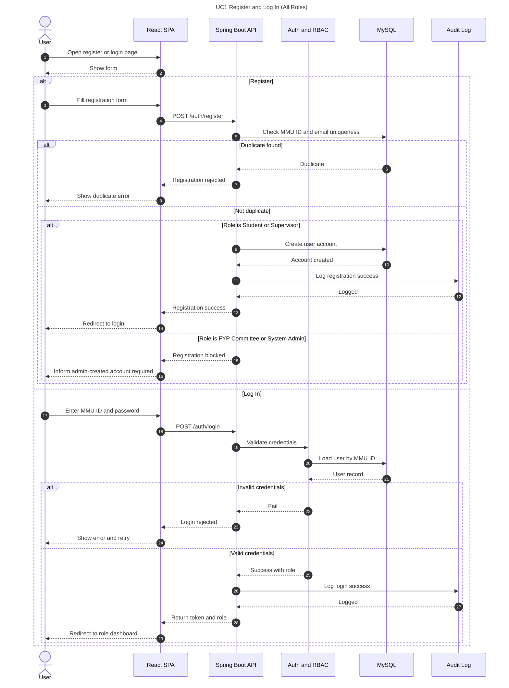
```mermaid
sequenceDiagram
  title UC1 Register and Log In (All Roles)
  autonumber

  actor U as User
  participant FE as React SPA
  participant BE as Spring Boot API
  participant AUTH as Auth and RBAC
  participant DB as MySQL
  participant AUD as Audit Log

  U->>FE: Open register or login page
  FE-->>U: Show form

  alt Register
    U->>FE: Fill registration form
    FE->>BE: POST /auth/register
    BE->>DB: Check MMU ID and email uniqueness
    alt Duplicate found
      DB-->>BE: Duplicate
      BE-->>FE: Registration rejected
      FE-->>U: Show duplicate error
    else Not duplicate
      alt Role is Student or Supervisor
        BE->>DB: Create user account
        DB-->>BE: Account created
        BE->>AUD: Log registration success
        AUD-->>BE: Logged
        BE-->>FE: Registration success
        FE-->>U: Redirect to login
      else Role is FYP Committee or System Admin
        BE-->>FE: Registration blocked
        FE-->>U: Inform admin-created account required
      end
    end

  else Log In
    U->>FE: Enter MMU ID and password
    FE->>BE: POST /auth/login
    BE->>AUTH: Validate credentials
    AUTH->>DB: Load user by MMU ID
    DB-->>AUTH: User record
    alt Invalid credentials
      AUTH-->>BE: Fail
      BE-->>FE: Login rejected
      FE-->>U: Show error and retry
    else Valid credentials
      AUTH-->>BE: Success with role
      BE->>AUD: Log login success
      AUD-->>BE: Logged
      BE-->>FE: Return token and role
      FE-->>U: Redirect to role dashboard
    end
  end
```

## 4.2.2 UC2 Manage Student Profile (Student)

### Mermaid Sequence Diagram (UC2)

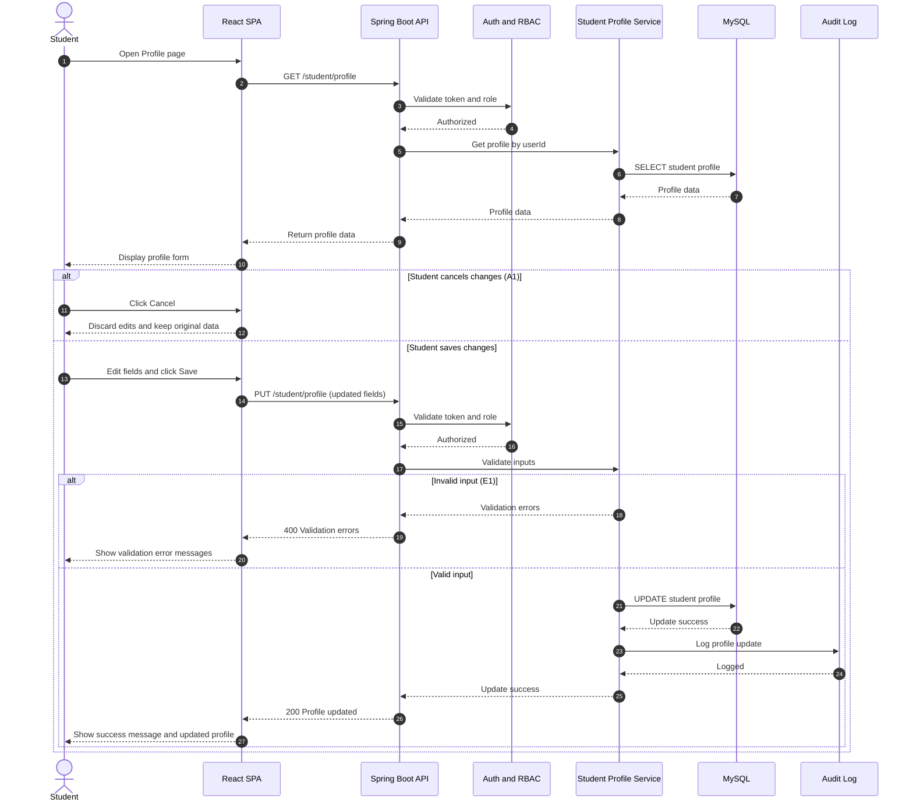
```mermaid
sequenceDiagram
  autonumber

  actor STU as Student
  participant FE as React SPA
  participant BE as Spring Boot API
  participant AUTH as Auth and RBAC
  participant SVC as Student Profile Service
  participant DB as MySQL
  participant AUD as Audit Log

  STU->>FE: Open Profile page
  FE->>BE: GET /student/profile
  BE->>AUTH: Validate token and role
  AUTH-->>BE: Authorized
  BE->>SVC: Get profile by userId
  SVC->>DB: SELECT student profile
  DB-->>SVC: Profile data
  SVC-->>BE: Profile data
  BE-->>FE: Return profile data
  FE-->>STU: Display profile form

  alt Student cancels changes (A1)
    STU->>FE: Click Cancel
    FE-->>STU: Discard edits and keep original data
  else Student saves changes
    STU->>FE: Edit fields and click Save
    FE->>BE: PUT /student/profile (updated fields)
    BE->>AUTH: Validate token and role
    AUTH-->>BE: Authorized
    BE->>SVC: Validate inputs
    alt Invalid input (E1)
      SVC-->>BE: Validation errors
      BE-->>FE: 400 Validation errors
      FE-->>STU: Show validation error messages
    else Valid input
      SVC->>DB: UPDATE student profile
      DB-->>SVC: Update success
      SVC->>AUD: Log profile update
      AUD-->>SVC: Logged
      SVC-->>BE: Update success
      BE-->>FE: 200 Profile updated
      FE-->>STU: Show success message and updated profile
    end
  end
```

---

### Report Section (Numbered Description)

#### 4.2.2 UC2 Manage Student Profile (Student) — Figure 4.12

{insert diagram}

1. The student opens the **Profile** page in the React SPA.
    
2. The frontend requests the current profile using `GET /student/profile`.
    
3. The backend verifies the student session using **Auth and RBAC**.
    
4. The Student Profile Service retrieves profile data from **MySQL** and returns it to the frontend for display.
    
5. The student edits the required profile fields (personal and academic details).
    
6. If the student selects **Cancel** (A1), the system discards the changes and restores the previously loaded profile values.
    
7. If the student selects **Save**, the frontend submits the updates using `PUT /student/profile`.
    
8. The backend performs authentication and input validation.
    
9. If validation fails (E1), the system returns error messages and the frontend displays the validation errors.
    
10. If validation succeeds, the system updates the profile in **MySQL**, records the action in the **Audit Log**, and returns a success response.
    
11. The frontend displays a success message and shows the updated profile information.
## 4.2.3 UC3 View FYP Dashboard (Student)

### Mermaid Sequence Diagram (UC3)

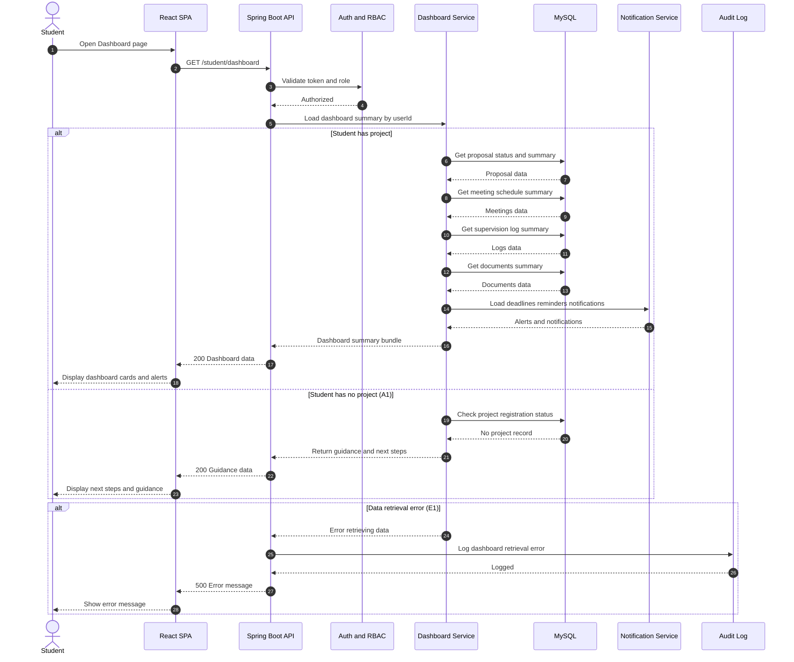
```mermaid
sequenceDiagram
  autonumber
  actor STU as Student
  participant FE as React SPA
  participant BE as Spring Boot API
  participant AUTH as Auth and RBAC
  participant DASH as Dashboard Service
  participant DB as MySQL
  participant NOTI as Notification Service
  participant AUD as Audit Log

  STU->>FE: Open Dashboard page
  FE->>BE: GET /student/dashboard
  BE->>AUTH: Validate token and role
  AUTH-->>BE: Authorized

  BE->>DASH: Load dashboard summary by userId

  alt Student has project
    DASH->>DB: Get proposal status and summary
    DB-->>DASH: Proposal data
    DASH->>DB: Get meeting schedule summary
    DB-->>DASH: Meetings data
    DASH->>DB: Get supervision log summary
    DB-->>DASH: Logs data
    DASH->>DB: Get documents summary
    DB-->>DASH: Documents data
    DASH->>NOTI: Load deadlines reminders notifications
    NOTI-->>DASH: Alerts and notifications
    DASH-->>BE: Dashboard summary bundle
    BE-->>FE: 200 Dashboard data
    FE-->>STU: Display dashboard cards and alerts

  else Student has no project (A1)
    DASH->>DB: Check project registration status
    DB-->>DASH: No project record
    DASH-->>BE: Return guidance and next steps
    BE-->>FE: 200 Guidance data
    FE-->>STU: Display next steps and guidance
  end

  alt Data retrieval error (E1)
    DASH-->>BE: Error retrieving data
    BE->>AUD: Log dashboard retrieval error
    AUD-->>BE: Logged
    BE-->>FE: 500 Error message
    FE-->>STU: Show error message
  end
```

> If your Mermaid tool is strict and fails when `alt` is placed after earlier `alt`, tell me — I’ll rewrite it into a single `alt` structure. (Some renderers are picky.)

---

### Report Section (Numbered Description)

#### 4.2.3 UC3 View FYP Dashboard (Student) — Figure 4.13

{insert diagram}

1. The student opens the **Dashboard** page in the React SPA.
    
2. The frontend sends `GET /student/dashboard` to the Spring Boot API.
    
3. The backend validates the student session using **Auth and RBAC**.
    
4. The Dashboard Service loads the dashboard summary for the student, including proposal status, meeting schedule, supervision logs, document summary, deadlines, and notifications.
    
5. If the student has an active project, the system returns the summary data and the frontend displays dashboard cards and alerts.
    
6. If the student has no project (A1), the system returns guidance and next steps (e.g., registration/proposal actions) and the frontend displays the guidance.
    
7. If a data retrieval error occurs (E1), the system logs the error in the audit log and displays an error message to the student.
## 4.2.4 UC4 Browse and Search Supervisors (Student)

**Figure 4.14 UC4 Browse and Search Supervisors Sequence Diagram**

### Mermaid code

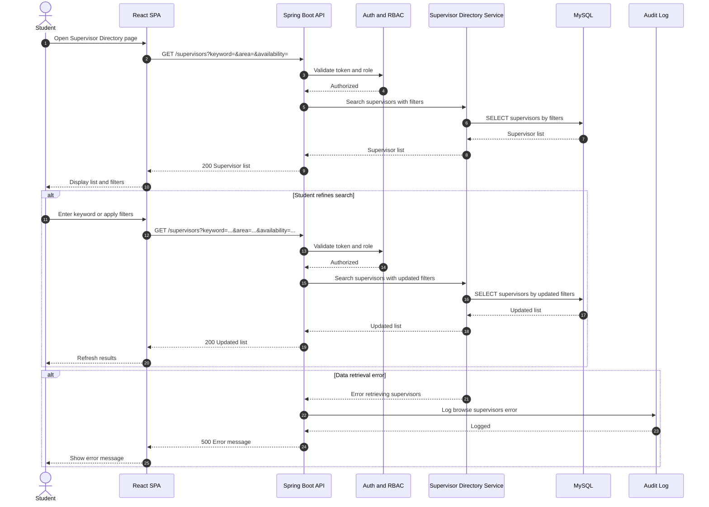
```mermaid
sequenceDiagram
  autonumber
  actor STU as Student
  participant FE as React SPA
  participant BE as Spring Boot API
  participant AUTH as Auth and RBAC
  participant SVC as Supervisor Directory Service
  participant DB as MySQL
  participant AUD as Audit Log

  STU->>FE: Open Supervisor Directory page
  FE->>BE: GET /supervisors?keyword=&area=&availability=
  BE->>AUTH: Validate token and role
  AUTH-->>BE: Authorized
  BE->>SVC: Search supervisors with filters
  SVC->>DB: SELECT supervisors by filters
  DB-->>SVC: Supervisor list
  SVC-->>BE: Supervisor list
  BE-->>FE: 200 Supervisor list
  FE-->>STU: Display list and filters

  alt Student refines search
    STU->>FE: Enter keyword or apply filters
    FE->>BE: GET /supervisors?keyword=...&area=...&availability=...
    BE->>AUTH: Validate token and role
    AUTH-->>BE: Authorized
    BE->>SVC: Search supervisors with updated filters
    SVC->>DB: SELECT supervisors by updated filters
    DB-->>SVC: Updated list
    SVC-->>BE: Updated list
    BE-->>FE: 200 Updated list
    FE-->>STU: Refresh results
  end

  alt Data retrieval error
    SVC-->>BE: Error retrieving supervisors
    BE->>AUD: Log browse supervisors error
    AUD-->>BE: Logged
    BE-->>FE: 500 Error message
    FE-->>STU: Show error message
  end
```

### Report (numbered)

1. Student opens the **Supervisor Directory** page.
    
2. Frontend requests supervisors with optional filters via `GET /supervisors`.
    
3. Backend validates the session using **Auth and RBAC**.
    
4. Supervisor Directory Service queries **MySQL** and returns the supervisor list.
    
5. Frontend displays the list and filter controls.
    
6. If the student refines the search, the frontend sends another `GET /supervisors` with updated filters and refreshes results.
    
7. If retrieval fails, the backend logs the error and the UI shows an error message.
    

---

## 4.2.5 UC5 View AI Supervisor Recommendations (Student)

**Figure 4.15 UC5 View AI Supervisor Recommendations Sequence Diagram**

### Mermaid code

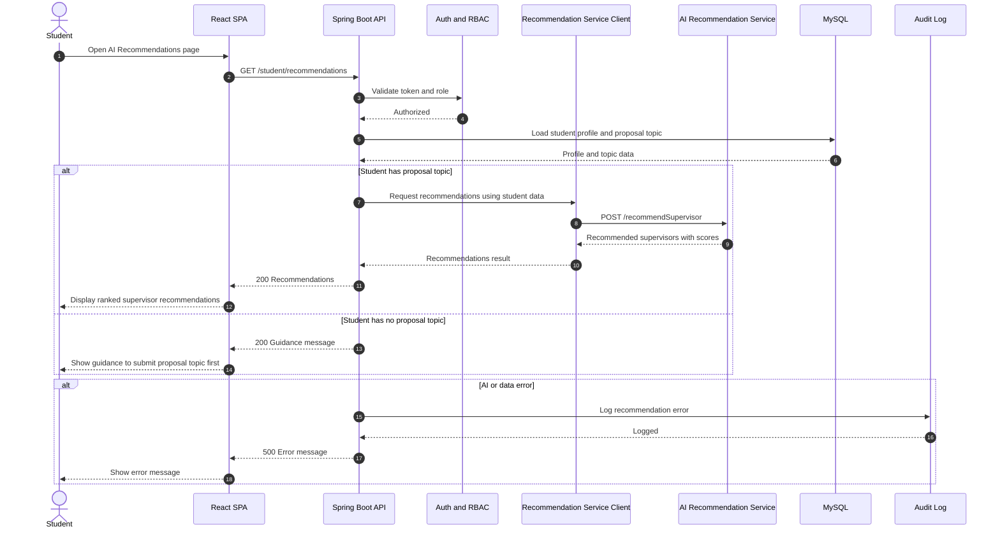
```mermaid
sequenceDiagram
  autonumber
  actor STU as Student
  participant FE as React SPA
  participant BE as Spring Boot API
  participant AUTH as Auth and RBAC
  participant REC as Recommendation Service Client
  participant AI as AI Recommendation Service
  participant DB as MySQL
  participant AUD as Audit Log

  STU->>FE: Open AI Recommendations page
  FE->>BE: GET /student/recommendations
  BE->>AUTH: Validate token and role
  AUTH-->>BE: Authorized

  BE->>DB: Load student profile and proposal topic
  DB-->>BE: Profile and topic data

  alt Student has proposal topic
    BE->>REC: Request recommendations using student data
    REC->>AI: POST /recommendSupervisor
    AI-->>REC: Recommended supervisors with scores
    REC-->>BE: Recommendations result
    BE-->>FE: 200 Recommendations
    FE-->>STU: Display ranked supervisor recommendations
  else Student has no proposal topic
    BE-->>FE: 200 Guidance message
    FE-->>STU: Show guidance to submit proposal topic first
  end

  alt AI or data error
    BE->>AUD: Log recommendation error
    AUD-->>BE: Logged
    BE-->>FE: 500 Error message
    FE-->>STU: Show error message
  end
```

### Report (numbered)

1. Student opens the **AI Recommendations** page.
    
2. Frontend calls `GET /student/recommendations`.
    
3. Backend validates the session using **Auth and RBAC**.
    
4. Backend loads the student profile and proposal topic from **MySQL**.
    
5. If a proposal topic exists, backend calls the AI recommendation service and receives ranked supervisors with scores.
    
6. Frontend displays the recommended supervisors.
    
7. If no proposal topic exists, the system shows guidance to submit a proposal/topic first.
    
8. If errors occur, the system logs the failure and displays an error message.
    

---

## 4.2.6 UC6 Send Supervisor Request (Student)

**Figure 4.16 UC6 Send Supervisor Request Sequence Diagram**

### Mermaid code

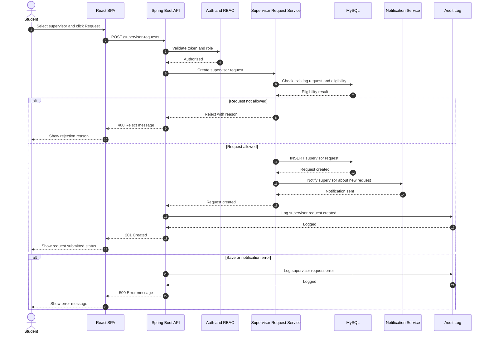
```mermaid
sequenceDiagram
  autonumber
  actor STU as Student
  participant FE as React SPA
  participant BE as Spring Boot API
  participant AUTH as Auth and RBAC
  participant REQ as Supervisor Request Service
  participant DB as MySQL
  participant NOTI as Notification Service
  participant AUD as Audit Log

  STU->>FE: Select supervisor and click Request
  FE->>BE: POST /supervisor-requests
  BE->>AUTH: Validate token and role
  AUTH-->>BE: Authorized
  BE->>REQ: Create supervisor request

  REQ->>DB: Check existing request and eligibility
  DB-->>REQ: Eligibility result

  alt Request not allowed
    REQ-->>BE: Reject with reason
    BE-->>FE: 400 Reject message
    FE-->>STU: Show rejection reason
  else Request allowed
    REQ->>DB: INSERT supervisor request
    DB-->>REQ: Request created
    REQ->>NOTI: Notify supervisor about new request
    NOTI-->>REQ: Notification sent
    REQ-->>BE: Request created
    BE->>AUD: Log supervisor request created
    AUD-->>BE: Logged
    BE-->>FE: 201 Created
    FE-->>STU: Show request submitted status
  end

  alt Save or notification error
    BE->>AUD: Log supervisor request error
    AUD-->>BE: Logged
    BE-->>FE: 500 Error message
    FE-->>STU: Show error message
  end
```

### Report (numbered)

1. Student selects a supervisor and submits a request.
    
2. Frontend sends `POST /supervisor-requests` to the backend.
    
3. Backend validates the student session via **Auth and RBAC**.
    
4. Supervisor Request Service checks eligibility and whether a request already exists in **MySQL**.
    
5. If not allowed, the system returns a rejection reason to the student.
    
6. If allowed, the request is saved in **MySQL** and a notification is sent to the supervisor.
    
7. The action is logged in the audit log and the UI shows the submitted status.
    
8. If any error occurs, the system logs it and shows an error message.
    

---

## 4.2.7 UC7 Manage Proposal (Student)

**Figure 4.17 UC7 Manage Proposal Sequence Diagram**

### Mermaid code

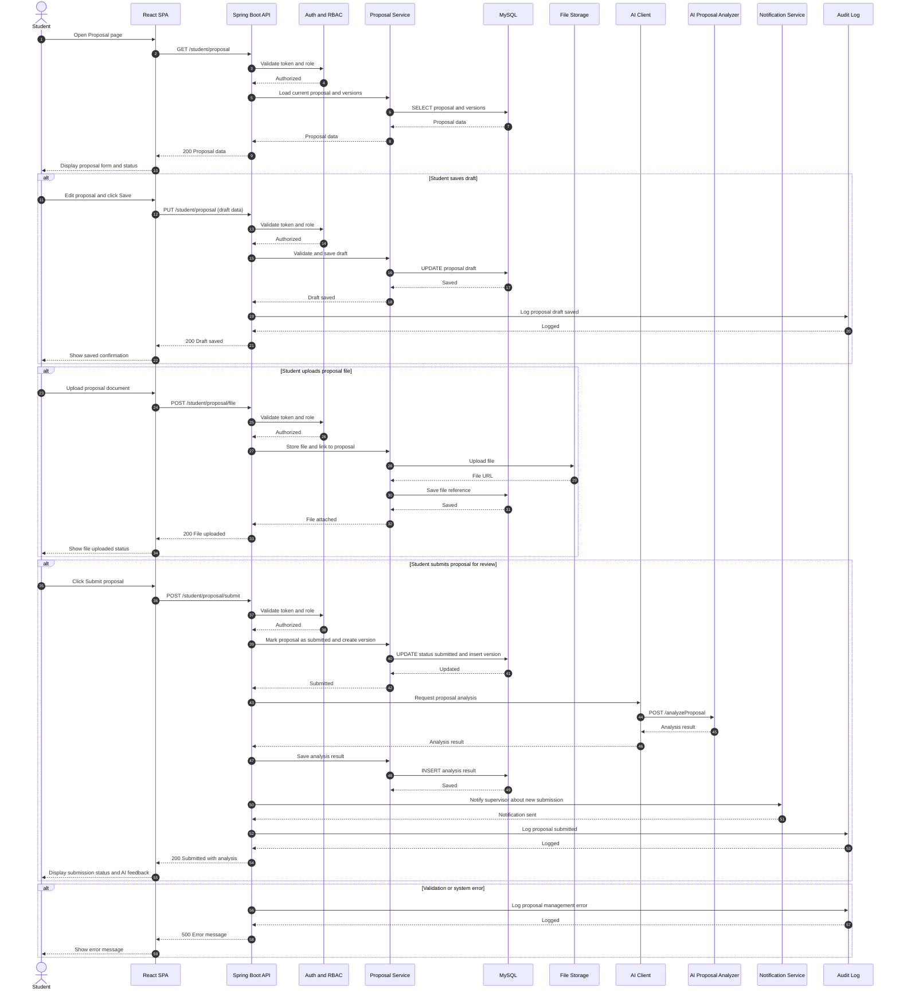
```mermaid
sequenceDiagram
  autonumber
  actor STU as Student
  participant FE as React SPA
  participant BE as Spring Boot API
  participant AUTH as Auth and RBAC
  participant PROP as Proposal Service
  participant DB as MySQL
  participant FS as File Storage
  participant AIClient as AI Client
  participant AI as AI Proposal Analyzer
  participant NOTI as Notification Service
  participant AUD as Audit Log

  STU->>FE: Open Proposal page
  FE->>BE: GET /student/proposal
  BE->>AUTH: Validate token and role
  AUTH-->>BE: Authorized
  BE->>PROP: Load current proposal and versions
  PROP->>DB: SELECT proposal and versions
  DB-->>PROP: Proposal data
  PROP-->>BE: Proposal data
  BE-->>FE: 200 Proposal data
  FE-->>STU: Display proposal form and status

  alt Student saves draft
    STU->>FE: Edit proposal and click Save
    FE->>BE: PUT /student/proposal (draft data)
    BE->>AUTH: Validate token and role
    AUTH-->>BE: Authorized
    BE->>PROP: Validate and save draft
    PROP->>DB: UPDATE proposal draft
    DB-->>PROP: Saved
    PROP-->>BE: Draft saved
    BE->>AUD: Log proposal draft saved
    AUD-->>BE: Logged
    BE-->>FE: 200 Draft saved
    FE-->>STU: Show saved confirmation
  end

  alt Student uploads proposal file
    STU->>FE: Upload proposal document
    FE->>BE: POST /student/proposal/file
    BE->>AUTH: Validate token and role
    AUTH-->>BE: Authorized
    BE->>PROP: Store file and link to proposal
    PROP->>FS: Upload file
    FS-->>PROP: File URL
    PROP->>DB: Save file reference
    DB-->>PROP: Saved
    PROP-->>BE: File attached
    BE-->>FE: 200 File uploaded
    FE-->>STU: Show file uploaded status
  end

  alt Student submits proposal for review
    STU->>FE: Click Submit proposal
    FE->>BE: POST /student/proposal/submit
    BE->>AUTH: Validate token and role
    AUTH-->>BE: Authorized
    BE->>PROP: Mark proposal as submitted and create version
    PROP->>DB: UPDATE status submitted and insert version
    DB-->>PROP: Updated
    PROP-->>BE: Submitted

    BE->>AIClient: Request proposal analysis
    AIClient->>AI: POST /analyzeProposal
    AI-->>AIClient: Analysis result
    AIClient-->>BE: Analysis result
    BE->>PROP: Save analysis result
    PROP->>DB: INSERT analysis result
    DB-->>PROP: Saved

    BE->>NOTI: Notify supervisor about new submission
    NOTI-->>BE: Notification sent
    BE->>AUD: Log proposal submitted
    AUD-->>BE: Logged
    BE-->>FE: 200 Submitted with analysis
    FE-->>STU: Display submission status and AI feedback
  end

  alt Validation or system error
    BE->>AUD: Log proposal management error
    AUD-->>BE: Logged
    BE-->>FE: 500 Error message
    FE-->>STU: Show error message
  end
```

### Report (numbered)

1. Student opens the **Proposal** page; frontend requests current proposal via `GET /student/proposal`.
    
2. Backend validates session via **Auth and RBAC** and loads proposal data from **MySQL**.
    
3. The proposal form and current status are displayed to the student.
    
4. If the student saves a draft, the frontend sends `PUT /student/proposal`; the backend validates and updates the draft record in **MySQL**, then logs the action.
    
5. If the student uploads a proposal file, the frontend sends `POST /student/proposal/file`; the system stores the file in **File Storage** and saves its reference in **MySQL**.
    
6. If the student submits the proposal, the backend updates the proposal status to submitted, creates a new version, and triggers the **AI Proposal Analyzer**.
    
7. The AI analysis result is saved and returned to the student, and the supervisor is notified about the submission.
    
8. Any validation or system error is logged and an error message is shown to the student.
    

---

If your draw.io Mermaid renderer complains about **multiple `alt` blocks** in UC7, tell me and I’ll rewrite UC7 into **one single `alt` structure** (some versions are picky).
## 4.2.8 UC8 View Proposal Status (Student)

**Figure 4.18 UC8 View Proposal Status Sequence Diagram**

### Mermaid

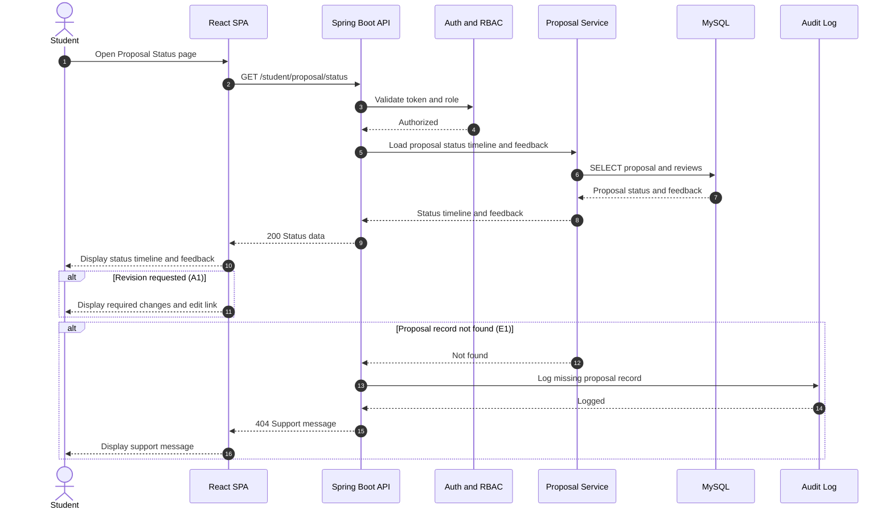
```mermaid
sequenceDiagram
  autonumber
  actor STU as Student
  participant FE as React SPA
  participant BE as Spring Boot API
  participant AUTH as Auth and RBAC
  participant PROP as Proposal Service
  participant DB as MySQL
  participant AUD as Audit Log

  STU->>FE: Open Proposal Status page
  FE->>BE: GET /student/proposal/status
  BE->>AUTH: Validate token and role
  AUTH-->>BE: Authorized

  BE->>PROP: Load proposal status timeline and feedback
  PROP->>DB: SELECT proposal and reviews
  DB-->>PROP: Proposal status and feedback
  PROP-->>BE: Status timeline and feedback
  BE-->>FE: 200 Status data
  FE-->>STU: Display status timeline and feedback

  alt Revision requested (A1)
    FE-->>STU: Display required changes and edit link
  end

  alt Proposal record not found (E1)
    PROP-->>BE: Not found
    BE->>AUD: Log missing proposal record
    AUD-->>BE: Logged
    BE-->>FE: 404 Support message
    FE-->>STU: Display support message
  end
```

### Report (numbered)

1. Student opens the **Proposal Status** page.
    
2. Frontend sends `GET /student/proposal/status` to the backend.
    
3. Backend validates the session using **Auth and RBAC**.
    
4. Proposal Service retrieves proposal status timeline and supervisor feedback from **MySQL**.
    
5. System returns the status data and the frontend displays the timeline and feedback.
    
6. If revision is requested (A1), the system highlights required changes and provides an edit link.
    
7. If no proposal record exists (E1), the system logs the issue and displays a support message.
    

---

## 4.2.9 UC9 View Project Registration Status (Student)

**Figure 4.19 UC9 View Project Registration Status Sequence Diagram**

### Mermaid

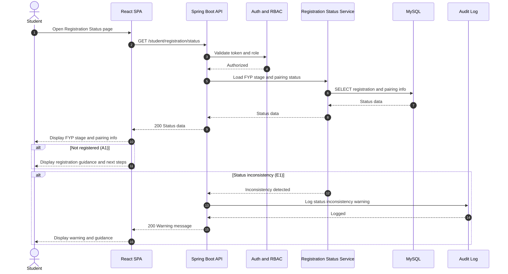
```mermaid
sequenceDiagram
  autonumber
  actor STU as Student
  participant FE as React SPA
  participant BE as Spring Boot API
  participant AUTH as Auth and RBAC
  participant REG as Registration Status Service
  participant DB as MySQL
  participant AUD as Audit Log

  STU->>FE: Open Registration Status page
  FE->>BE: GET /student/registration/status
  BE->>AUTH: Validate token and role
  AUTH-->>BE: Authorized

  BE->>REG: Load FYP stage and pairing status
  REG->>DB: SELECT registration and pairing info
  DB-->>REG: Status data
  REG-->>BE: Status data
  BE-->>FE: 200 Status data
  FE-->>STU: Display FYP stage and pairing info

  alt Not registered (A1)
    FE-->>STU: Display registration guidance and next steps
  end

  alt Status inconsistency (E1)
    REG-->>BE: Inconsistency detected
    BE->>AUD: Log status inconsistency warning
    AUD-->>BE: Logged
    BE-->>FE: 200 Warning message
    FE-->>STU: Display warning and guidance
  end
```

### Report (numbered)

1. Student opens **Registration Status** page.
    
2. Frontend calls `GET /student/registration/status`.
    
3. Backend validates the session using **Auth and RBAC**.
    
4. Registration Status Service loads FYP stage and pairing status from **MySQL**.
    
5. Frontend displays the current stage, pairing information, and next steps.
    
6. If the student is not registered (A1), the system shows registration guidance.
    
7. If an inconsistency is detected (E1), the system shows a warning and logs the issue.
    

---

## 4.2.10 UC10 Manage Meeting Schedule (Student)

**Figure 4.20 UC10 Manage Meeting Schedule Sequence Diagram**

### Mermaid

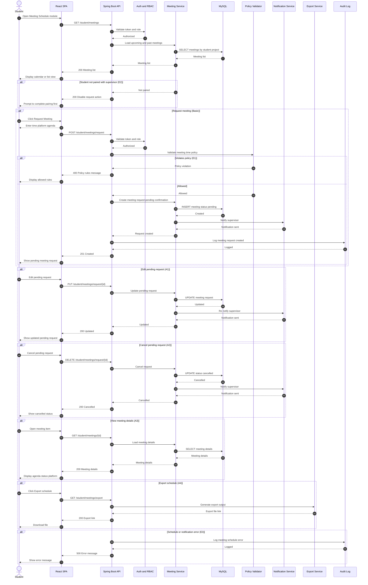
```mermaid
sequenceDiagram
  autonumber
  actor STU as Student
  participant FE as React SPA
  participant BE as Spring Boot API
  participant AUTH as Auth and RBAC
  participant MEET as Meeting Service
  participant DB as MySQL
  participant POL as Policy Validator
  participant NOTI as Notification Service
  participant EXP as Export Service
  participant AUD as Audit Log

  STU->>FE: Open Meeting Schedule module
  FE->>BE: GET /student/meetings
  BE->>AUTH: Validate token and role
  AUTH-->>BE: Authorized
  BE->>MEET: Load upcoming and past meetings
  MEET->>DB: SELECT meetings by student project
  DB-->>MEET: Meeting list
  MEET-->>BE: Meeting list
  BE-->>FE: 200 Meeting list
  FE-->>STU: Display calendar or list view

  alt Student not paired with supervisor (E2)
    MEET-->>BE: Not paired
    BE-->>FE: 200 Disable request action
    FE-->>STU: Prompt to complete pairing first
  end

  alt Request meeting (Basic)
    STU->>FE: Click Request Meeting
    FE-->>STU: Enter time platform agenda
    FE->>BE: POST /student/meetings/request
    BE->>AUTH: Validate token and role
    AUTH-->>BE: Authorized

    BE->>POL: Validate meeting time policy
    alt Violates policy (E1)
      POL-->>BE: Policy violation
      BE-->>FE: 400 Policy rules message
      FE-->>STU: Display allowed rules
    else Allowed
      POL-->>BE: Allowed
      BE->>MEET: Create meeting request pending confirmation
      MEET->>DB: INSERT meeting status pending
      DB-->>MEET: Created
      MEET->>NOTI: Notify supervisor
      NOTI-->>MEET: Notification sent
      MEET-->>BE: Request created
      BE->>AUD: Log meeting request created
      AUD-->>BE: Logged
      BE-->>FE: 201 Created
      FE-->>STU: Show pending meeting request
    end
  end

  alt Edit pending request (A1)
    STU->>FE: Edit pending request
    FE->>BE: PUT /student/meetings/request/{id}
    BE->>MEET: Update pending request
    MEET->>DB: UPDATE meeting request
    DB-->>MEET: Updated
    MEET->>NOTI: Re notify supervisor
    NOTI-->>MEET: Notification sent
    MEET-->>BE: Updated
    BE-->>FE: 200 Updated
    FE-->>STU: Show updated pending request
  end

  alt Cancel pending request (A2)
    STU->>FE: Cancel pending request
    FE->>BE: DELETE /student/meetings/request/{id}
    BE->>MEET: Cancel request
    MEET->>DB: UPDATE status cancelled
    DB-->>MEET: Cancelled
    MEET->>NOTI: Notify supervisor
    NOTI-->>MEET: Notification sent
    MEET-->>BE: Cancelled
    BE-->>FE: 200 Cancelled
    FE-->>STU: Show cancelled status
  end

  alt View meeting details (A3)
    STU->>FE: Open meeting item
    FE->>BE: GET /student/meetings/{id}
    BE->>MEET: Load meeting details
    MEET->>DB: SELECT meeting details
    DB-->>MEET: Meeting details
    MEET-->>BE: Meeting details
    BE-->>FE: 200 Meeting details
    FE-->>STU: Display agenda status platform
  end

  alt Export schedule (A4)
    STU->>FE: Click Export schedule
    FE->>BE: GET /student/meetings/export
    BE->>EXP: Generate export output
    EXP-->>BE: Export file link
    BE-->>FE: 200 Export link
    FE-->>STU: Download file
  end

  alt Schedule or notification error (E3)
    BE->>AUD: Log meeting schedule error
    AUD-->>BE: Logged
    BE-->>FE: 500 Error message
    FE-->>STU: Show error message
  end
```

### Report (numbered)

1. Student opens **Meeting Schedule** module.
    
2. Frontend requests meeting list via `GET /student/meetings`.
    
3. Backend validates session and returns upcoming and past meetings from **MySQL**.
    
4. If student is not paired (E2), the request action is disabled and guidance is shown.
    
5. Student can request a meeting by submitting time, platform, and agenda.
    
6. System validates policy rules; if violated (E1), it blocks submission and shows allowed rules.
    
7. If allowed, system creates a pending request, notifies the supervisor, and shows pending status.
    
8. Student may edit (A1) or cancel (A2) a pending request; system updates status and notifies supervisor.
    
9. Student can view details (A3) and export schedule (A4).
    
10. Any service error (E3) is logged and an error message is displayed.
    

---

## 4.2.11 UC11 Manage Supervision Log (Student)

**Figure 4.21 UC11 Manage Supervision Log Sequence Diagram**

### Mermaid

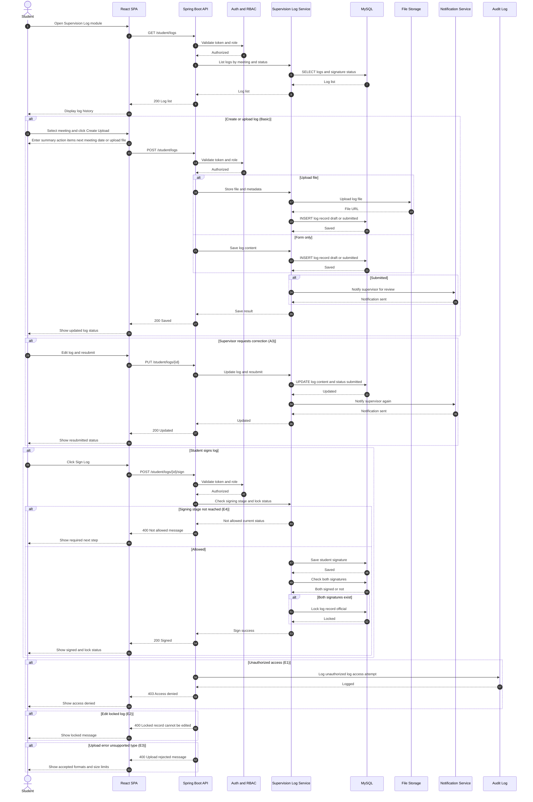
```mermaid
sequenceDiagram
  autonumber
  actor STU as Student
  participant FE as React SPA
  participant BE as Spring Boot API
  participant AUTH as Auth and RBAC
  participant LOG as Supervision Log Service
  participant DB as MySQL
  participant FS as File Storage
  participant NOTI as Notification Service
  participant AUD as Audit Log

  STU->>FE: Open Supervision Log module
  FE->>BE: GET /student/logs
  BE->>AUTH: Validate token and role
  AUTH-->>BE: Authorized
  BE->>LOG: List logs by meeting and status
  LOG->>DB: SELECT logs and signature status
  DB-->>LOG: Log list
  LOG-->>BE: Log list
  BE-->>FE: 200 Log list
  FE-->>STU: Display log history

  alt Create or upload log (Basic)
    STU->>FE: Select meeting and click Create Upload
    FE-->>STU: Enter summary action items next meeting date or upload file
    FE->>BE: POST /student/logs
    BE->>AUTH: Validate token and role
    AUTH-->>BE: Authorized

    alt Upload file
      BE->>LOG: Store file and metadata
      LOG->>FS: Upload log file
      FS-->>LOG: File URL
      LOG->>DB: INSERT log record draft or submitted
      DB-->>LOG: Saved
    else Form only
      BE->>LOG: Save log content
      LOG->>DB: INSERT log record draft or submitted
      DB-->>LOG: Saved
    end

    alt Submitted
      LOG->>NOTI: Notify supervisor for review
      NOTI-->>LOG: Notification sent
    end

    LOG-->>BE: Save result
    BE-->>FE: 200 Saved
    FE-->>STU: Show updated log status
  end

  alt Supervisor requests correction (A3)
    STU->>FE: Edit log and resubmit
    FE->>BE: PUT /student/logs/{id}
    BE->>LOG: Update log and resubmit
    LOG->>DB: UPDATE log content and status submitted
    DB-->>LOG: Updated
    LOG->>NOTI: Notify supervisor again
    NOTI-->>LOG: Notification sent
    LOG-->>BE: Updated
    BE-->>FE: 200 Updated
    FE-->>STU: Show resubmitted status
  end

  alt Student signs log
    STU->>FE: Click Sign Log
    FE->>BE: POST /student/logs/{id}/sign
    BE->>AUTH: Validate token and role
    AUTH-->>BE: Authorized
    BE->>LOG: Check signing stage and lock status

    alt Signing stage not reached (E4)
      LOG-->>BE: Not allowed current status
      BE-->>FE: 400 Not allowed message
      FE-->>STU: Show required next step
    else Allowed
      LOG->>DB: Save student signature
      DB-->>LOG: Saved
      LOG->>DB: Check both signatures
      DB-->>LOG: Both signed or not

      alt Both signatures exist
        LOG->>DB: Lock log record official
        DB-->>LOG: Locked
      end

      LOG-->>BE: Sign success
      BE-->>FE: 200 Signed
      FE-->>STU: Show signed and lock status
    end
  end

  alt Unauthorized access (E1)
    BE->>AUD: Log unauthorized log access attempt
    AUD-->>BE: Logged
    BE-->>FE: 403 Access denied
    FE-->>STU: Show access denied
  end

  alt Edit locked log (E2)
    BE-->>FE: 400 Locked record cannot be edited
    FE-->>STU: Show locked message
  end

  alt Upload error unsupported type (E3)
    BE-->>FE: 400 Upload rejected message
    FE-->>STU: Show accepted formats and size limits
  end
```

### Report (numbered)

1. Student opens **Supervision Log** module; system lists logs by meeting with status and signatures.
    
2. Student creates or uploads a log; system stores content and optional file, then saves to **MySQL** and **File Storage**.
    
3. If submitted, the supervisor is notified for review.
    
4. If correction is requested (A3), student edits and re-submits and the supervisor is notified again.
    
5. When signing is allowed, student signs the log; the system records the signature and locks the log if both signatures exist.
    
6. Unauthorized access, locked-edit attempts, upload errors, or signing too early trigger the relevant error messages and logging.
    

---

## 4.2.12 UC12 Upload and Manage FYP Documents (Student)

**Figure 4.22 UC12 Upload and Manage FYP Documents Sequence Diagram**

### Mermaid

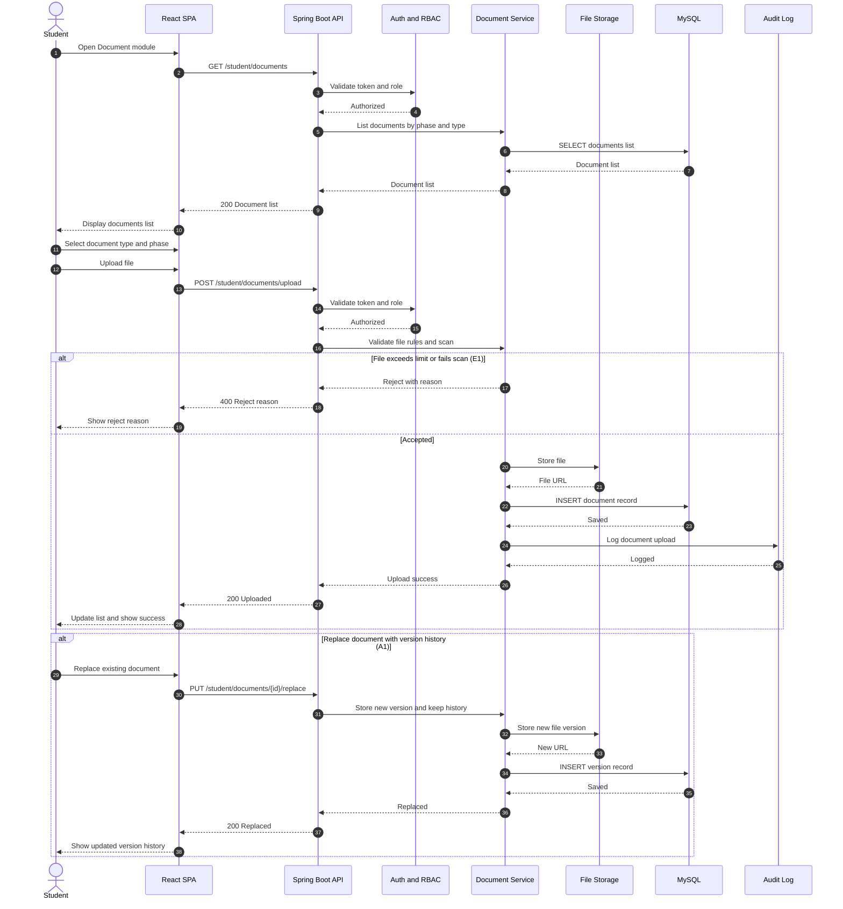
```mermaid
sequenceDiagram
  autonumber
  actor STU as Student
  participant FE as React SPA
  participant BE as Spring Boot API
  participant AUTH as Auth and RBAC
  participant DOC as Document Service
  participant FS as File Storage
  participant DB as MySQL
  participant AUD as Audit Log

  STU->>FE: Open Document module
  FE->>BE: GET /student/documents
  BE->>AUTH: Validate token and role
  AUTH-->>BE: Authorized
  BE->>DOC: List documents by phase and type
  DOC->>DB: SELECT documents list
  DB-->>DOC: Document list
  DOC-->>BE: Document list
  BE-->>FE: 200 Document list
  FE-->>STU: Display documents list

  STU->>FE: Select document type and phase
  STU->>FE: Upload file
  FE->>BE: POST /student/documents/upload
  BE->>AUTH: Validate token and role
  AUTH-->>BE: Authorized
  BE->>DOC: Validate file rules and scan

  alt File exceeds limit or fails scan (E1)
    DOC-->>BE: Reject with reason
    BE-->>FE: 400 Reject reason
    FE-->>STU: Show reject reason
  else Accepted
    DOC->>FS: Store file
    FS-->>DOC: File URL
    DOC->>DB: INSERT document record
    DB-->>DOC: Saved
    DOC->>AUD: Log document upload
    AUD-->>DOC: Logged
    DOC-->>BE: Upload success
    BE-->>FE: 200 Uploaded
    FE-->>STU: Update list and show success
  end

  alt Replace document with version history (A1)
    STU->>FE: Replace existing document
    FE->>BE: PUT /student/documents/{id}/replace
    BE->>DOC: Store new version and keep history
    DOC->>FS: Store new file version
    FS-->>DOC: New URL
    DOC->>DB: INSERT version record
    DB-->>DOC: Saved
    DOC-->>BE: Replaced
    BE-->>FE: 200 Replaced
    FE-->>STU: Show updated version history
  end
```

### Report (numbered)

1. Student opens **Document module** and the system lists existing documents.
    
2. Student selects document phase and type, then uploads a file.
    
3. Backend validates session and checks file constraints and scanning rules.
    
4. If file fails (E1), the system rejects and shows the reason.
    
5. If accepted, the file is stored in **File Storage** and metadata is saved in **MySQL**.
    
6. If replacing a document (A1), the system stores a new version and keeps version history.
    

---

## 4.2.13 UC13 View FYP Guidelines, Rubrics and Deadlines (Student)

**Figure 4.23 UC13 View FYP Guidelines, Rubrics and Deadlines Sequence Diagram**

### Mermaid

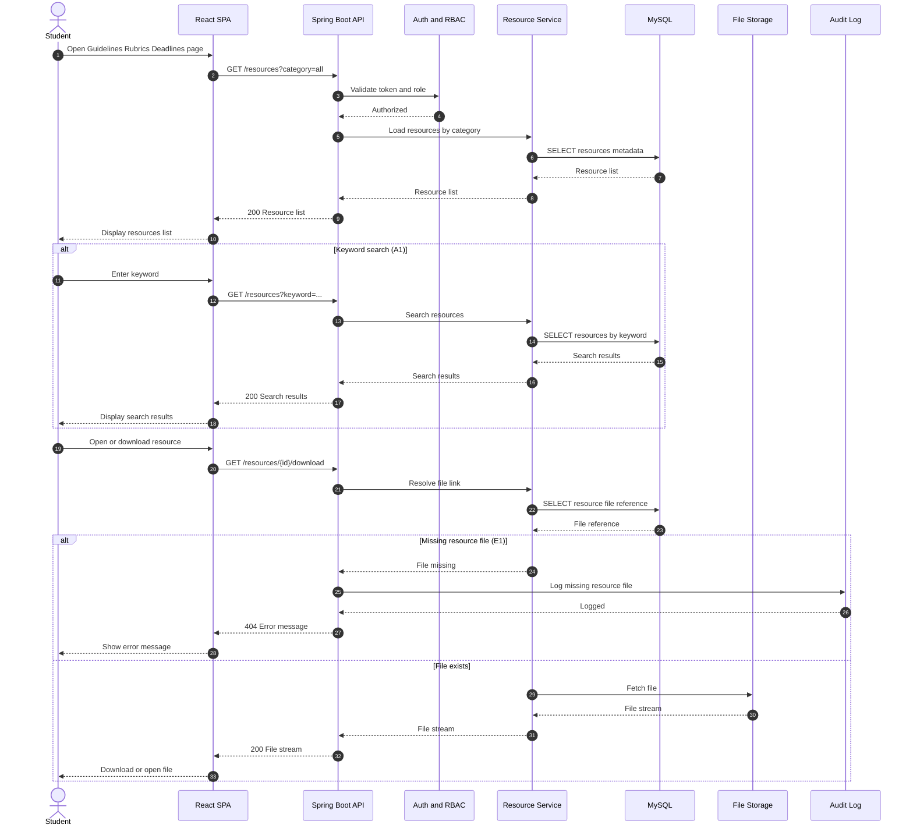
```mermaid
sequenceDiagram
  autonumber
  actor STU as Student
  participant FE as React SPA
  participant BE as Spring Boot API
  participant AUTH as Auth and RBAC
  participant RES as Resource Service
  participant DB as MySQL
  participant FS as File Storage
  participant AUD as Audit Log

  STU->>FE: Open Guidelines Rubrics Deadlines page
  FE->>BE: GET /resources?category=all
  BE->>AUTH: Validate token and role
  AUTH-->>BE: Authorized
  BE->>RES: Load resources by category
  RES->>DB: SELECT resources metadata
  DB-->>RES: Resource list
  RES-->>BE: Resource list
  BE-->>FE: 200 Resource list
  FE-->>STU: Display resources list

  alt Keyword search (A1)
    STU->>FE: Enter keyword
    FE->>BE: GET /resources?keyword=...
    BE->>RES: Search resources
    RES->>DB: SELECT resources by keyword
    DB-->>RES: Search results
    RES-->>BE: Search results
    BE-->>FE: 200 Search results
    FE-->>STU: Display search results
  end

  STU->>FE: Open or download resource
  FE->>BE: GET /resources/{id}/download
  BE->>RES: Resolve file link
  RES->>DB: SELECT resource file reference
  DB-->>RES: File reference

  alt Missing resource file (E1)
    RES-->>BE: File missing
    BE->>AUD: Log missing resource file
    AUD-->>BE: Logged
    BE-->>FE: 404 Error message
    FE-->>STU: Show error message
  else File exists
    RES->>FS: Fetch file
    FS-->>RES: File stream
    RES-->>BE: File stream
    BE-->>FE: 200 File stream
    FE-->>STU: Download or open file
  end
```

### Report (numbered)

1. Student opens **Guidelines, Rubrics and Deadlines** page.
    
2. System loads resources by category and displays them.
    
3. Student may search by keyword (A1); system returns matching resources.
    
4. Student opens or downloads a resource; system retrieves the file from storage.
    
5. If the file is missing (E1), the system logs the incident and shows an error message.
    

---

## 4.2.14 UC14 View Reminders and Notifications (Student)

**Figure 4.24 UC14 View Reminders and Notifications Sequence Diagram**

### Mermaid

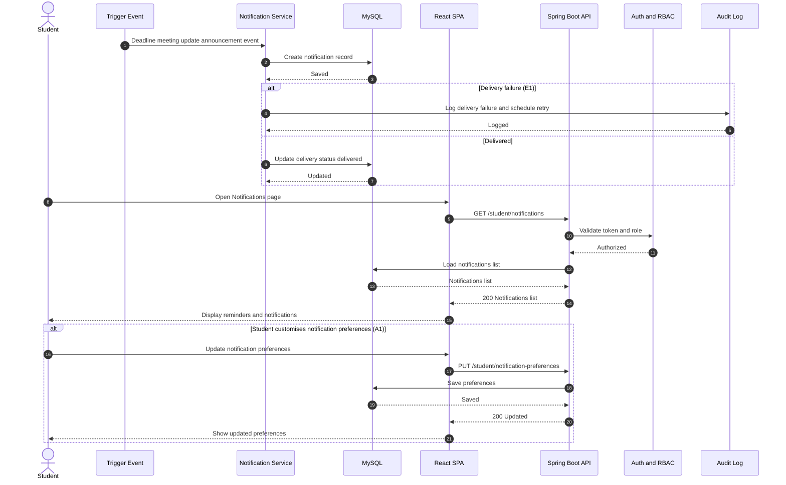
```mermaid
sequenceDiagram
  autonumber
  actor STU as Student
  participant TRG as Trigger Event
  participant NOTI as Notification Service
  participant DB as MySQL
  participant FE as React SPA
  participant BE as Spring Boot API
  participant AUTH as Auth and RBAC
  participant AUD as Audit Log

  TRG->>NOTI: Deadline meeting update announcement event
  NOTI->>DB: Create notification record
  DB-->>NOTI: Saved

  alt Delivery failure (E1)
    NOTI->>AUD: Log delivery failure and schedule retry
    AUD-->>NOTI: Logged
  else Delivered
    NOTI->>DB: Update delivery status delivered
    DB-->>NOTI: Updated
  end

  STU->>FE: Open Notifications page
  FE->>BE: GET /student/notifications
  BE->>AUTH: Validate token and role
  AUTH-->>BE: Authorized
  BE->>DB: Load notifications list
  DB-->>BE: Notifications list
  BE-->>FE: 200 Notifications list
  FE-->>STU: Display reminders and notifications

  alt Student customises notification preferences (A1)
    STU->>FE: Update notification preferences
    FE->>BE: PUT /student/notification-preferences
    BE->>DB: Save preferences
    DB-->>BE: Saved
    BE-->>FE: 200 Updated
    FE-->>STU: Show updated preferences
  end
```

### Report (numbered)

1. A trigger event occurs (deadline, meeting update, or announcement).
    
2. Notification Service creates a notification record in **MySQL**.
    
3. If delivery fails (E1), the system logs the failure and retries based on rules; otherwise delivery status is updated.
    
4. Student opens the **Notifications** page; system retrieves and displays notifications.
    
5. Student may update notification preferences (A1); the system saves the updated preferences.
    

---

## 4.2.15 UC15 Ask Questions Using the FYP Chatbot (Student)

**Figure 4.25 UC15 Ask Questions Using the FYP Chatbot Sequence Diagram**

### Mermaid

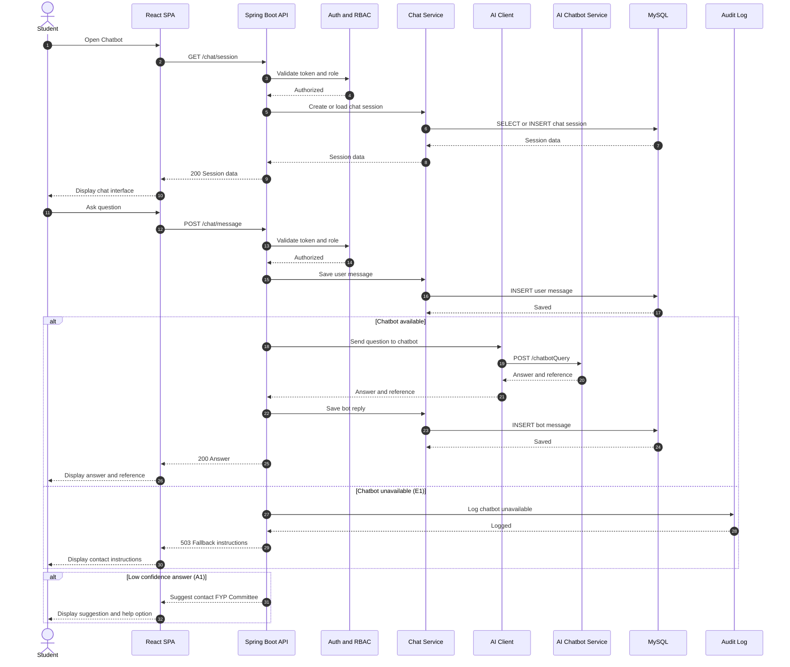
```mermaid
sequenceDiagram
  autonumber
  actor STU as Student
  participant FE as React SPA
  participant BE as Spring Boot API
  participant AUTH as Auth and RBAC
  participant CHAT as Chat Service
  participant AIClient as AI Client
  participant AI as AI Chatbot Service
  participant DB as MySQL
  participant AUD as Audit Log

  STU->>FE: Open Chatbot
  FE->>BE: GET /chat/session
  BE->>AUTH: Validate token and role
  AUTH-->>BE: Authorized
  BE->>CHAT: Create or load chat session
  CHAT->>DB: SELECT or INSERT chat session
  DB-->>CHAT: Session data
  CHAT-->>BE: Session data
  BE-->>FE: 200 Session data
  FE-->>STU: Display chat interface

  STU->>FE: Ask question
  FE->>BE: POST /chat/message
  BE->>AUTH: Validate token and role
  AUTH-->>BE: Authorized
  BE->>CHAT: Save user message
  CHAT->>DB: INSERT user message
  DB-->>CHAT: Saved

  alt Chatbot available
    BE->>AIClient: Send question to chatbot
    AIClient->>AI: POST /chatbotQuery
    AI-->>AIClient: Answer and reference
    AIClient-->>BE: Answer and reference
    BE->>CHAT: Save bot reply
    CHAT->>DB: INSERT bot message
    DB-->>CHAT: Saved
    BE-->>FE: 200 Answer
    FE-->>STU: Display answer and reference
  else Chatbot unavailable (E1)
    BE->>AUD: Log chatbot unavailable
    AUD-->>BE: Logged
    BE-->>FE: 503 Fallback instructions
    FE-->>STU: Display contact instructions
  end

  alt Low confidence answer (A1)
    BE-->>FE: Suggest contact FYP Committee
    FE-->>STU: Display suggestion and help option
  end
```

### Report (numbered)

1. Student opens the chatbot; system creates or loads a chat session.
    
2. Student sends a question; the system stores the user message.
    
3. If chatbot service is available, the backend sends the query to the AI chatbot and returns an answer with references, then stores the bot reply.
    
4. If chatbot is unavailable (E1), the system logs the issue and shows fallback contact instructions.
    
5. If the response confidence is low (A1), the system suggests contacting the FYP Committee and provides a help option.
    

---

## 4.2.16 UC16 Manage Supervisor Profile (Supervisor)

**Figure 4.26 UC16 Manage Supervisor Profile Sequence Diagram**

### Mermaid

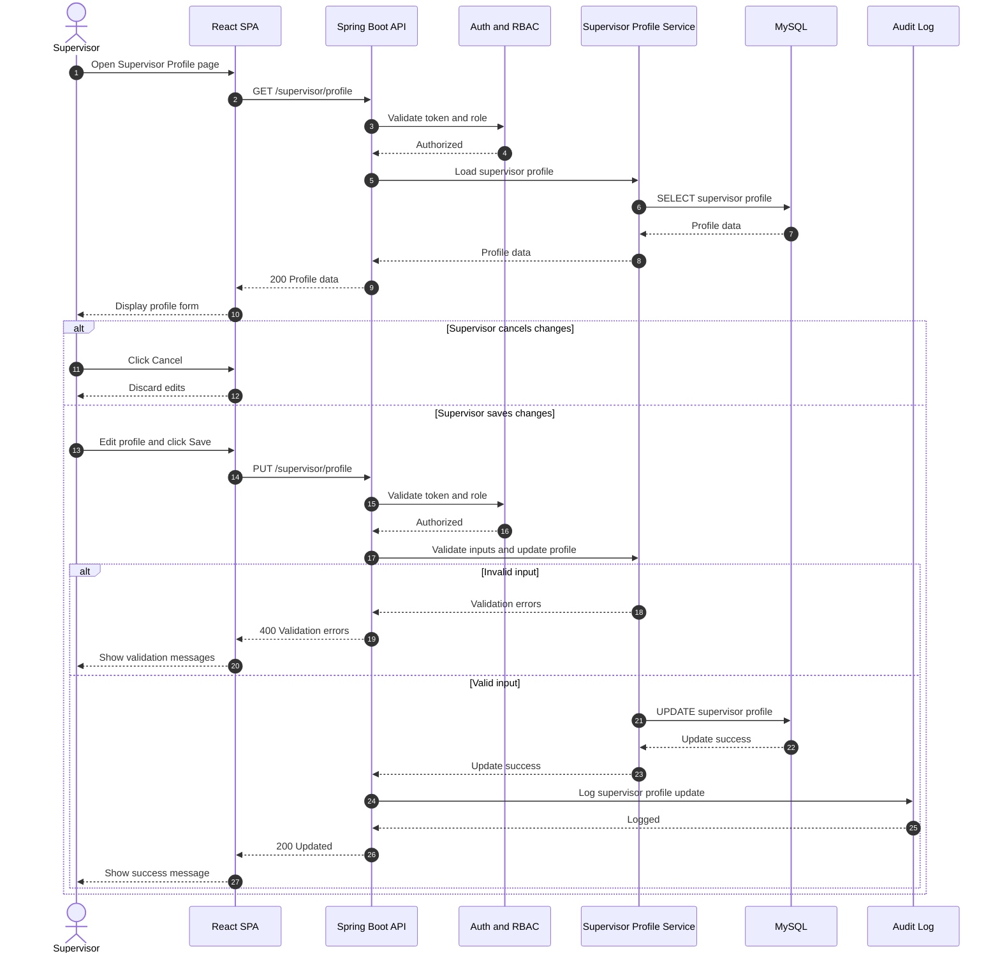
```mermaid
sequenceDiagram
  autonumber
  actor SUP as Supervisor
  participant FE as React SPA
  participant BE as Spring Boot API
  participant AUTH as Auth and RBAC
  participant SVC as Supervisor Profile Service
  participant DB as MySQL
  participant AUD as Audit Log

  SUP->>FE: Open Supervisor Profile page
  FE->>BE: GET /supervisor/profile
  BE->>AUTH: Validate token and role
  AUTH-->>BE: Authorized
  BE->>SVC: Load supervisor profile
  SVC->>DB: SELECT supervisor profile
  DB-->>SVC: Profile data
  SVC-->>BE: Profile data
  BE-->>FE: 200 Profile data
  FE-->>SUP: Display profile form

  alt Supervisor cancels changes
    SUP->>FE: Click Cancel
    FE-->>SUP: Discard edits
  else Supervisor saves changes
    SUP->>FE: Edit profile and click Save
    FE->>BE: PUT /supervisor/profile
    BE->>AUTH: Validate token and role
    AUTH-->>BE: Authorized
    BE->>SVC: Validate inputs and update profile
    alt Invalid input
      SVC-->>BE: Validation errors
      BE-->>FE: 400 Validation errors
      FE-->>SUP: Show validation messages
    else Valid input
      SVC->>DB: UPDATE supervisor profile
      DB-->>SVC: Update success
      SVC-->>BE: Update success
      BE->>AUD: Log supervisor profile update
      AUD-->>BE: Logged
      BE-->>FE: 200 Updated
      FE-->>SUP: Show success message
    end
  end
```

### Report (numbered)

1. Supervisor opens **Profile** page; frontend requests current profile.
    
2. Backend validates session and loads supervisor profile from **MySQL**.
    
3. Supervisor edits profile fields (research areas, quota, availability) or cancels.
    
4. On save, backend validates input and updates the profile in **MySQL**.
    
5. If validation fails, error messages are shown; otherwise success is returned and logged.
    

---

## 4.2.17 UC17 Review and Respond to Supervisor Requests (Supervisor)

**Figure 4.27 UC17 Review and Respond to Supervisor Requests Sequence Diagram**

### Mermaid

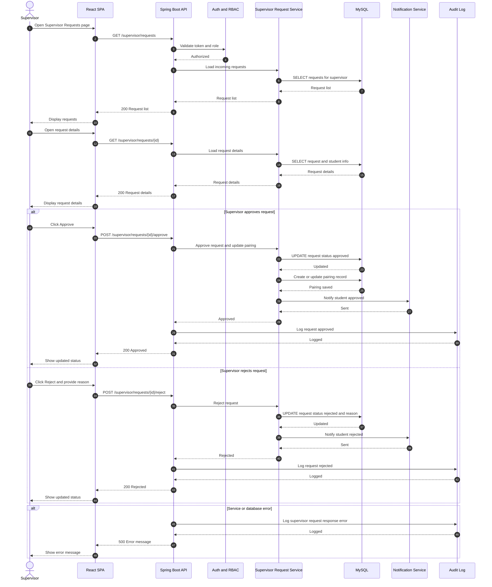
```mermaid
sequenceDiagram
  autonumber
  actor SUP as Supervisor
  participant FE as React SPA
  participant BE as Spring Boot API
  participant AUTH as Auth and RBAC
  participant REQ as Supervisor Request Service
  participant DB as MySQL
  participant NOTI as Notification Service
  participant AUD as Audit Log

  SUP->>FE: Open Supervisor Requests page
  FE->>BE: GET /supervisor/requests
  BE->>AUTH: Validate token and role
  AUTH-->>BE: Authorized
  BE->>REQ: Load incoming requests
  REQ->>DB: SELECT requests for supervisor
  DB-->>REQ: Request list
  REQ-->>BE: Request list
  BE-->>FE: 200 Request list
  FE-->>SUP: Display requests

  SUP->>FE: Open request details
  FE->>BE: GET /supervisor/requests/{id}
  BE->>REQ: Load request details
  REQ->>DB: SELECT request and student info
  DB-->>REQ: Request details
  REQ-->>BE: Request details
  BE-->>FE: 200 Request details
  FE-->>SUP: Display request details

  alt Supervisor approves request
    SUP->>FE: Click Approve
    FE->>BE: POST /supervisor/requests/{id}/approve
    BE->>REQ: Approve request and update pairing
    REQ->>DB: UPDATE request status approved
    DB-->>REQ: Updated
    REQ->>DB: Create or update pairing record
    DB-->>REQ: Pairing saved
    REQ->>NOTI: Notify student approved
    NOTI-->>REQ: Sent
    REQ-->>BE: Approved
    BE->>AUD: Log request approved
    AUD-->>BE: Logged
    BE-->>FE: 200 Approved
    FE-->>SUP: Show updated status
  else Supervisor rejects request
    SUP->>FE: Click Reject and provide reason
    FE->>BE: POST /supervisor/requests/{id}/reject
    BE->>REQ: Reject request
    REQ->>DB: UPDATE request status rejected and reason
    DB-->>REQ: Updated
    REQ->>NOTI: Notify student rejected
    NOTI-->>REQ: Sent
    REQ-->>BE: Rejected
    BE->>AUD: Log request rejected
    AUD-->>BE: Logged
    BE-->>FE: 200 Rejected
    FE-->>SUP: Show updated status
  end

  alt Service or database error
    BE->>AUD: Log supervisor request response error
    AUD-->>BE: Logged
    BE-->>FE: 500 Error message
    FE-->>SUP: Show error message
  end
```

### Report (numbered)

1. Supervisor opens **Requests** module; system loads incoming requests.
    
2. Supervisor views a request and chooses approve or reject.
    
3. On approve, the system updates request status, creates pairing, notifies student, and logs the action.
    
4. On reject, the system updates status with reason, notifies student, and logs the action.
    
5. Errors are logged and shown to the supervisor.
    

---

## 4.2.18 UC18 View Supervisee List and Project Details (Supervisor)

**Figure 4.28 UC18 View Supervisee List and Project Details Sequence Diagram**

### Mermaid

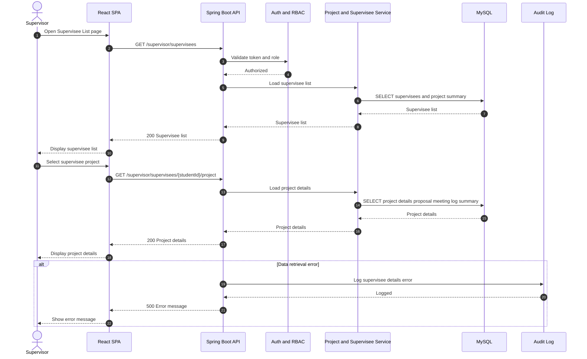
```mermaid
sequenceDiagram
  autonumber
  actor SUP as Supervisor
  participant FE as React SPA
  participant BE as Spring Boot API
  participant AUTH as Auth and RBAC
  participant PROJ as Project and Supervisee Service
  participant DB as MySQL
  participant AUD as Audit Log

  SUP->>FE: Open Supervisee List page
  FE->>BE: GET /supervisor/supervisees
  BE->>AUTH: Validate token and role
  AUTH-->>BE: Authorized
  BE->>PROJ: Load supervisee list
  PROJ->>DB: SELECT supervisees and project summary
  DB-->>PROJ: Supervisee list
  PROJ-->>BE: Supervisee list
  BE-->>FE: 200 Supervisee list
  FE-->>SUP: Display supervisee list

  SUP->>FE: Select supervisee project
  FE->>BE: GET /supervisor/supervisees/{studentId}/project
  BE->>PROJ: Load project details
  PROJ->>DB: SELECT project details proposal meeting log summary
  DB-->>PROJ: Project details
  PROJ-->>BE: Project details
  BE-->>FE: 200 Project details
  FE-->>SUP: Display project details

  alt Data retrieval error
    BE->>AUD: Log supervisee details error
    AUD-->>BE: Logged
    BE-->>FE: 500 Error message
    FE-->>SUP: Show error message
  end
```

### Report (numbered)

1. Supervisor opens **Supervisee List**; system loads supervisee projects.
    
2. Supervisor selects a supervisee; system loads detailed project information from **MySQL**.
    
3. Frontend displays supervisee list and selected project details.
    
4. Any retrieval error is logged and displayed.
    

---

## 4.2.19 UC19 Review Student Proposal (Supervisor)

**Figure 4.29 UC19 Review Student Proposal Sequence Diagram**

### Mermaid

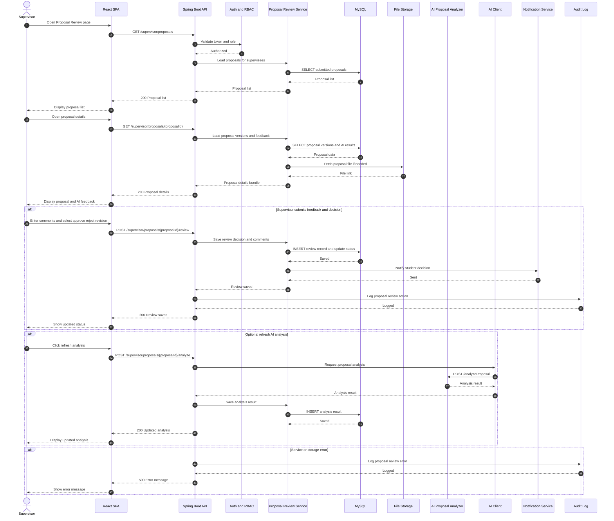
```mermaid
sequenceDiagram
  autonumber
  actor SUP as Supervisor
  participant FE as React SPA
  participant BE as Spring Boot API
  participant AUTH as Auth and RBAC
  participant PROP as Proposal Review Service
  participant DB as MySQL
  participant FS as File Storage
  participant AI as AI Proposal Analyzer
  participant AIClient as AI Client
  participant NOTI as Notification Service
  participant AUD as Audit Log

  SUP->>FE: Open Proposal Review page
  FE->>BE: GET /supervisor/proposals
  BE->>AUTH: Validate token and role
  AUTH-->>BE: Authorized
  BE->>PROP: Load proposals for supervisees
  PROP->>DB: SELECT submitted proposals
  DB-->>PROP: Proposal list
  PROP-->>BE: Proposal list
  BE-->>FE: 200 Proposal list
  FE-->>SUP: Display proposal list

  SUP->>FE: Open proposal details
  FE->>BE: GET /supervisor/proposals/{proposalId}
  BE->>PROP: Load proposal versions and feedback
  PROP->>DB: SELECT proposal versions and AI results
  DB-->>PROP: Proposal data
  PROP->>FS: Fetch proposal file if needed
  FS-->>PROP: File link
  PROP-->>BE: Proposal details bundle
  BE-->>FE: 200 Proposal details
  FE-->>SUP: Display proposal and AI feedback

  alt Supervisor submits feedback and decision
    SUP->>FE: Enter comments and select approve reject revision
    FE->>BE: POST /supervisor/proposals/{proposalId}/review
    BE->>PROP: Save review decision and comments
    PROP->>DB: INSERT review record and update status
    DB-->>PROP: Saved
    PROP->>NOTI: Notify student decision
    NOTI-->>PROP: Sent
    PROP-->>BE: Review saved
    BE->>AUD: Log proposal review action
    AUD-->>BE: Logged
    BE-->>FE: 200 Review saved
    FE-->>SUP: Show updated status
  end

  alt Optional refresh AI analysis
    SUP->>FE: Click refresh analysis
    FE->>BE: POST /supervisor/proposals/{proposalId}/analyze
    BE->>AIClient: Request proposal analysis
    AIClient->>AI: POST /analyzeProposal
    AI-->>AIClient: Analysis result
    AIClient-->>BE: Analysis result
    BE->>PROP: Save analysis result
    PROP->>DB: INSERT analysis result
    DB-->>PROP: Saved
    BE-->>FE: 200 Updated analysis
    FE-->>SUP: Display updated analysis
  end

  alt Service or storage error
    BE->>AUD: Log proposal review error
    AUD-->>BE: Logged
    BE-->>FE: 500 Error message
    FE-->>SUP: Show error message
  end
```

### Report (numbered)

1. Supervisor opens **Proposal Review** and loads submitted proposals.
    
2. Supervisor opens a proposal; system loads versions, files, and AI results.
    
3. Supervisor enters comments and submits decision; system updates status, stores feedback, notifies student, and logs the action.
    
4. Supervisor may refresh AI analysis; system calls AI service and stores updated results.
    
5. Errors are logged and shown.
    

---

## 4.2.20 UC20 Manage Supervision Meetings (Supervisor)

**Figure 4.30 UC20 Manage Supervision Meetings Sequence Diagram**

### Mermaid

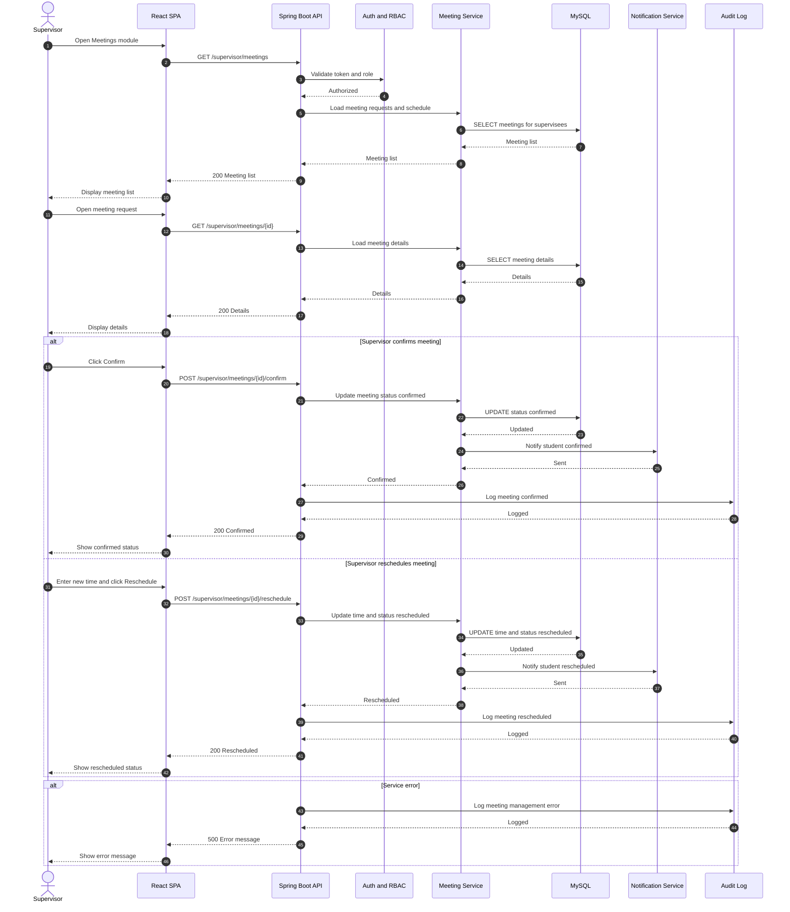
```mermaid
sequenceDiagram
  autonumber
  actor SUP as Supervisor
  participant FE as React SPA
  participant BE as Spring Boot API
  participant AUTH as Auth and RBAC
  participant MEET as Meeting Service
  participant DB as MySQL
  participant NOTI as Notification Service
  participant AUD as Audit Log

  SUP->>FE: Open Meetings module
  FE->>BE: GET /supervisor/meetings
  BE->>AUTH: Validate token and role
  AUTH-->>BE: Authorized
  BE->>MEET: Load meeting requests and schedule
  MEET->>DB: SELECT meetings for supervisees
  DB-->>MEET: Meeting list
  MEET-->>BE: Meeting list
  BE-->>FE: 200 Meeting list
  FE-->>SUP: Display meeting list

  SUP->>FE: Open meeting request
  FE->>BE: GET /supervisor/meetings/{id}
  BE->>MEET: Load meeting details
  MEET->>DB: SELECT meeting details
  DB-->>MEET: Details
  MEET-->>BE: Details
  BE-->>FE: 200 Details
  FE-->>SUP: Display details

  alt Supervisor confirms meeting
    SUP->>FE: Click Confirm
    FE->>BE: POST /supervisor/meetings/{id}/confirm
    BE->>MEET: Update meeting status confirmed
    MEET->>DB: UPDATE status confirmed
    DB-->>MEET: Updated
    MEET->>NOTI: Notify student confirmed
    NOTI-->>MEET: Sent
    MEET-->>BE: Confirmed
    BE->>AUD: Log meeting confirmed
    AUD-->>BE: Logged
    BE-->>FE: 200 Confirmed
    FE-->>SUP: Show confirmed status
  else Supervisor reschedules meeting
    SUP->>FE: Enter new time and click Reschedule
    FE->>BE: POST /supervisor/meetings/{id}/reschedule
    BE->>MEET: Update time and status rescheduled
    MEET->>DB: UPDATE time and status rescheduled
    DB-->>MEET: Updated
    MEET->>NOTI: Notify student rescheduled
    NOTI-->>MEET: Sent
    MEET-->>BE: Rescheduled
    BE->>AUD: Log meeting rescheduled
    AUD-->>BE: Logged
    BE-->>FE: 200 Rescheduled
    FE-->>SUP: Show rescheduled status
  end

  alt Service error
    BE->>AUD: Log meeting management error
    AUD-->>BE: Logged
    BE-->>FE: 500 Error message
    FE-->>SUP: Show error message
  end
```

### Report (numbered)

1. Supervisor opens **Meetings** module and views meeting requests.
    
2. Supervisor opens a request to view details.
    
3. Supervisor confirms or reschedules; system updates the meeting record, notifies student, and logs the action.
    
4. Errors are logged and shown.
    

---

## 4.2.21 UC21 Review, Comment on and Sign Supervision Log (Supervisor)

**Figure 4.31 UC21 Review, Comment on and Sign Supervision Log Sequence Diagram**

### Mermaid

```mermaid
sequenceDiagram
  autonumber
  actor SUP as Supervisor
  participant FE as React SPA
  participant BE as Spring Boot API
  participant AUTH as Auth and RBAC
  participant LOG as Supervision Log Service
  participant DB as MySQL
  participant FS as File Storage
  participant NOTI as Notification Service
  participant AUD as Audit Log

  SUP->>FE: Open Supervision Logs module
  FE->>BE: GET /supervisor/logs
  BE->>AUTH: Validate token and role
  AUTH-->>BE: Authorized
  BE->>LOG: Load submitted logs for supervisees
  LOG->>DB: SELECT logs and status
  DB-->>LOG: Log list
  LOG-->>BE: Log list
  BE-->>FE: 200 Log list
  FE-->>SUP: Display logs list

  SUP->>FE: Open log details
  FE->>BE: GET /supervisor/logs/{id}
  BE->>LOG: Load log content and file link
  LOG->>DB: SELECT log content and signatures
  DB-->>LOG: Log content
  LOG->>FS: Fetch log file if any
  FS-->>LOG: File link
  LOG-->>BE: Log details
  BE-->>FE: 200 Log details
  FE-->>SUP: Display log details

  alt Supervisor comments and requests correction
    SUP->>FE: Enter comments and request correction
    FE->>BE: POST /supervisor/logs/{id}/request-correction
    BE->>LOG: Save comments and set status correction requested
    LOG->>DB: UPDATE log status and comments
    DB-->>LOG: Updated
    LOG->>NOTI: Notify student correction requested
    NOTI-->>LOG: Sent
    LOG-->>BE: Updated
    BE->>AUD: Log correction request
    AUD-->>BE: Logged
    BE-->>FE: 200 Updated
    FE-->>SUP: Show updated status
  else Supervisor signs log
    SUP->>FE: Click Sign Log
    FE->>BE: POST /supervisor/logs/{id}/sign
    BE->>LOG: Check log status and lock state
    alt Log not ready for signing
      LOG-->>BE: Not allowed
      BE-->>FE: 400 Not allowed message
      FE-->>SUP: Show current status
    else Ready
      LOG->>DB: Save supervisor signature
      DB-->>LOG: Saved
      LOG->>DB: Check both signatures
      DB-->>LOG: Both signed or not
      alt Both signatures exist
        LOG->>DB: Lock log official
        DB-->>LOG: Locked
      end
      LOG-->>BE: Signed
      BE->>AUD: Log supervisor signing
      AUD-->>BE: Logged
      BE-->>FE: 200 Signed
      FE-->>SUP: Show signed and lock status
    end
  end

  alt Service or storage error
    BE->>AUD: Log supervision log review error
    AUD-->>BE: Logged
    BE-->>FE: 500 Error message
    FE-->>SUP: Show error message
  end
```

### Report (numbered)

1. Supervisor opens **Logs** module and views submitted logs.
    
2. Supervisor opens a log and reviews content and attachments.
    
3. Supervisor may request correction with comments; system updates status and notifies student.
    
4. Supervisor may sign the log; system records the signature and locks the log when both signatures exist.
    
5. Errors are logged and shown.
    

---

## 4.2.22 UC22 View Supervisee Progress Dashboard (Supervisor)

**Figure 4.32 UC22 View Supervisee Progress Dashboard Sequence Diagram**

### Mermaid

```mermaid
sequenceDiagram
  autonumber
  actor SUP as Supervisor
  participant FE as React SPA
  participant BE as Spring Boot API
  participant AUTH as Auth and RBAC
  participant DASH as Progress Dashboard Service
  participant DB as MySQL
  participant AUD as Audit Log

  SUP->>FE: Open Supervisee Progress Dashboard
  FE->>BE: GET /supervisor/progress
  BE->>AUTH: Validate token and role
  AUTH-->>BE: Authorized

  BE->>DASH: Load progress summary for supervisees
  DASH->>DB: SELECT proposal status meeting log and document summary
  DB-->>DASH: Progress data
  DASH-->>BE: Progress data
  BE-->>FE: 200 Progress data
  FE-->>SUP: Display progress cards and alerts

  alt Data retrieval error
    BE->>AUD: Log progress dashboard error
    AUD-->>BE: Logged
    BE-->>FE: 500 Error message
    FE-->>SUP: Show error message
  end
```

### Report (numbered)

1. Supervisor opens **Progress Dashboard**.
    
2. System loads supervisee progress summary from **MySQL**.
    
3. Frontend displays progress cards and alerts.
    
4. Errors are logged and displayed.
    

---

## 4.2.23 UC23 Upload, Download and Review FYP Documents (Supervisor)

**Figure 4.33 UC23 Upload, Download and Review FYP Documents Sequence Diagram**

### Mermaid

```mermaid
sequenceDiagram
  autonumber
  actor SUP as Supervisor
  participant FE as React SPA
  participant BE as Spring Boot API
  participant AUTH as Auth and RBAC
  participant DOC as Document Review Service
  participant DB as MySQL
  participant FS as File Storage
  participant NOTI as Notification Service
  participant AUD as Audit Log

  SUP->>FE: Open Documents module
  FE->>BE: GET /supervisor/documents
  BE->>AUTH: Validate token and role
  AUTH-->>BE: Authorized
  BE->>DOC: Load supervisee documents list
  DOC->>DB: SELECT documents metadata
  DB-->>DOC: Document list
  DOC-->>BE: Document list
  BE-->>FE: 200 Document list
  FE-->>SUP: Display documents list

  SUP->>FE: Download document
  FE->>BE: GET /supervisor/documents/{id}/download
  BE->>DOC: Resolve file link
  DOC->>FS: Fetch file
  FS-->>DOC: File stream
  DOC-->>BE: File stream
  BE-->>FE: 200 File stream
  FE-->>SUP: Download file

  alt Supervisor uploads feedback file
    SUP->>FE: Upload feedback document
    FE->>BE: POST /supervisor/documents/{id}/feedback
    BE->>DOC: Store feedback and link to document
    DOC->>FS: Store feedback file
    FS-->>DOC: Feedback file URL
    DOC->>DB: INSERT feedback record
    DB-->>DOC: Saved
    DOC->>NOTI: Notify student feedback uploaded
    NOTI-->>DOC: Sent
    DOC-->>BE: Feedback saved
    BE->>AUD: Log feedback upload
    AUD-->>BE: Logged
    BE-->>FE: 200 Feedback uploaded
    FE-->>SUP: Show feedback uploaded
  end

  alt Document retrieval or storage error
    BE->>AUD: Log document review error
    AUD-->>BE: Logged
    BE-->>FE: 500 Error message
    FE-->>SUP: Show error message
  end
```

### Report (numbered)

1. Supervisor opens **Documents** module and loads supervisee document list.
    
2. Supervisor downloads a document; the system retrieves the file from storage.
    
3. Supervisor may upload feedback; the system stores the feedback file, records metadata, notifies the student, and logs the action.
    
4. Errors are logged and displayed.
    

---

## 4.2.24 UC24 Publish FYP Announcements (Supervisor, FYP Committee)

**Figure 4.34 UC24 Publish FYP Announcements Sequence Diagram**

### Mermaid

```mermaid
sequenceDiagram
  autonumber
  actor P as Publisher
  participant FE as React SPA
  participant BE as Spring Boot API
  participant AUTH as Auth and RBAC
  participant ANN as Announcement Service
  participant DB as MySQL
  participant NOTI as Notification Service
  participant AUD as Audit Log

  P->>FE: Open Announcements module
  FE->>BE: GET /announcements/manage
  BE->>AUTH: Validate token and role
  AUTH-->>BE: Authorized
  BE->>ANN: Load existing announcements
  ANN->>DB: SELECT announcements by scope
  DB-->>ANN: Announcement list
  ANN-->>BE: Announcement list
  BE-->>FE: 200 Announcement list
  FE-->>P: Display announcements list

  P->>FE: Click Create Announcement
  FE-->>P: Enter title content scope audience and schedule
  FE->>BE: POST /announcements
  BE->>AUTH: Validate token and role
  AUTH-->>BE: Authorized
  BE->>ANN: Validate announcement inputs

  alt Invalid input
    ANN-->>BE: Validation errors
    BE-->>FE: 400 Validation errors
    FE-->>P: Show validation messages
  else Valid input
    ANN->>DB: INSERT announcement record
    DB-->>ANN: Saved
    ANN->>NOTI: Send announcement notifications
    NOTI-->>ANN: Sent
    ANN-->>BE: Publish success
    BE->>AUD: Log announcement published
    AUD-->>BE: Logged
    BE-->>FE: 201 Published
    FE-->>P: Show publish success
  end

  alt Service or notification error
    BE->>AUD: Log announcement publish error
    AUD-->>BE: Logged
    BE-->>FE: 500 Error message
    FE-->>P: Show error message
  end
```

### Report (numbered)

1. Supervisor or FYP Committee opens the **Announcements** module.
    
2. System loads existing announcements after validating access via **Auth and RBAC**.
    
3. Publisher creates an announcement by entering title, content, scope, and target audience.
    
4. System validates inputs; if invalid, validation messages are displayed.
    
5. If valid, the announcement is stored in **MySQL**, notifications are sent, and the action is logged.
    
6. Any error is logged and shown to the publisher.
    

---

## 4.2.25 UC25 View Proposal Review Queue (FYP Committee)

**Figure 4.35 UC25 View Proposal Review Queue Sequence Diagram**

### Mermaid

```mermaid
sequenceDiagram
  autonumber
  actor COM as FYP Committee
  participant FE as React SPA
  participant BE as Spring Boot API
  participant AUTH as Auth and RBAC
  participant QUE as Proposal Queue Service
  participant DB as MySQL
  participant AUD as Audit Log

  COM->>FE: Open Proposal Review Queue
  FE->>BE: GET /committee/proposals/queue
  BE->>AUTH: Validate token and role
  AUTH-->>BE: Authorized
  BE->>QUE: Load proposals pending committee review
  QUE->>DB: SELECT proposals by status pending
  DB-->>QUE: Proposal queue list
  QUE-->>BE: Proposal queue list
  BE-->>FE: 200 Proposal queue list
  FE-->>COM: Display queue list with filters

  alt Committee applies filter or search
    COM->>FE: Apply filters
    FE->>BE: GET /committee/proposals/queue?filter=...
    BE->>QUE: Load filtered queue
    QUE->>DB: SELECT filtered proposals
    DB-->>QUE: Filtered list
    QUE-->>BE: Filtered list
    BE-->>FE: 200 Filtered list
    FE-->>COM: Refresh queue list
  end

  alt Data retrieval error
    BE->>AUD: Log proposal queue load error
    AUD-->>BE: Logged
    BE-->>FE: 500 Error message
    FE-->>COM: Show error message
  end
```

### Report (numbered)

1. FYP Committee opens the **Proposal Review Queue**.
    
2. Backend validates the committee role and loads proposals pending review from **MySQL**.
    
3. Frontend displays the queue and supports filtering/searching.
    
4. Errors during retrieval are logged and shown.
    

---

## 4.2.26 UC26 Review Proposal (FYP Committee)

**Figure 4.36 UC26 Review Proposal Sequence Diagram**

### Mermaid

```mermaid
sequenceDiagram
  autonumber
  actor COM as FYP Committee
  participant FE as React SPA
  participant BE as Spring Boot API
  participant AUTH as Auth and RBAC
  participant REV as Committee Proposal Review Service
  participant DB as MySQL
  participant FS as File Storage
  participant NOTI as Notification Service
  participant AUD as Audit Log

  COM->>FE: Open proposal from queue
  FE->>BE: GET /committee/proposals/{proposalId}
  BE->>AUTH: Validate token and role
  AUTH-->>BE: Authorized
  BE->>REV: Load proposal details and history
  REV->>DB: SELECT proposal details and reviews
  DB-->>REV: Proposal data
  REV->>FS: Fetch proposal file if needed
  FS-->>REV: File link
  REV-->>BE: Proposal bundle
  BE-->>FE: 200 Proposal bundle
  FE-->>COM: Display proposal details and status

  COM->>FE: Enter comments and decision
  FE->>BE: POST /committee/proposals/{proposalId}/review
  BE->>REV: Validate and save committee review
  alt Invalid decision or missing comments
    REV-->>BE: Validation errors
    BE-->>FE: 400 Validation errors
    FE-->>COM: Show validation messages
  else Valid review
    REV->>DB: INSERT committee review and update status
    DB-->>REV: Saved
    REV->>NOTI: Notify student and supervisor
    NOTI-->>REV: Sent
    REV-->>BE: Review saved
    BE->>AUD: Log committee review
    AUD-->>BE: Logged
    BE-->>FE: 200 Review saved
    FE-->>COM: Show updated status
  end

  alt Service or storage error
    BE->>AUD: Log committee proposal review error
    AUD-->>BE: Logged
    BE-->>FE: 500 Error message
    FE-->>COM: Show error message
  end
```

### Report (numbered)

1. Committee opens a proposal from the queue.
    
2. System validates access and loads proposal details, history, and file link.
    
3. Committee submits decision and comments.
    
4. System validates the review; if valid, saves decision, updates status, notifies relevant users, and logs the action.
    
5. Errors are logged and shown.
    

---

## 4.2.27 UC27 Manage General FYP Documents (FYP Committee)

**Figure 4.37 UC27 Manage General FYP Documents Sequence Diagram**

### Mermaid

```mermaid
sequenceDiagram
  autonumber
  actor COM as FYP Committee
  participant FE as React SPA
  participant BE as Spring Boot API
  participant AUTH as Auth and RBAC
  participant RES as Resource Document Service
  participant DB as MySQL
  participant FS as File Storage
  participant AUD as Audit Log

  COM->>FE: Open General FYP Documents module
  FE->>BE: GET /committee/resources
  BE->>AUTH: Validate token and role
  AUTH-->>BE: Authorized
  BE->>RES: Load resource list
  RES->>DB: SELECT resource metadata
  DB-->>RES: Resource list
  RES-->>BE: Resource list
  BE-->>FE: 200 Resource list
  FE-->>COM: Display resources

  alt Committee uploads new resource
    COM->>FE: Select category and upload file
    FE->>BE: POST /committee/resources/upload
    BE->>RES: Validate file and metadata
    alt Invalid file or missing metadata
      RES-->>BE: Validation errors
      BE-->>FE: 400 Validation errors
      FE-->>COM: Show validation messages
    else Valid
      RES->>FS: Store file
      FS-->>RES: File URL
      RES->>DB: INSERT resource record
      DB-->>RES: Saved
      BE->>AUD: Log resource upload
      AUD-->>BE: Logged
      BE-->>FE: 200 Uploaded
      FE-->>COM: Show success
    end
  end

  alt Committee updates resource metadata
    COM->>FE: Edit resource title category or deadline tag
    FE->>BE: PUT /committee/resources/{id}
    BE->>RES: Update metadata
    RES->>DB: UPDATE resource metadata
    DB-->>RES: Updated
    BE-->>FE: 200 Updated
    FE-->>COM: Show updated resource
  end

  alt Missing resource file
    BE->>AUD: Log missing resource file
    AUD-->>BE: Logged
    BE-->>FE: 404 Error message
    FE-->>COM: Show error message
  end
```

### Report (numbered)

1. Committee opens **General FYP Documents** and views existing resources.
    
2. Committee may upload a new resource; system validates, stores file, saves metadata, and logs the action.
    
3. Committee may update resource metadata; system updates records in **MySQL**.
    
4. Missing file incidents are logged and shown.
    

---

## 4.2.28 UC28 View FYP Project and Pairing Overview (FYP Committee)

**Figure 4.38 UC28 View FYP Project and Pairing Overview Sequence Diagram**

### Mermaid

```mermaid
sequenceDiagram
  autonumber
  actor COM as FYP Committee
  participant FE as React SPA
  participant BE as Spring Boot API
  participant AUTH as Auth and RBAC
  participant OVR as Pairing Overview Service
  participant DB as MySQL
  participant AUD as Audit Log

  COM->>FE: Open Project and Pairing Overview
  FE->>BE: GET /committee/overview
  BE->>AUTH: Validate token and role
  AUTH-->>BE: Authorized
  BE->>OVR: Load overview metrics and lists
  OVR->>DB: SELECT project pairing and load status
  DB-->>OVR: Overview data
  OVR-->>BE: Overview data
  BE-->>FE: 200 Overview data
  FE-->>COM: Display overview dashboard

  alt Committee applies filters
    COM->>FE: Filter by cycle status or unpaired
    FE->>BE: GET /committee/overview?filter=...
    BE->>OVR: Load filtered overview
    OVR->>DB: SELECT filtered data
    DB-->>OVR: Filtered data
    OVR-->>BE: Filtered data
    BE-->>FE: 200 Filtered data
    FE-->>COM: Refresh overview dashboard
  end

  alt Data retrieval error
    BE->>AUD: Log overview load error
    AUD-->>BE: Logged
    BE-->>FE: 500 Error message
    FE-->>COM: Show error message
  end
```

### Report (numbered)

1. Committee opens the **Project and Pairing Overview** page.
    
2. System validates access and retrieves pairing, load, and project status metrics from **MySQL**.
    
3. Committee can apply filters; system refreshes the displayed overview.
    
4. Errors are logged and shown.
    

---

## 4.2.29 UC29 Generate and Export FYP Reports (FYP Committee)

**Figure 4.39 UC29 Generate and Export FYP Reports Sequence Diagram**

### Mermaid

```mermaid
sequenceDiagram
  autonumber
  actor COM as FYP Committee
  participant FE as React SPA
  participant BE as Spring Boot API
  participant AUTH as Auth and RBAC
  participant REP as Report Export Service
  participant DB as MySQL
  participant FS as File Storage
  participant AUD as Audit Log

  COM->>FE: Open Reports module
  FE->>BE: GET /committee/reports
  BE->>AUTH: Validate token and role
  AUTH-->>BE: Authorized
  BE-->>FE: 200 Report options
  FE-->>COM: Display report filters and types

  COM->>FE: Select report type and filters and click Generate
  FE->>BE: POST /committee/reports/generate
  BE->>REP: Build report dataset
  REP->>DB: SELECT required report data
  DB-->>REP: Dataset
  REP->>REP: Generate report file
  REP->>FS: Store generated report file
  FS-->>REP: File link
  REP-->>BE: Report file link
  BE->>AUD: Log report generation
  AUD-->>BE: Logged
  BE-->>FE: 200 Report link
  FE-->>COM: Download report file

  alt Generation error
    BE->>AUD: Log report generation error
    AUD-->>BE: Logged
    BE-->>FE: 500 Error message
    FE-->>COM: Show error message
  end
```

### Report (numbered)

1. Committee opens **Reports** module and views available report types and filters.
    
2. Committee selects report type and parameters, then generates the report.
    
3. Report service retrieves required data from **MySQL**, generates the report file, and stores it in **File Storage**.
    
4. System returns a downloadable link and logs the generation activity.
    
5. Any generation error is logged and displayed.
    

---
## 4.2.30 UC30 Manage User Accounts and Roles (System Administrator)

**Figure 4.40 UC30 Manage User Accounts and Roles Sequence Diagram**

### Mermaid

```mermaid
sequenceDiagram
  autonumber
  actor ADM as System Administrator
  participant FE as React SPA
  participant BE as Spring Boot API
  participant AUTH as Auth and RBAC
  participant UMS as User Account Service
  participant DB as MySQL
  participant NOTI as Notification Service
  participant AUD as Audit Log

  ADM->>FE: Open User Management module
  FE->>BE: GET /admin/users
  BE->>AUTH: Validate token and admin role
  AUTH-->>BE: Authorized
  BE->>UMS: Load user accounts list
  UMS->>DB: SELECT users with roles and status
  DB-->>UMS: User list
  UMS-->>BE: User list
  BE-->>FE: 200 User list
  FE-->>ADM: Display users list and actions

  alt Create user account
    ADM->>FE: Click Create User
    FE-->>ADM: Enter user details and role
    FE->>BE: POST /admin/users
    BE->>UMS: Validate and create account
    alt Invalid input or duplicate
      UMS-->>BE: Validation or duplicate error
      BE-->>FE: 400 Error message
      FE-->>ADM: Show validation message
    else Valid
      UMS->>DB: INSERT user account and role
      DB-->>UMS: Created
      UMS->>NOTI: Send account credentials or invite
      NOTI-->>UMS: Sent
      UMS-->>BE: Created
      BE->>AUD: Log user created
      AUD-->>BE: Logged
      BE-->>FE: 201 Created
      FE-->>ADM: Show success and refresh list
    end
  end

  alt Update role or status
    ADM->>FE: Change role or activate deactivate
    FE->>BE: PUT /admin/users/{id}
    BE->>UMS: Validate update rules
    alt Invalid update
      UMS-->>BE: Update blocked message
      BE-->>FE: 400 Blocked
      FE-->>ADM: Show blocked reason
    else Valid update
      UMS->>DB: UPDATE role or status
      DB-->>UMS: Updated
      UMS-->>BE: Updated
      BE->>AUD: Log user updated
      AUD-->>BE: Logged
      BE-->>FE: 200 Updated
      FE-->>ADM: Show success
    end
  end

  alt Service or database error
    BE->>AUD: Log user management error
    AUD-->>BE: Logged
    BE-->>FE: 500 Error message
    FE-->>ADM: Show error message
  end
```

### Report (numbered)

1. System Administrator opens **User Management** and requests the user list.
    
2. Backend validates admin access and loads users, roles, and status from **MySQL**.
    
3. Admin may create a user by entering details and selecting a role; system validates and checks duplicates.
    
4. If valid, the account is created, notification is sent, and the action is logged.
    
5. Admin may update a user’s role or status; system validates and updates **MySQL**, then logs the action.
    
6. Errors are logged and displayed.
    

---

## 4.2.31 UC31 Configure System Parameters (System Administrator)

**Figure 4.41 UC31 Configure System Parameters Sequence Diagram**

### Mermaid

```mermaid
sequenceDiagram
  autonumber
  actor ADM as System Administrator
  participant FE as React SPA
  participant BE as Spring Boot API
  participant AUTH as Auth and RBAC
  participant CFG as System Parameter Service
  participant DB as MySQL
  participant AUD as Audit Log

  ADM->>FE: Open System Parameters module
  FE->>BE: GET /admin/config/parameters
  BE->>AUTH: Validate token and admin role
  AUTH-->>BE: Authorized
  BE->>CFG: Load parameters
  CFG->>DB: SELECT system parameters
  DB-->>CFG: Parameter list
  CFG-->>BE: Parameter list
  BE-->>FE: 200 Parameter list
  FE-->>ADM: Display parameters

  ADM->>FE: Edit parameter values
  FE->>BE: PUT /admin/config/parameters
  BE->>CFG: Validate parameter rules
  alt Invalid value
    CFG-->>BE: Validation errors
    BE-->>FE: 400 Validation errors
    FE-->>ADM: Show validation messages
  else Valid
    CFG->>DB: UPDATE parameters
    DB-->>CFG: Updated
    CFG-->>BE: Updated
    BE->>AUD: Log parameter update
    AUD-->>BE: Logged
    BE-->>FE: 200 Updated
    FE-->>ADM: Show success
  end

  alt Service error
    BE->>AUD: Log parameter configuration error
    AUD-->>BE: Logged
    BE-->>FE: 500 Error message
    FE-->>ADM: Show error message
  end
```

### Report (numbered)

1. Admin opens **System Parameters** module and loads current configuration values.
    
2. System validates admin access and retrieves parameters from **MySQL**.
    
3. Admin updates parameter values; system validates rules and constraints.
    
4. If valid, parameters are updated and the action is logged; otherwise validation errors are displayed.
    
5. Any service error is logged and shown.
    

---

## 4.2.32 UC32 Configure Integration and Export Settings (System Administrator)

**Figure 4.42 UC32 Configure Integration and Export Settings Sequence Diagram**

### Mermaid

```mermaid
sequenceDiagram
  autonumber
  actor ADM as System Administrator
  participant FE as React SPA
  participant BE as Spring Boot API
  participant AUTH as Auth and RBAC
  participant INT as Integration Setting Service
  participant DB as MySQL
  participant EXT as External System
  participant AUD as Audit Log

  ADM->>FE: Open Integration and Export Settings
  FE->>BE: GET /admin/config/integrations
  BE->>AUTH: Validate token and admin role
  AUTH-->>BE: Authorized
  BE->>INT: Load integration and export settings
  INT->>DB: SELECT integration settings
  DB-->>INT: Settings list
  INT-->>BE: Settings list
  BE-->>FE: 200 Settings list
  FE-->>ADM: Display settings

  ADM->>FE: Update API keys endpoints export rules
  FE->>BE: PUT /admin/config/integrations
  BE->>INT: Validate settings format

  alt Test connection enabled
    INT->>EXT: Test connection
    EXT-->>INT: Test result
  end

  alt Invalid settings or test failed
    INT-->>BE: Error message
    BE-->>FE: 400 Error message
    FE-->>ADM: Show error and guidance
  else Valid
    INT->>DB: UPDATE integration settings
    DB-->>INT: Updated
    INT-->>BE: Updated
    BE->>AUD: Log integration settings update
    AUD-->>BE: Logged
    BE-->>FE: 200 Updated
    FE-->>ADM: Show success
  end

  alt Service error
    BE->>AUD: Log integration configuration error
    AUD-->>BE: Logged
    BE-->>FE: 500 Error message
    FE-->>ADM: Show error message
  end
```

### Report (numbered)

1. Admin opens **Integration and Export Settings** module.
    
2. System validates admin access and loads current settings from **MySQL**.
    
3. Admin updates endpoints, API keys, and export rules; system validates format and optionally runs a connection test.
    
4. If settings are invalid or test fails, the system shows an error; otherwise settings are saved and logged.
    
5. Errors are logged and displayed.
    

---

## 4.2.33 UC33 Perform System Maintenance (System Administrator)

**Figure 4.43 UC33 Perform System Maintenance Sequence Diagram**

### Mermaid

```mermaid
sequenceDiagram
  autonumber
  actor ADM as System Administrator
  participant FE as React SPA
  participant BE as Spring Boot API
  participant AUTH as Auth and RBAC
  participant MAIN as Maintenance Service
  participant DB as MySQL
  participant FS as File Storage
  participant AUD as Audit Log

  ADM->>FE: Open System Maintenance module
  FE->>BE: GET /admin/maintenance
  BE->>AUTH: Validate token and admin role
  AUTH-->>BE: Authorized
  BE-->>FE: 200 Maintenance options
  FE-->>ADM: Display maintenance actions

  alt Backup database and files
    ADM->>FE: Click Run Backup
    FE->>BE: POST /admin/maintenance/backup
    BE->>MAIN: Execute backup job
    MAIN->>DB: Export database backup
    DB-->>MAIN: Backup file
    MAIN->>FS: Store backup file
    FS-->>MAIN: Stored
    MAIN-->>BE: Backup completed
    BE->>AUD: Log backup completed
    AUD-->>BE: Logged
    BE-->>FE: 200 Backup success
    FE-->>ADM: Show backup success
  end

  alt View audit logs
    ADM->>FE: Open audit log viewer
    FE->>BE: GET /admin/audit
    BE->>DB: SELECT audit logs
    DB-->>BE: Audit log list
    BE-->>FE: 200 Audit log list
    FE-->>ADM: Display audit logs
  end

  alt System health check
    ADM->>FE: Run health check
    FE->>BE: GET /admin/maintenance/health
    BE->>MAIN: Run health checks
    MAIN-->>BE: Health status
    BE-->>FE: 200 Health status
    FE-->>ADM: Display health status
  end

  alt Maintenance failure
    BE->>AUD: Log maintenance error
    AUD-->>BE: Logged
    BE-->>FE: 500 Error message
    FE-->>ADM: Show error message
  end
```

### Report (numbered)

1. Admin opens **System Maintenance** module and views maintenance actions.
    
2. For backup, system executes a backup job, stores backup output, and logs completion.
    
3. Admin may view audit logs, where the system retrieves audit entries from **MySQL**.
    
4. Admin may run health checks, where the system returns health status results.
    
5. Any maintenance failure is logged and displayed.