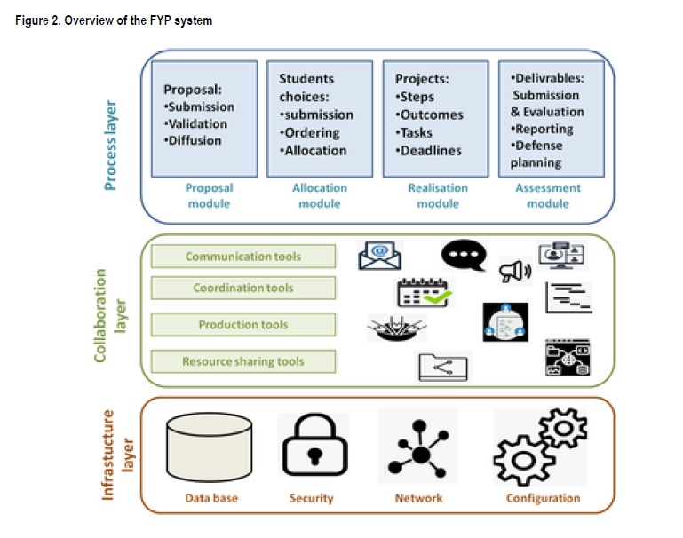
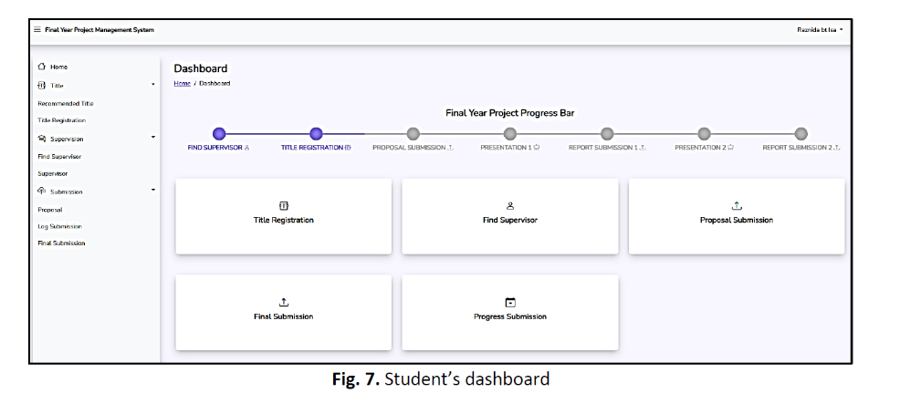
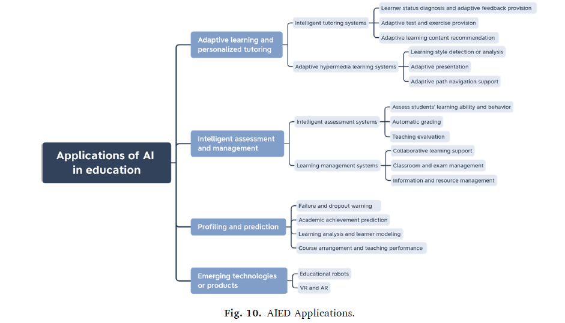
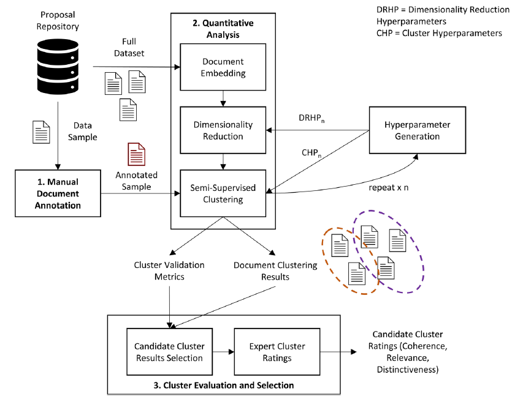
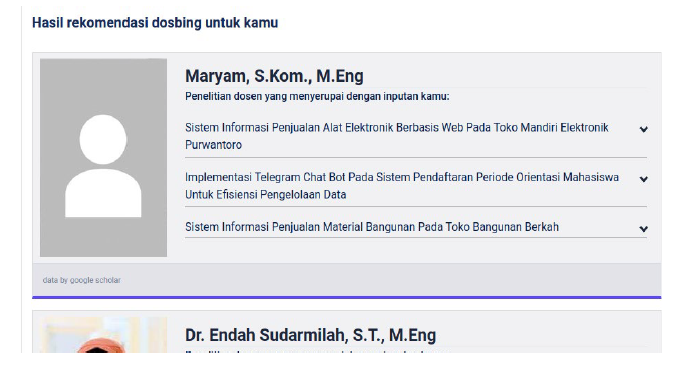
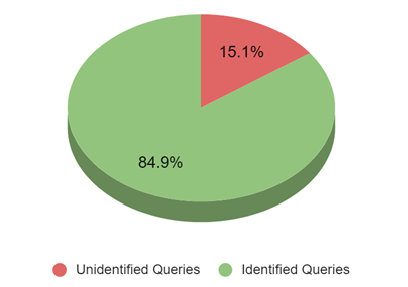

# Chapter 2: BACKGROUND STUDY

## 2.1 Existing Systems

The management of Final Year Projects (FYP) in the academic institutions
has evolved with the introduction of web-based systems to a great
extent. Many universities have established dedicated FYP portals to
manage the project registration, supervision and assessment. However,
these systems often only focus on the digitisation of forms and the
submission of documents, while important supervision activities (e.g.
supervisor assignment, quality checking of the proposal and progress
tracking) are still dealt with manually or on a separate platform. This
section explores a few existing systems in Malaysian universities as
well as learning management and collaboration tools widely used in
Malaysia higher education and identify the strengths, weaknesses and
opportunities for improvement.

### 2.1.1 Multimedia University (MMU)

At Multimedia University (MMU), a compulsory component of the Final Year
Project is included for all undergraduate programmes in the Faculty of
Computing and Informatics (FCI). The FYP Handbook outlines the structure
of the project and provides assessment components and report format,
with an emphasis on independent work, good project management and use of
the APA style of academic writing.

FCI currently manages FYP activities through use of an internal
web-based portal called FYP System 3.0. As shown in Figure 2.1, FYP
System 3.0, provides a home page which contains announcements, link to
"Available Projects", "Confirmed Projects", "Students List", "FYP
Registration" and login and registration panel for new students. The
system is still being referred to as a prototype, and some functions are
simply being added as we go along, but it has become the primary point
of access for students and staff to access FYP-related information.

Within the context of FYP System 3.0, the supervisors send their project
titles to the FYP committee in one or more rounds each trimester. Once
approved, these titles become available for publication under the
"Available Projects" section for students to browse. For student
proposing projects, a specific "FYP Student Proposal Submission
Process" has been issued by the faculty. The student first prepares a
proposal and gives it to a potential supervisor. The supervisor reviews
the proposal and may make revisions. After the proposal is finalised,
the supervisor submits it into FYP System 3.0 and only proposals
submitted through the system will be reviewed by FYP Committee. Students
are clearly instructed not to submit proposals directly by email because
proposals sent in this way will not be considered. This workflow ensures
there is no direct proposal submission by students into the system and
students rely on their supervisors to upload proposals for them.

Course registration is also partly done outside the portal. After a
student and supervisor reach an agreement about a project, the student
enters FYP System 3.0 so that the supervisor can associate the student
with the selected title, and then uploads a manually signed registration
form. Faculty administrators later use this form to enrol the student in
the official FYP subject in the central academic system (CLIC). As a
result FYP System 3.0 is more of a record keeping and listing tool than
a full online workflow for project registration and approval.

Network accessibility is another limitation. FYP System 3.0 is hosted on
the MMU intranet and is not available directly from the public Internet.
Students who are off-campus will first be required to connect to the MMU
Virtual Private Network (VPN) before they can access the FYP website.
While this is a good security enhancement, it introduces technical
processes for students who are not familiar with setting up a VPN or
students with unstable connections and makes using the portal as a
single, always-available point of access less practical.

In addition, there are multiple other platforms that MMU uses during the
lifecycle of the FYP. The MMU Online Portal and eBwise (a Moodle-based
learning management system) are used for course management, meeting-log
submission and announcements, and Turnitin manages the checking of
plagiarism, and email is still used for many informal communications.
These platforms are not specifically geared toward one-to-one FYP
supervision workflows, automated supervisor recommendation or integrated
progress tracking. As a result FYP information is scattered in FYP
System 3.0, VPN restricted intranet pages, eBwise, and email. There is
no central, intelligent platform to combine project registration,
proposal analysis, supervision records and analytics. This piece-meal
and access-limited environment is the motive behind the need for a
better FYP supervision system with more intelligent features.

Figure 2.1 MMU FCI FYP System 3.0 -- Home Screen

### 2.1.2 Universiti Malaysia Sarawak (UNIMAS)

The Faculty of Computer Science and Information Technology (FCSIT)
Universiti Malaysia Sarawak (UNIMAS) has an online FYP Management System
v2.0. The homepage offers fast access to general documents including
poster templates, paper formats and user guides as well as specific
sections for FYP 1 and FYP 2. Each section includes course outlines,
assessment rubrics and report preparation formats. This set up aids
standardisation of documentation and gives students easy access to key
resources.

One of the most remarkable features in the UNIMAS system is the
"Supervisor List by Majoring" section. Supervisors are presented in
coloured cards organised by specialisation (e.g. Computational Science).
Each card contains the supervisor's name, email address, existing
number of supervisees, number of supervision quota and a "Register
Now" button. Students can search through this list to find available
supervisors in their major and start the registration process from
within the system. This user interface makes supervisor availability
transparent and reduces guess work when students are looking for a
supervisor.

Despite these benefits, information distribution and manual registration
are still the focus of the UNIMAS portal. Decisions on the choice of
supervisor are still made entirely by students and coordinators, based
on reading profiles and quotas. There is no AI-powered recommendation
engine that automatically matches the proposals to the supervisors based
on their research interest and no visible module for automated analysis
of the proposals or integrated analysis of the meeting logs. As such,
the UNIMAS system is a good example of a well-structured FYP portal
based on manual judgment for decisions on supervision.

Figure 2.2 UNIMAS FYP Management System v2.0 -- Home Screen

### 2.1.3 Universiti Malaysia Perlis (UniMAP)

Universiti Malaysia Perlis (UniMAP) has faculty-level FYP portals such
as the FTKEN FYP System for the Faculty of Electronic Engineering
Technology. The system gives role based login to FYP committee,
supervisors & students. New users can register for an account and
existing users can reset passwords through the same interface. Once
logged in, users get access to functions such as project registration,
title management and basic reporting.

The UniMAP portals centralise the information about the projects and
standardise how the FYP data is captured. They usually give the
supervisors the option to suggest titles for projects, the students to
choose titles or submit proposals, and coordinators to keep track of the
total list of projects in a faculty. This approach lessens the need for
paper forms and informal communication and it can ensure that all
official titles and assignments are held in one database.

However, like the UNIMAS system, the main functions of the UniMAP
portals are data entry/retrieval functions. There is low evidence of
such advanced features as intelligent supervisor balancing, automated
analysis of proposal content or tools to monitor supervision activity
across time. The systems enhance administrative efficiency but currently
do not implement the AI or analytics to aid in decision-making in
supervision.

Figure 2.3 UniMAP FTKEN Final Year Project
Management System -- Registration Screen

### 2.1.4 Universiti Teknologi MARA (UiTM)

A number of faculties in Universiti Teknologi MARA (UiTM) have developed
their own FYP management and assessment systems. One example is a
web-based Final Year Project Management System which helps in
substituting manual processes and minimising the errors in storing the
project information. The system is intended to serve as a central place
for students to register projects, students/ supervisors to monitor
progress and project coordinators to track FYP activities. Another
example is the Final Year Project Assessment System (FYPAS), which uses
digitalisation to digitise the evaluation process by enabling evaluators
to enter marks online and calculate final scores automatically.

These systems are an example of the benefits of centralised data
management and electronic assessment. They minimise paperwork, reduce
the processing time and allow better audit trails for evaluations.
Nevertheless, their primary focus remains on the automation of workflows
and grading rather than on intelligent support for supervision as such.
Students still usually search for supervisors manually and proposal
quality is still determined by human reviewers without the benefit of
automated text analysis. Features such as supervisor recommendation,
proposal scoring or chatbot-based guidance have not yet found wide incorporation.

Figure 2.4 Universiti Teknologi MARA (UiTM) FYP Management System --
Login Screen

### 2.1.5 Universiti Teknologi Malaysia (UTM)

Universiti Teknologi Malaysia (UTM) has a comprehensive FYP portal under
the name of "My First Thesis". The website offers a well-constructed
path for the students through the menu items such as "Start Your FYP",
"Briefing for FYP", "Logbook", "Template", "File Uploading", "Assessment
& Dates", "FYP Report", "FYP Seminar" and "Technical Paper". Students
are guided through three stages of first attending briefings, then
proposing a topic, keeping a logbook, preparing reports according to
official templates and finally submitting the e-report and technical
paper via the portal.

For topic registration, the portal provides a Topic Proposal form in
which the student can enter some important information like programme,
proposed supervisor, title, objectives and scope and then submits the
proposal. This ensures that critical information in a standard format is
captured and stored digitally from the start of the FYP process. The
same portal also provides for online logbook entries and file uploads
for various deliverables which provide for a more complete workflow than
many older systems.

Even with this rich feature set the UTM portal is still relying on
manual decision making. The system collects and stores data but there is
no automatic analysis of the content of proposals or recommendation of
supervisor based on research interests and capacity. Meeting logs are
maintained as logs or uploaded files but there is little evidence for
higher-level analytics such as automatic alerts for inactive projects or
supervision dashboards. Consequently, the UTM system is a mature
embodiment of process digitalisation but it is not yet an AI-enhanced
supervision platform.

Figure 2.5 Universiti Teknologi Malaysia
(UTM) FYP Portal -- Home Screen

### 2.1.6 Learning Management Systems (LMS) with Project Features

Apart from dedicated FYP portals, many universities are using general
purpose learning management systems (LMS) such as Moodle and Canvas in
teaching and assessment. MMU, for instance, uses eBwise, which has been
built on Moodle, to deliver course materials, assignments and quizzes.
Lecturers may post resources, build online activities and grades while
students may turn in assignments and join forums.

Moodle is an open source LMS which allows educators to build online
courses with resources, assignments, quizzes, forums and gradebooks. It
supports file submission, feedback, grading and tracking of learner
progress and can be access via web browser or mobile app. Because of
this flexibility some institutions re-use Moodle course shells to manage
FYP deliverables and communication (using the Assignment activity for
example to collect proposals and reports, or forums to communicate
announcements). Nevertheless, Moodle is built on the basic philosophy of
course over one-to-one supervision workflow structures. It does not
natively support features such as supervisor load balancing, automatic
proposal checks or integrated supervision analytics which may be project
specific.

Canvas is another popular LMS created by Instructure. Canvas features,
such as modules, online assignments, discussion forums, quizzes and an
extensive Gradebook that provides instructors with a clear picture of
learner progress and allows them to manage their assignment weightings
and marks. Like Moodle, Canvas has the capabilities to host FYP-related
activities through setting up a "course" for Final Year Project,
assignment slots for interim and final reports, and discussions to
communicate. It also integrates with 3rd-party tools, such as
AI-assistant grading tools for programming assignments.

Despite all of these capabilities, both Moodle and Canvas are generic
teaching platforms. They do not have in-built functions for automatic
assignment of supervisor, modelling of supervisor capacity, maintenance
of per-project meeting log with approval workflow or NLP analysis of FYP
proposals. Any such processes would have to be implemented with the help
of custom plug-ins or manual workarounds, often outside of a faculty
project alone.

Figure 2.6 MMU Learning Management System (Moodle) -- Mobile Course View

### 2.1.7 Microsoft Teams

Microsoft Teams is a communication and collaboration tool which has
become popular in the educational world, particularly during and after
the pandemic of Covid 19. Teams for Education allows teachers and
students to communicate using chat, video meetings and channels, file
sharing, and integrate other applications in Microsoft 365. In the
education edition, class teams offer features like assignments, grading
and class notebooks, allow teachers to send work out, collect work and
feedback in a single interface.

Many universities, including MMU, are using Teams as an additional
channel to FYP meetings, online consultation and files sharing. During
video calls it is convenient when scheduling video calls, keeping the
history of chats and storing shared documents in SharePoint. However,
Microsoft Teams is not an FYP management system. It does not maintain
structured metadata on projects (titles, objectives or supervisor
quotas, for example) and it does not provide specialised tools for
project registration, supervisor allocation or evaluation of proposals.
Like Moodle and Canvas, it requires a lot of manual configuration and
discipline on the part of the users to be an effective supervision
platform.

Figure 2.7 Microsoft Teams -- T2530 FYP1 (Pre-FYP) General Channel Files

###  2.1.8 Summary

Overall, the majority of the reviewed FYP systems (MMU FYP System 3.0,
UNIMAS FYP Management System, UniMAP faculty portals, UiTM faculty
systems, and UTM "My First Thesis") have been effective in digitising
most of the essential administrative components such as project
listings, templates, project proposal forms, and registration records,
and fundamental role-based access. Such general platforms as Moodle and
Microsoft Teams also contribute to distributing documents,
announcements, assignments, and online meetings, which assists
universities to have a baseline structure of the FYP communication and
assessment.

But in these systems, there are a number of loopholes that have remained
the same. To start with, matching between the supervisors and the
students is still very manual as the students have to scroll through the
lists and verify the quotas informally and send emails to the supervisor
to be sure that they have been matched. Second, the processing of
proposals can be document-intensive and human-intensive and have few
automated measures to verify that proposals include the necessary
sections, or that its quality is up to the minimum standards. Third, the
tools (portal, LMS, email, Teams, cloud drives) where supervision
activities are carried out are usually fragmented, and it is hard to
have a single and full supervision record that would consist of meeting
history, action items, feedback and progress status. The availability
limitations of the intranet like the dependency by the intranet in the
context of MMU also make further impractical the usage of the portal off
campus and the temptation to treat the portal as the sole source of
truth.

Accordingly, even though the existing solutions enhance the efficiency
of the administrative aspect, they do not typically include end-to-end
supervision workflow integration, proposal intelligence (automatic
completeness or quality controls), data-driven supervisor
recommendation, and progress analytics dashboard. The above limitations
are the direct reason why the proposed FYP Supervision System is needed,
in which the centralisation of registration, proposals, meetings, logs,
documents, and announcements into a single platform will be proposed,
with AI-assisted modules (supervisor recommendation, proposal analysers,
and chatbot support) being implemented to decrease the workload and
enhance the quality of supervision.

## 2.2 Literature Survey

This section is a review of recent literature that is relevant to a
web-based FYP supervision system.

## 2.2.1 FYP Management Systems

As student cohorts grow, efficient
management of final year projects becomes more important. Many
institutions have developed specific FYP management systems to attempt
to make the supervision, project tracking, and communication process
more efficient. Lounas et al (2023) presented an e-collaboration
platform that covers the whole FYP lifecycle - from the proposal
submission and project allocation to progress tracking and final
evaluation. This multi-user system was intended for students, their
supervisors, and administrators and provided them with the ability to
communicate, coordinate, and share resources, while each user had their
own personal workspace. Notably, the platform covered all the
collaborative aspects of FYP supervision and the evaluation showed a
positive result in terms of increased efficiency of the process with a
positive user adoption. These findings highlight the importance of a
centralized online system for better coordination and oversight for
managing FYP.

Figure 2.8 Overview of the FYP system by Lounas et al. (2023)

Similarly, Isa et al. (2024) created a
prototype of a web-based FYP management system in an effort to improve
project monitoring and project supervision. Their dashboard-driven
application let students visualize their project timeline and progress,
and also enabled lecturers and FYP coordinators to centrally monitor
student performance and deadlines. The system helped in efficient
three-way communication (student-supervisor-coordinator) and introduced
automated alerts to make sure that important milestones were achieved.
The expected benefits of this platform were better quality of
supervision, less time delay in projects and a more structured FYP
process.

Figure 2.9 Student's dashboard in the FYP Management System by Isa et
al. (2024)

In sum, the recent FYP management systems show that a centralized
platform has the ability to greatly streamline the supervision process.
Key features such as progress dashboards, integrated communication
modules, and automated reminders have been shown to increase
transparency and efficiency in the management of FYPs. Collectively,
these works ensure the need for a dedicated FYP management module in the
proposed system, which ensures that all stakeholders of the project
(students, supervisors and administrators) are coordinated and informed
throughout the project duration

## 2.2.2 AI in Education

Artificial intelligence has become an increasingly important part of
modern education, providing tools that can be used to personalize
learning and automate certain tasks. Research in AI in Education (AIED)
has grown significantly in the last few years with a wide range of
applications including, but not limited to, intelligent tutoring systems
and administrative support. For example, a comprehensive review by Wang
et al. (2024) outlines major categories of AIED applications including
adaptive learning systems and personalized tutoring systems, intelligent
assessment and grading systems, student profiling systems and
performance prediction systems as well as other emerging AI-driven
educational products. These technologies have been proven to improve a
number of aspects of learning and management - adaptive systems can
adjust instruction to individual student needs, while AI-powered
analytics can help educators identify at-risk students using data
trends. Importantly, such tools are not limited to classroom learning,
but also to educational administration and decision-making, which is
relevant for an FYP supervision platform.

Figure 2.10 AIED Applications (four main categories of AI in Education
applications).

Recent literature focuses on the point that integration of AI can have
tangible benefits in education when done thoughtfully. A systematic
review conducted by Garzon et al. (2025) demonstrated an increase in the
amount of AI-education research since 2022 and reported a number of
positive results of AI adoption. Notably, the use of AI tools has been
linked to better learning outcomes, more personalized instruction, and
increased student motivation and engagement. These benefits come from
the fact that AI systems can give feedback immediately, be tailored to
pace and learners can take more time to learn at their own pace, and
instructors can be freed from some of the repetitive work to focus on
higher-level mentoring. At the same time, researchers warn of
challenges, such as ethical considerations, data privacy and teacher's
readiness for AI tools. For example, the implementation of AI in a
"smart classroom" environment helped the teachers with classroom
management and with hybrid learning, but also created technical
complexities and cost issues which need to be addressed by institutions.
Similarly, Saputra et al. (2023) mentioned that the use of AI can
enhance assessment and administrative processes, although there are
challenges that could impact this process, including a lack of
pedagogical frameworks and low digital literacy among employees.

In the light of the proposed FYP supervision system, the above insights
suggest that exploiting the AI elements could contribute to an important
level of additional functionality. By incorporating AI-powered modules
the system can help to automate labor-intensive tasks and offer
data-informed support to educators. Prior studies confirm that when used
properly, AI in education is not only a matter of increased efficiency,
but can also maintain or enhance the quality of education by allowing
for more personalized and timely support to students. Therefore, the
design of our FYP supervision system will include implementation of AI
techniques for areas that can be shown to have benefits - for instance,
by using machine learning to automatically assess drafts of proposals or
match students with suitable supervisors - while keeping in mind ethical
and usability considerations mentioned in the literature.

## 2.2.3 NLP for Proposal Analysis

A core feature of the envisioned system is automated proposal checking,
which relies on Natural Language Processing (NLP) to analyze students'
project proposals. Handling numerous proposals manually is
time-consuming and prone to inconsistency, especially as project topics
grow interdisciplinary. Studies show that NLP can effectively assist in
understanding and classifying proposal documents. For example, Chikwarti
and Thomas (2023) developed an NLP-driven framework to automate the
topic mapping and alignment of research proposals. They highlight that
traditional manual classification of proposals is often "error-prone and
inconsistent" in large-scale environments, whereas their approach uses
transformer-based language models and domain ontologies to extract each
proposal's key thematic elements and categorize it appropriately. In
their system, proposals are automatically classified according to
scientific domains and even matched with relevant funding agency
priorities by computing semantic similarity scores. This resulted in an
impressive 89% classification accuracy on a test set of 5,000 proposals,
significantly improving the speed and consistency of reviewer assignment
and proposal routing compared to manual methods. Such a result
demonstrates NLP's capability to perform complex evaluation tasks (like
reading and labeling proposal text) with high reliability and at scale.

Another pertinent study by Knisely and Pavliscsak (2023) applied NLP
with semi-supervised machine learning to cluster research proposals by
topic area. Through the use of state-of-the-art text embeddings (BERT),
and a partial human-in-the-loop clustering approach, they were able to
group the documents of a proposal into meaningful groups that matched
thematic areas of interest. Notably, their semi-supervised method
produced roughly 25% higher topic coherence in clustering results than
fully unsupervised techniques, and this suggests that NLP techniques are
able to capture the topical structure of proposals in a way that aligns
well with expert judgement. These clustered groupings of proposals can
be useful in finding trends in proposals or ensuring that similar
project ideas are considered in a consistent manner. Other NLP
applications in proposal analysis are plagiarism detection and
originality checks, automated readability or quality evaluation and
extraction of information for decision support. For example, NLP-based
plagiarism detection systems are becoming more and more advanced in the
ability to compare the text, and detect the overlaps, which could be
used to check that student proposals are original.

Figure 2.11 Overview of the NLP-based
semi-supervised clustering methodology for research proposal
categorization

Drawing from these works, the proposed FYP supervision system will
incorporate an "automated proposal analysis" component that leverages
NLP to support academic staff. Specifically, the system could parse each
submitted project proposal, automatically classify its academic field or
topic keywords, and flag potential issues. By doing so, the system
provides a form of automated preliminary review, helping supervisors and
FYP committees handle the growing volume of proposals more efficiently.
The literature confirms that NLP techniques are capable of performing
such analysis with a high degree of accuracy and consistency. This not
only saves time but also contributes to fairness and early feedback for
students. In summary, NLP-based proposal analysis, as evidenced by
current research, is a viable and valuable addition to a web-based FYP
supervision system's feature set.

## 2.2.4 Supervisor Recommendation Systems

Matching students with the appropriate project supervisor is a critical
component of FYP management as a good match can increase student
motivation and project success. Traditional allocation on a manual basis
is often based on limited information or informal "word-of-mouth"
recommendations. Recent research has therefore investigated automated
supervisor recommendation systems to optimise this matching process. One
of the key findings is that having a student's project topic be of
interest to a supervisor's expertise has a significant impact on the
FYP's success: students are often more enthusiastic and better guided
when working with supervisors who are knowledgeable of the topic of the
project. Falah and Suryawan (2022) handled the aforementioned problem by
designing a content-based filtering recommender system that recommends
appropriate supervisors based on the content of proposals. In their
system, a student enters the title, abstract, and keywords of their
proposed project and the algorithm calculates the cosine similarity
between the student's project proposal and the research profiles of
faculty members. The name of those supervisors whose published work has
the closest affinity with the topics proposed is then recommended. This
approach proved effective - the application was able to find supervisors
whose interests and expertise were in line with the students'
proposals, thereby validating the premise that text similarity can be
used as a proxy to measure research fit. By automating the process of
searching and comparing, the system enabled students to
find an advisor more in a data-driven way,
rather than using a purely ad hoc knowledge.

Figure 2.12 Results page of the supervisor recommendation system
(cosine-similarity / content-based filtering output)

Another advanced implementation is the two-way supervisor recommendation
system by Dasri et al. (2025). They do not just take the preferences and
project topic of the student into account but also consider the
preferences or capacity of the supervisors, so there is actually a
mutual matching model. Their solution is based on a skyline query
algorithm (k-skyband) to deal with multiple criteria for matching and
compare a traditional approach (Block Nested Loop, BNL) with a big data
optimized approach (MapReduce k-skyband). In testing, the MapReduce
based model brought dramatic improvements in scalability - performing 8x
faster computation speed than the BNL method, vital for handling large
datasets of students and supervisors. The system used a database of 239
research topics entries to make an educated guess on what students are
interested in researching, then comparing them with possible supervisors
areas. The recommendations were tuned (with an optimal parameter k=16
for the skyband algorithm) to balance between relevance and diversity of
recommendations. Feedback on this system was positive: in a user study,
students rated the recommended supervisor lists very favorable on
relevance (score 3.5/4), topic diversity (3.7), serendipity (3.4) and
novelty (3.5). Such evaluations suggest that recommendations from the
matches not only were accurate but were introducing students to
supervisors whom they might not have considered themselves, but not
overloading them with irrelevant options. Furthermore, Dasri et al. note
that with a better student-supervisor matching process the system can
eventually lead to an improved supervision experience and potentially
contribute to the on-time completion rate.

These studies highlight feasibility and the benefits of an intelligent
supervisor allocation feature in an FYP system. For the proposed
platform, a Supervisor Recommender Module will be designed to
automatically propose a list of suitable Supervisors for a given project
proposal using techniques from the above works. This module could
perhaps combine content based analysis similar to the two way model by
Dasri et al. The goal is to insure each student is matched with a
faculty supervisor with relevant expertise and interest in the project
area, therefore creating a more supportive and productive mentorship. By
automating this process, the system can improve fairness and
transparency in the allocation of supervisors, as well as be better
adapted to changing conditions than static manual allocation.
Ultimately, the literature seems to indicate that such recommendation
systems can lead to an improvement in student satisfaction and student
outcomes of capstone projects, and is well aligned with the goal of
improving the FYP supervision process.

## 2.2.5 Chatbots in Academic Environments

Universities are increasingly using chatbots as virtual assistants to
assist students both outside the classroom. These AI-driven
conversational agents can assist with various student queries ranging
from responding to common questions about administrative procedures to
offering guidance on academic issues. A recent review by Peyton et al.
(2025) looking at university chatbots for use in student support,
identified that although there are many different implementations, the
higher education sector is still investigating the full potential of
this technology. Campus chatbots can complement student service by being
available 24/7 and providing instant responses, to complement the work
of the academic and support staff. For example, chatbots have been used
to answer questions about course enrollment, deadlines, campus
facilities or technical support, which helps to lessen the response load
on university offices. Peyton et al. state that many institutions have
reported positive results including enhanced student engagement and
satisfaction with the entire learning process when routine queries are
managed and offered by AI chatbots because students receive timely
responses at any given time of the day. They also emphasise observations
by previous researchers that chatbots provide "personalisation and 24/7
instantaneous availability" in educational settings which makes them a
promising resource to use for student interaction. However, the review
also identified challenges: creating a high-quality chatbot for a
university often involves bringing together a lot of domain-specific
data which can be hard to curate. Additionally, many universities have
not yet fully harnessed the capabilities of advanced conversational AI -
conversational AI chatbots of the past were often rule-based and limited
in scope. The advent of state-of-the-art NLP and generative AI is an
opportunity to build more flexible and intelligent academic chatbots.
Peyton et al. have suggested that by taking advantage of existing
institutional data, combined with newer AI frameworks, universities are
able to develop chatbots that go beyond the simple FAQ to support more
interactive and context-aware support.

In the context of an FYP supervision system, an integrated chatbot could
be a first-line 'help desk' to students, and even supervisors. Such a
chatbot can be programmed to provide responses to frequently asked
questions around the FYP process, thereby clearing doubts on procedures
on the spot. The real-world deployments prove the viability of this
approach. For example, Nadir et al. (2025) deployed "SQUbot", an
AI-powered chatbot in the Sultan Qaboos University to help students with
various academic and administrative queries. Notably, SQUbot was
bilingual (English and Arabic), to reflect the linguistic needs of the
student population, and used IBM Watson's NLP services for intent
recognition and dialogue management. The chatbot could be able to impart
general information as well as personalized responses for things like
the student's own timetable or the state of their project. During pilot
testing, SQUbot had about 84.9% accuracy in the ability to understand
student queries i.e. correctly recognized the intent of almost 85% of
questions asked. Most of the unanswered queries were as a result of
either very colloquial phrasing or questions outside of the scope the
chatbot was trained for, which the developers responded to by refining
the training data and adding fallbacks. Overall, the implementation was
considered to be successful as it greatly relieved the staff from a
great deal of routine
enquiries and helped students to gain quick
assistance on all hours.

Figure 2.13 Identified vs. unidentified student queries in SQUbot pilot
testing

For our proposed system, a chatbot component in the FYP portal can be
used in a similar way to enhance the user experience by not only
immediately addressing FAQs related to FYP supervision. Students could
pose questions to the chatbot such as "How do I submit my project
draft?" or "What is the rubric for how I can evaluate proposals?" And
get the answers immediately and consistently based on the FYP handbook
or system database. Supervisors and administrators may also use the
chatbot to perform quick queries. By referring to the methods discussed
by Peyton et al. and the success of systems such as SQUbot, we would
create the chatbot with strong NLP methods and an integration with the
knowledge base of the FYP system. The chatbot would work within a
defined scope (FYP-related content) in order to keep the accuracy high,
but be expandable in scope as new common questions are asked. This is
consistent with findings that closed-domain chatbots need to be
continually curated but can be a major source of reducing friction in
day-to-day academic activities. Ultimately, the inclusion of a chatbot
aligns with the aim of a student-friendly, self-service platform: it
will enable students to access the support and information they need
when they need it, in addition to the support given by human supervisors
and FYP coordinators.

## 2.3 Problems to be solved

Based on the analysis of the existing systems and the related
literature, there are several key problems that are not solved in FYP
supervision process especially in MMU FCI. First, supervisor-student
matching is still highly a manual operation. Whether students have a
supervisor with a proposed title or have come up with their own idea,
students are expected to identify and approach possible supervisors on
their own. Supervisor capacity and research interests need to be checked
informally, usually resulting in repeated exchanges by email,
competition for popular lecturers and uncertainty for students who have
no experience of staff expertise.

Second, MMU's current FYP system is not a fully integrated and online
proposal submission and validation system. While other institutions like
UNIMAS and UTM are already offering structured forms to provide the
topic proposals online, MMU students are generally trading the proposals
with documents and email with no automatic validation related to the
content. As a consequence there are proposals that are inconsistent in
terms of format and fail to include important parts of the proposal,
e.g. objectives, scope or methodology, leaving extra work to supervisors
and coordinators. This is added to the high volume of repetitive
procedural queries. Coordinators and supervisors often get the same
questions about deadlines, how to report, how to submit and how to
evaluate. Whilst guidelines and announcements are published by existing
systems and LMS platforms, students can miss them or misunderstand them
and without a self-service, conversational interface, staff have to
waste valuable time answering routine enquiries instead of supervising
academics.

Third, supervision records are scattered on a number of platforms.
Meeting logs, feedback, draft reports and assessment forms are stored
separately in eBwise, email, local devices, Turnitin and informal
messaging channels. This fragmentation makes it difficult to create a
more complete picture of a student's history and trajectory as they are
being supervised, and makes it impossible for coordinators to have a
consolidated, real-time view of what is happening with a particular
project across the faculty. Last but not least, there are limited
analytics and early warning mechanisms on existing systems. There are
generally no dashboards or automatic indicators to identify students who
are falling behind, supervisors that may be overloaded or proposals that
could be problematic. Coordinators are required to use manual checks and
ad hoc reports that are time consuming and may not pull up issues early
enough for meaningful intervention.

These gaps suggest that it is not enough to have digitised forms and
file uploads. A smarter and more integrated FYP supervision system is
needed to enable data-driven supervisor student matching, structured
proposals submission with automatic checks, active student support with
self-service tools, and supervisor and coordinator monitoring and
analytics.

## 2.4 Technological Background

This section presents the main technologies that will be used for
development of the proposed FYP Supervision System and explains the
reasons for the use of these technologies in the proposed project.

### 2.4.1 Backend and Database 

**2.4.1.1 Java Spring Boot (backend)**

The backend of the system will be developed using Spring Boot, which is
a popular Java framework for building web applications and APIs (Rest
APIs). Spring Boot is used because:

- it facilitates fast development thanks to auto-configuration;

- it provides built-in support for common features such as dependency
  injection, validation and security; and

- it works well with relational databases and external services.

In this project, Spring Boot will be used in the authentication of the
users, business logic for managing FYP (e.g. project registration and
supervision records), and communication with the database and AI
modules.

#### 2.4.1.2 MySQL (database)

All persistent data, i.e. user profile, project details, proposals,
meetings etc, shall be stored in a MySQL database. The popular open
source relational database management system MySQL provides the
following features:

- structured storage of data in tables with defined relationships;

- support for standard SQL queries; and

- good performance and reliability for web systems.

Using MySQL allows the system to maintain consistent and structured
records of FYP-related information.

### 2.4.2 Frontend Technology

#### **2.4.2.1 React (Client-Side Interface)**

The interface will be created based on React, and it is a JavaScript
library of creating interactive web interfaces. React is suitable
because:

- it supports the development of single-page applications where the page
  updates without full reloads;

- it uses reusable components, which helps maintain a consistent look
  and feel; and

- it can provide a responsive and modern experience for students and
  lecturers.

Through the React frontend, users will be able to view project
information, submit proposals, manage supervision meetings and interact
with the chatbot.

***2.4.3 AI and NLP Technologies***

Python-based tools and libraries will be the primary instruments of the
implementation of the AI-related features of the system (proposal
analysis, supervisor recommendation and chatbot assistant).

**2.4.3.1 Flask Microservices (Python AI Modules)**

The AI functions will be packaged into microservices that will be
developed on Flask, a simple Python web framework. Every AI-based
feature may be launched as a standalone Flask service, for example:

- a proposal analysis service that receives proposal text and returns
  feedback,

- a supervisor recommendation service that accepts a project description
  and returns a ranked list of supervisors, and

- a chatbot service answering typical FYP-related questions.

This microservice design ensures that AI logic is not coupled with the
primary Java backend and, therefore, a service can be developed, tested
and scaled independently. These Flask services will be communicated with
the Java backend through the use of REST APIs.

<!--
UPDATED 2026-05-10: Subsections 2.4.3.2-2.4.3.4 have been rewritten to
reflect the actual AI techniques used in FYP2 implementation.
- TF-IDF + Cosine Similarity (recommender) → replaced by Sentence-BERT
  (BAAI/bge-base-en-v1.5) embeddings + a five-component weighted score.
- spaCy → not used. Replaced by pure-Python rule-based NLP (Flesch-Kincaid,
  Gunning Fog, regex-based section detection) in nlp_utils.py.
- Rule-Based NLP Checks → kept and extended to mention the fine-tuned
  DistilBERT regression head (chunk-and-averaged) and the optional
  remote LLM (Groq Llama 3.3 / OpenAI) for richer feedback prose.
- New 2.4.3.5 added on FAISS + retrieval-augmented generation for the
  chatbot, since this technique was not previously covered.
-->

**2.4.3.2 Sentence-BERT Embeddings and Weighted Scoring**

For the supervisor recommendation task, the system uses pretrained
Sentence-BERT embeddings (`BAAI/bge-base-en-v1.5`, 768-dim) rather than
sparse TF-IDF vectors. Each student profile and each supervisor profile
is converted into a single dense vector that captures the meaning of
the text rather than only its surface terms, so a student whose
interests include "natural language processing" matches a supervisor
whose research areas include "computational linguistics" without
requiring an exact term overlap. The supervisor profile passed to the
embedding model also includes recent supervised project titles, so the
match is grounded in the supervisor's actual past work rather than
only self-described expertise.

The match score is a transparent weighted sum of five components:
the cosine similarity between the two embeddings (weight 0.50), the
Jaccard overlap of student interests with supervisor research areas
(0.18), the Jaccard overlap of student skills with supervisor expertise
(0.10), a programme-match flag (0.07), and an availability factor
based on remaining quota (0.15). Supervisors who are at quota or
marked unavailable are filtered out before scoring rather than ranked
low, so the result list never contains a supervisor the student cannot
actually request. The five-component breakdown is also returned to the
frontend so each ranked result can be explained in terms the student
understands.

**2.4.3.3 Rule-Based NLP Utilities for Proposal Structure**

The proposal analysis service relies on a pure-Python rule-based NLP
layer rather than a heavyweight library such as spaCy. The
`nlp_utils.py` module computes readability metrics (Flesch-Kincaid
grade, Flesch reading ease, Gunning Fog), sentence-length statistics,
lexical diversity, and a citation count, and uses regex-based section
detection to verify the presence of the standard MMU FCI proposal
sections (problem statement, objectives, scope, methodology). The
output is four sub-scores — clarity, structure, scope, innovation —
each on a 0-100 scale. This stage runs on every analysis request and
does not depend on any model file being present, so the service is
always able to return a baseline assessment.

**2.4.3.4 Fine-Tuned DistilBERT and Optional Remote LLM**

On top of the rule-based layer, the proposal analyser uses a
fine-tuned DistilBERT regression head trained on the ASAP automated
essay scoring dataset to produce an overall text-quality score on the
same 0-100 scale. Because DistilBERT-base has a 512-token context
window, long proposals are split into overlapping 480-token windows
with 384-token stride and the per-chunk scores are combined into a
length-weighted average. The earlier approach of truncating to the
first ~400 words is therefore replaced with a measurement that covers
the full proposal text.

A third optional stage adds richer prose feedback (detailed strengths,
weaknesses, and suggestions) by calling an OpenAI-compatible large
language model — Groq's `llama-3.3-70b-versatile` is the default when
a Groq API key is configured, and OpenAI's GPT models are supported
as an alternative. When no API key is present, the analyser falls back
to the rule-based layer's own short feedback strings, so the service
is always usable without external credentials.

**2.4.3.5 FAISS Retrieval-Augmented Generation for the Chatbot**

The FYP chatbot uses retrieval-augmented generation over a curated
knowledge base of fifteen FYP-related documents. Each document is
chunked at index time, embedded with `all-MiniLM-L6-v2` (384-dim), and
stored in a FAISS vector index. At query time, the user message is
embedded with the same model and the top-five most similar chunks are
retrieved. The retrieved context, together with the user message and
recent session history, is then passed to the same OpenAI-compatible
LLM described in §2.4.3.4. A confidence score is computed as the
top-1 cosine similarity multiplied by a generator-path multiplier, and
queries whose top-1 similarity falls below 0.30 are deemed
out-of-scope and answered with a fixed reply rather than passed to
the LLM. This guard prevents the chatbot from hallucinating answers
to questions that are not covered by the knowledge base.

### 2.4.4 Integration

RESTful APIs will be used to communicate between all components in the
system using HTTP and JSON:

- The Spring Boot backend will expose endpoints for the React frontend
  to perform operations such as login, project registration, proposal
  submission and meeting management.

- The Flask AI services will have endpoints such as /analyzeProposal,
  /recommendSupervisor and /chatbotQuery. These endpoints will be called
  by the backend when there is a need to process the AI.

This design keeps the frontend, backend and AI modules loosely coupled
so that each part can be developed and maintained separately.

### 2.4.5 Summary

<!--
UPDATED 2026-05-10: Replaced the "TF-IDF, spaCy and rule-based checks"
phrasing with the techniques actually used in FYP2 (Sentence-BERT,
DistilBERT, FAISS RAG, optional remote LLM, plus rule-based NLP).
-->

To conclude, the system will use Spring boot and MySQL as a stable
backend and data layer application, and React as a user-friendly web
interface, whereas Python/Flask and a layered set of natural-language
processing techniques — pretrained Sentence-BERT embeddings for
supervisor matching, a fine-tuned DistilBERT regression head together
with rule-based NLP utilities for proposal analysis, and FAISS-backed
retrieval-augmented generation with an optional remote large language
model for the chatbot — will be utilised to give the system an
intelligent support. Such a combination will suit building a modern
maintainable FYP supervision system, with both normal and AI-enhanced
functionality.

## 2.5 Proposed Solution

This project proposes a web-based FYP Supervising System which
centralises the entire supervision workflow and introduce the
intelligent support features. The system is to be developed using
three-tier architecture in which Spring Boot backend will be used to
implement business logic and the Restful APIs, MySQL relational database
will be used to store all the data related to FYP (Students,
Supervisors, Projects, Proposals, Meetings, Documents and Logs) and
React web frontend will be used to provide role-based interfaces to the
users (Students, Supervisors and Coordinators). User authentication and
authorisation will make sure that each role only has access to functions
that are relevant to them, while a structured data model takes the place
of the current scattered use of emails, spreadsheets and shared folders.
By bringing information into a single system, the solution is meant to
decrease confusion, duplicated effort and missing records.

<!--
UPDATED 2026-05-10: Module descriptions in this paragraph have been
brought in line with the actual FYP2 implementation.
- Recommender: TF-IDF/similarity → Sentence-BERT embeddings + a
  five-component weighted score (semantic, interest, skill, programme,
  availability).
- Proposal analyser: now also describes the fine-tuned DistilBERT
  regression head and the optional LLM stage, not just the structural
  checks.
- Chatbot: "retrieval-based NLP" → FAISS-backed retrieval-augmented
  generation with a remote LLM (Groq Llama 3.3 / OpenAI) plus
  out-of-scope guard.
-->

To solve individual problems of supervision, several AI modules will be
used which are implemented as separate microservices in Python Flask
and connected to the main system by using REST. A Supervisor
Recommendation module will encode each student profile and each
supervisor profile (including recent supervised project titles) as
Sentence-BERT embeddings and rank candidates with a transparent
five-component weighted score that combines semantic similarity, two
Jaccard overlaps, a programme-match flag, and an availability factor;
supervisors who are at quota or marked unavailable are filtered out
before scoring rather than being penalised after, so the result list
never misleads the student. A Proposal Analyzer module combines a
rule-based NLP layer (Flesch-Kincaid grade, Gunning Fog, section
detection) with a fine-tuned DistilBERT regression head that scores
the full proposal text via a chunk-and-average pass, and optionally
augments the prose feedback through a remote large language model
when an API key is configured; the result identifies missing or weak
sections so that students can improve their work before formal review.
In addition, a Chatbot Assistant uses retrieval-augmented generation
over the FYP handbook, briefing slides, and FAQs — a FAISS vector
index supplies the most relevant chunks at query time, and a remote
language model (Groq's Llama 3.3 by default, OpenAI as alternative)
generates the reply; an out-of-scope cut-off prevents the model from
answering questions that the knowledge base does not cover.

Overall, the complete solution of the proposed problems found in the
current supervision process (fragmented communication, manual tracking,
difficulties of finding suitable supervisors, heavy administrative
workload) is the combination of a modern web application stack (Spring
Boot, MySQL, React), with focused AI microservices (supervisor
recommendation, proposal analysis and chatbot support). The proposed
solution is expected to make the FYP supervision process more organised,
transparent and efficient for MMU FCI students, supervisors and
administrators.

# REFERENCES

Abdul Aziz, M., Kamaruzaman, F. J., & Abu Hashim, A. H. (2018). The
development of E-Research Engine System for Final Year Project (FYP).

Ahmad, M. H. (2011). Web-based FSKM Final Year Project Management System
/[Bachelor's thesis, Universiti Teknologi MARA/]. UiTM Institutional
Repository.

Chikwarti, D. K., & Thomas, J. (2023). Automated topic mapping and
alignment in research proposals using NLP-driven ontologies.
*International Journal of Advanced Engineering Technologies and
Innovations, 1*(5), 23--33.

Dasri, D., Annisa, A., & Haryanto, T. (2025). Two-way thesis supervisor
recommendation system using MapReduce k-skyband view queries.
*International Journal on Informatics Visualization, 9*(1), 163--175.
<https://doi.org/10.62527/joiv.9.1.2800>

Falah, Z. F., & Suryawan, F. (2022). Recommendation system to propose
final project supervisors using cosine similarity matrix. *Khazanah
Informatika: Jurnal Ilmu Komputer dan Informatika, 8*(2), 1--10.
<https://doi.org/10.23917/khif.v8i2.16235>

Garzón, J., Patiño, E., & Marulanda, C. (2025). Systematic review of
artificial intelligence in education: Trends, benefits, and challenges.
*Multimodal Technologies and Interaction, 9*(8), Article 84.
<https://doi.org/10.3390/mti9080084>

Instructure. (n.d.). Canvas LMS: Learning management system.
Instructure. <https://www.instructure.com/canvas>

Isa, R., Othman, S., Ali, A. S., Azizan, N., & Ferguson, J. (2024).
Prototype development of final year project management system to monitor
student's performance. *Journal of Advanced Research in Applied Sciences
and Engineering Technology, 40*(1), 164--173.

Kannan, M. (n.d.). *Final Year Project Supervisor Management System*
/[Undergraduate project report/]. Universiti Malaysia Sarawak (UNIMAS).

Knisely, B. M., & Pavliscsak, H. H. (2023). Research proposal content
extraction using natural language processing and semi-supervised
clustering: A demonstration and comparative analysis. *Scientometrics,
128*(6), 3197--3224. <https://doi.org/10.1007/s11192-023-04689-3>

Lounas, R., Hamzaoui, I., Bouguelmouna, N., & Mokrani, H. (2023). An
e-collaboration application for final-year project management.
*International Journal of e-Collaboration, 19*(1), 1--17.
<https://doi.org/10.4018/IJeC.315787>

Microsoft. (n.d.). Microsoft Teams for Education. Microsoft Education.
<https://www.microsoft.com/en-us/education/products/teams>

Moodle. (n.d.). Moodle.org: Home. Moodle Project. <https://moodle.org>

Multimedia University. (n.d.). eBwise -- Moodle user guides. MMU.
<https://ebwise.mmu.edu.my/guide/>

Multimedia University. (n.d.). FYP System 3.0 /[Web portal/]. Faculty of
Computing and Informatics, Multimedia University.
<https://fci-fyp.mmu.edu.my>

Multimedia University. (n.d.). MMU Portal (CLiC and online services).
MMU. <https://online.mmu.edu.my>

Nadir, Z., Al Lawati, H. M., Mohammed, R. A., Al Subhi, M., & Hossen, A.
(2025). SQUbot: Enhancing student support through a personalized chatbot
system. *Technologies, 13*(9), Article 416.
<https://doi.org/10.3390/technologies13090416>

Peyton, K., Unnikrishnan, S., & Mulligan, B. (2025). A review of
university chatbots for student support: FAQs and beyond. *Discover
Education, 4*, Article 21. <https://doi.org/10.1007/s44217-025-00397-7>

Universiti Malaysia Perlis. (n.d.). FTKEN FYP System -- Electronic
Engineering (FKTEN) and Computer Engineering /[Web system/]. School of
Microelectronic / Electronic Engineering Technology, UniMAP.
<https://ftkenfyp.unimap.edu.my/electronic/index.php> and
<https://ftkenfyp.unimap.edu.my/computer/index.php>

Universiti Malaysia Sarawak. (n.d.). FYP Management System /[Online
service/]. Faculty of Computer Science and Information Technology
(FCSIT). <https://www.fcsit.unimas.my/my-fcsit/student/online-services>

Universiti Malaysia Sarawak. (n.d.). FYP Management System v2.0 /[Web
system/]. Faculty of Computer Science and Information Technology
(FCSIT), UNIMAS. (Accessed via system interface and related project
documentation.)

Universiti Teknologi MARA. (n.d.). FYP Management System (FYP-MS).
Faculty of Electrical Engineering, UiTM. <https://www.fee-uitm.com/fyp/>

Universiti Teknologi Malaysia. (2021). Start your FYP -- SKM Final Year
Project Portal. School of Mechanical Engineering, UTM.
<https://mech.utm.my/fyp/start-your-fyp/>

Wang, S., Wang, F., Zhu, Z., Wang, J., Tran, T., & Du, Z. (2024).
Artificial intelligence in education: A systematic literature review.
*Expert Systems with Applications, 252*, 124167.
<https://doi.org/10.1016/j.eswa.2024.124167>
