## <mark>Changes from FYP1 ERD (FYP2 update)</mark>

<mark>**New entities (4)** — added to support implemented use cases:</mark>

- <mark>`USER_NOTIFICATION_PREFERENCES` — backs UC14 A1 (per-user notification channels and categories).</mark>
- <mark>`GENERATED_REPORT` — backs UC29 (persist generated report metadata for re-download).</mark>
- <mark>`EXPORT_CONFIG` — backs UC32 (reusable export presets: data type, fields, filters, schedule).</mark>
- <mark>`MAINTENANCE_JOB` — backs UC33 (track maintenance/cleanup jobs and outcomes).</mark>

<mark>**New attributes added to existing entities:**</mark>

- <mark>`SUPERVISOR_PROFILE` — `department`, `faculty`, `position`, `expertise`, `bio`, `office_location`, `office_hours`, `linkedin_url`, `google_scholar_url`.</mark>
- <mark>`PROJECT` — `description`.</mark>
- <mark>`PROPOSAL` — `title`, `current_version`.</mark>
- <mark>`PROPOSAL_VERSION` — `file_name`.</mark>
- <mark>`PROPOSAL_CHECK_RESULT` — `proposal_id` (FK, nullable), `checked_by`, `feasibility_score`, `innovation_score`, `clarity_score`, `scope_score`, `strengths`, `weaknesses`, `remarks`. `version_id` is now **nullable**. (The `plagiarism_score` column added in V10 was dropped in V31 because the analyser never produced a real signal for it.)</mark>
- <mark>`PROPOSAL_REVIEW` — `internal_notes`.</mark>
- <mark>`SYSTEM_PARAMETER` — `param_type`, `category`, `label`, `description`, `default_value`, `is_editable`, `validation_rules`.</mark>
- <mark>`INTEGRATION_SETTING` — `integration_type`, `provider`, `description`, `settings_json`, `last_tested_at`, `last_test_result`.</mark>
- <mark>`AUDIT_LOG` — `old_value`, `new_value`, `ip_address`, `user_agent`.</mark>

<mark>**New relationships:**</mark>

- <mark>`USER_ACCOUNT ||--o| USER_NOTIFICATION_PREFERENCES : configures`</mark>
- <mark>`USER_ACCOUNT ||--o{ GENERATED_REPORT : generates`</mark>
- <mark>`USER_ACCOUNT ||--o{ MAINTENANCE_JOB : triggers`</mark>
- <mark>`PROPOSAL ||--o{ PROPOSAL_CHECK_RESULT : aggregated_check` (proposal-level AI checks; co-exists with the existing version-level relationship which is now optional on both sides)</mark>

<mark>**Further FYP2 schema additions (V15-V31):**</mark>

<mark>**New entities (8) — added during FYP2 implementation:**</mark>

- <mark>`DEADLINE_REMINDER_LOG` (V17) — idempotency record for the deadline reminder dispatcher; composite PK `(deadline_id, days_before)` so the same reminder cannot fire twice.</mark>
- <mark>`PASSWORD_RESET_TOKEN` (V19, V21) — single-use password-reset tokens. Only the SHA-256 hash of the raw token is stored.</mark>
- <mark>`PUSH_SUBSCRIPTION` (V20) — Web Push subscriptions per browser/device endpoint.</mark>
- <mark>`APPROVED_STUDENT_ROSTER` (V22, V23) — pre-authorisation list. Matching student self-registrations auto-activate.</mark>
- <mark>`APPROVED_SUPERVISOR_ROSTER` (V22) — same pre-authorisation pattern, supervisor side.</mark>
- <mark>`ANNOUNCEMENT_ATTACHMENT` (V26) — file attachments on announcements.</mark>
- <mark>`ANNOUNCEMENT_LINK` (V26) — external links on announcements.</mark>
- <mark>`FYP_GRADE` (V30) — final-report grading rubric. One row per `(project, phase, grader)`; status flow `DRAFT → SUBMITTED → FINALISED`.</mark>

<mark>**Further attribute additions to existing entities:**</mark>

- <mark>`USER_ACCOUNT` — `password_hash`, `profile_image_path`, `login_attempts` (V27), `lockout_until` (V27).</mark>
- <mark>`STUDENT_PROFILE` — `faculty`, `intake_year`, `expected_graduation`, `skills`, `bio`, `linkedin_url`, `github_url`, `portfolio_url`.</mark>
- <mark>`FYP_CYCLE` — `cycle_type`, `academic_year`, `semester`, `created_at`, `updated_at`.</mark>
- <mark>`SUPERVISOR_REQUEST` — `proposed_title`, `response_message`, `expires_at`.</mark>
- <mark>`PROJECT` — `fyp1_passed` (V15, BOOLEAN nullable).</mark>
- <mark>`MEETING` — `title`, `meeting_type`, `location`, `meeting_url`, `duration_minutes`, `notes`, `cancel_reason`, `alternative_datetimes`, `created_at`.</mark>
- <mark>`MEETING_LOG` — `student_user_id`, `supervisor_user_id`, `meeting_date`, `meeting_number`, `meeting_mode`, `fyp_phase`, `tasks_json`, `work_done_details`, `work_to_be_done`, `problems_and_solutions`, `correction_reason`, `created_at`, `updated_at`.</mark>
- <mark>`MEETING_LOG_SIGNATURE` — `signature_image_url`, `signature_sha256` (SHA-256 hash of the signature image bytes; lets a verifier prove the stored signature has not been altered).</mark>
- <mark>`ANNOUNCEMENT` — `priority`, `status`, `expires_at`, `view_count`, `updated_at`.</mark>
- <mark>`ANNOUNCEMENT_AUDIENCE` — `target_student_user_id` (V26, supports `SPECIFIC_STUDENTS` scope).</mark>
- <mark>`NOTIFICATION` — `target_route` (deep-link to the relevant page).</mark>
- <mark>`CHAT_MESSAGE` — `references_json`, `feedback` (V28), `feedback_at` (V28).</mark>
- <mark>`RESOURCE_DOCUMENT` — `description`, `file_name`, `file_size`, `download_count`.</mark>
- <mark>`DEADLINE` — `deadline_type`, `reminder_days`, `is_extendable`, `extended_date`, `created_at`, `updated_at`.</mark>

<mark>**Further new relationships:**</mark>

- <mark>`USER_ACCOUNT ||--o{ PASSWORD_RESET_TOKEN : owns`</mark>
- <mark>`USER_ACCOUNT ||--o{ PUSH_SUBSCRIPTION : owns`</mark>
- <mark>`DEADLINE ||--o{ DEADLINE_REMINDER_LOG : has_fired`</mark>
- <mark>`ANNOUNCEMENT ||--o{ ANNOUNCEMENT_ATTACHMENT : carries`</mark>
- <mark>`ANNOUNCEMENT ||--o{ ANNOUNCEMENT_LINK : carries`</mark>
- <mark>`USER_ACCOUNT ||--o{ ANNOUNCEMENT_AUDIENCE : targeted_as_student` (V26 added per-student targeting)</mark>
- <mark>`PROJECT ||--o{ FYP_GRADE : graded_by`</mark>
- <mark>`USER_ACCOUNT ||--o{ FYP_GRADE : grades_as_grader`</mark>
- <mark>`USER_ACCOUNT ||--o{ FYP_GRADE : finalises_as_admin`</mark>

<mark>**Relationship corrections (FK source clarified):**</mark>

- <mark>`PROJECT.student_user_id` and `PROJECT.supervisor_user_id` reference `USER_ACCOUNT.user_id` (not the profile tables). The "owns / supervises" relationships are drawn through `USER_ACCOUNT`. `STUDENT_PROFILE` and `SUPERVISOR_PROFILE` are 1-1 extensions of `USER_ACCOUNT` (PK = FK = `user_id`).</mark>
- <mark>`SUPERVISOR_REQUEST.student_user_id` and `SUPERVISOR_REQUEST.supervisor_user_id` likewise reference `USER_ACCOUNT.user_id`.</mark>

---

```mermaid

erDiagram

  USER_ACCOUNT {
    BIGINT user_id PK
    VARCHAR mmu_id UK
    VARCHAR email
    VARCHAR full_name
    VARCHAR phone
    VARCHAR role
    VARCHAR status
    DATETIME last_login_at
    DATETIME created_at
    DATETIME updated_at
  }

  STUDENT_PROFILE {
    BIGINT user_id PK
    VARCHAR programme
    VARCHAR specialisation
    DECIMAL cgpa
    VARCHAR fyp_status
    TEXT interests
    DATETIME updated_at
  }

  SUPERVISOR_PROFILE {
    BIGINT user_id PK
    VARCHAR department
    VARCHAR faculty
    VARCHAR position
    TEXT research_areas
    TEXT expertise
    INT supervision_quota
    INT current_load
    VARCHAR availability_status
    TEXT preferred_project_types
    TEXT bio
    VARCHAR office_location
    VARCHAR office_hours
    VARCHAR linkedin_url
    VARCHAR google_scholar_url
    DATETIME updated_at
  }

  FYP_CYCLE {
    BIGINT cycle_id PK
    VARCHAR cycle_code
    DATE start_date
    DATE end_date
    VARCHAR status
  }

  SUPERVISOR_REQUEST {
    BIGINT request_id PK
    BIGINT student_user_id FK
    BIGINT supervisor_user_id FK
    TEXT topic_summary
    TEXT message
    VARCHAR status
    DATETIME submitted_at
    DATETIME responded_at
  }

  PROJECT {
    BIGINT project_id PK
    BIGINT cycle_id FK
    BIGINT student_user_id FK
    BIGINT supervisor_user_id FK
    VARCHAR project_title
    TEXT description
    VARCHAR specialisation
    VARCHAR category
    VARCHAR stage
    VARCHAR status
    DATETIME registered_at
    DATETIME updated_at
  }

  PROPOSAL {
    BIGINT proposal_id PK
    BIGINT project_id FK
    BIGINT student_user_id FK
    BIGINT supervisor_user_id FK
    VARCHAR title
    VARCHAR status
    INT current_version
    DATETIME created_at
    DATETIME updated_at
  }

  PROPOSAL_VERSION {
    BIGINT version_id PK
    BIGINT proposal_id FK
    INT version_no
    TEXT content_text
    VARCHAR upload_file_path
    VARCHAR file_name
    DATETIME created_at
  }

  PROPOSAL_CHECK_RESULT {
    BIGINT check_id PK
    BIGINT version_id FK
    BIGINT proposal_id FK
    VARCHAR checked_by
    INT overall_score
    INT feasibility_score
    INT innovation_score
    INT clarity_score
    INT scope_score
    TEXT issues_summary
    TEXT missing_sections
    TEXT suggested_improvements
    TEXT strengths
    TEXT weaknesses
    TEXT remarks
    DATETIME checked_at
  }

  PROPOSAL_REVIEW {
    BIGINT review_id PK
    BIGINT proposal_id FK
    BIGINT reviewer_user_id FK
    VARCHAR reviewer_role
    VARCHAR decision
    TEXT remarks
    TEXT internal_notes
    DATETIME reviewed_at
  }

  MEETING {
    BIGINT meeting_id PK
    BIGINT project_id FK
    BIGINT requested_by_student_user_id FK
    DATETIME proposed_start_at
    DATETIME proposed_end_at
    VARCHAR platform
    TEXT agenda
    VARCHAR status
    DATETIME confirmed_start_at
    DATETIME confirmed_end_at
    DATETIME updated_at
  }

  MEETING_LOG {
    BIGINT log_id PK
    BIGINT meeting_id FK
    BIGINT project_id FK
    TEXT discussion_summary
    TEXT action_items
    DATE next_meeting_date
    TEXT supervisor_comments
    VARCHAR status
    DATETIME submitted_at
    DATETIME locked_at
  }

  MEETING_LOG_SIGNATURE {
    BIGINT signature_id PK
    BIGINT log_id FK
    BIGINT signer_user_id FK
    VARCHAR signer_role
    DATETIME signed_at
  }

  PROJECT_DOCUMENT {
    BIGINT document_id PK
    BIGINT project_id FK
    BIGINT uploaded_by_user_id FK
    VARCHAR doc_type
    VARCHAR phase
    INT version_no
    VARCHAR file_name
    VARCHAR storage_path
    DATETIME uploaded_at
  }

  RESOURCE_DOCUMENT {
    BIGINT resource_id PK
    BIGINT uploaded_by_admin_user_id FK
    VARCHAR category
    VARCHAR title
    VARCHAR storage_path
    VARCHAR visibility
    BOOLEAN is_active
    DATETIME published_at
  }

  DEADLINE {
    BIGINT deadline_id PK
    BIGINT cycle_id FK
    VARCHAR title
    DATE due_date
    VARCHAR audience
    TEXT notes
  }

  ANNOUNCEMENT {
    BIGINT announcement_id PK
    BIGINT created_by_user_id FK
    VARCHAR scope
    VARCHAR title
    TEXT content
    DATETIME publish_at
    DATETIME created_at
  }

  ANNOUNCEMENT_AUDIENCE {
    BIGINT audience_id PK
    BIGINT announcement_id FK
    BIGINT target_supervisor_user_id FK
  }

  NOTIFICATION {
    BIGINT notification_id PK
    BIGINT user_id FK
    VARCHAR type
    VARCHAR title
    TEXT message
    DATETIME created_at
    DATETIME read_at
  }

  USER_NOTIFICATION_PREFERENCES {
    BIGINT user_id PK
    TEXT preferences_json
    DATETIME updated_at
  }

  CHAT_SESSION {
    BIGINT session_id PK
    BIGINT user_id FK
    DATETIME started_at
    DATETIME ended_at
  }

  CHAT_MESSAGE {
    BIGINT message_id PK
    BIGINT session_id FK
    VARCHAR sender
    TEXT content
    DECIMAL confidence_score
    DATETIME sent_at
  }

  SYSTEM_PARAMETER {
    BIGINT param_id PK
    VARCHAR param_key UK
    VARCHAR param_value
    VARCHAR param_type
    VARCHAR category
    VARCHAR label
    TEXT description
    VARCHAR default_value
    BOOLEAN is_editable
    TEXT validation_rules
    BIGINT updated_by_user_id FK
    DATETIME updated_at
  }

  INTEGRATION_SETTING {
    BIGINT integration_id PK
    VARCHAR name
    VARCHAR integration_type
    VARCHAR provider
    TEXT description
    VARCHAR endpoint_url
    TEXT settings_json
    VARCHAR status
    DATETIME last_tested_at
    VARCHAR last_test_result
    BIGINT updated_by_user_id FK
    DATETIME updated_at
  }

  EXPORT_CONFIG {
    BIGINT config_id PK
    VARCHAR name
    VARCHAR data_type
    VARCHAR format
    BOOLEAN include_headers
    VARCHAR date_format
    TEXT fields_json
    TEXT filters_json
    TEXT schedule_json
    VARCHAR last_export_path
    DATETIME last_export_at
    DATETIME created_at
    DATETIME updated_at
  }

  GENERATED_REPORT {
    BIGINT report_id PK
    VARCHAR report_type
    VARCHAR title
    BIGINT generated_by_user_id FK
    DATETIME generated_at
    VARCHAR format
    VARCHAR file_path
    TEXT filters_json
    DATETIME expires_at
  }

  MAINTENANCE_JOB {
    BIGINT job_id PK
    VARCHAR job_type
    VARCHAR status
    DATETIME started_at
    DATETIME completed_at
    TEXT message
    TEXT result_json
    BIGINT triggered_by_user_id FK
    DATETIME created_at
  }

  AUDIT_LOG {
    BIGINT audit_id PK
    BIGINT user_id FK
    VARCHAR action
    VARCHAR entity_name
    BIGINT entity_id
    TEXT old_value
    TEXT new_value
    VARCHAR ip_address
    VARCHAR user_agent
    DATETIME created_at
    TEXT details
  }

  %% ===== FYP2 schema additions (V15-V31) =====

  DEADLINE_REMINDER_LOG {
    BIGINT deadline_id PK
    INT days_before PK
    DATETIME fired_at
  }

  PASSWORD_RESET_TOKEN {
    BIGINT id PK
    BIGINT user_id FK
    VARCHAR token_hash UK
    DATETIME expires_at
    DATETIME used_at
    DATETIME created_at
  }

  PUSH_SUBSCRIPTION {
    BIGINT id PK
    BIGINT user_id FK
    VARCHAR endpoint UK
    VARCHAR p256dh
    VARCHAR auth_key
    VARCHAR user_agent
    DATETIME created_at
    DATETIME last_used_at
  }

  APPROVED_STUDENT_ROSTER {
    BIGINT roster_id PK
    VARCHAR mmu_id UK
    VARCHAR email UK
    VARCHAR full_name
    VARCHAR programme
    VARCHAR specialisation
    VARCHAR faculty
    INT intake_year
    BIGINT uploaded_by FK
    DATETIME uploaded_at
    DATETIME updated_at
  }

  APPROVED_SUPERVISOR_ROSTER {
    BIGINT roster_id PK
    VARCHAR mmu_id UK
    VARCHAR email UK
    VARCHAR full_name
    VARCHAR department
    VARCHAR faculty
    VARCHAR position
    BIGINT uploaded_by FK
    DATETIME uploaded_at
    DATETIME updated_at
  }

  ANNOUNCEMENT_ATTACHMENT {
    BIGINT attachment_id PK
    BIGINT announcement_id FK
    VARCHAR file_name
    VARCHAR file_path
    BIGINT file_size
    VARCHAR mime_type
    DATETIME uploaded_at
  }

  ANNOUNCEMENT_LINK {
    BIGINT link_id PK
    BIGINT announcement_id FK
    VARCHAR label
    VARCHAR url
  }

  FYP_GRADE {
    BIGINT grade_id PK
    BIGINT project_id FK
    VARCHAR phase
    BIGINT grader_user_id FK
    VARCHAR grader_role
    TEXT rubric_json
    DECIMAL total_score
    VARCHAR letter_grade
    TEXT remarks
    VARCHAR status
    BIGINT finalised_by_user_id FK
    DATETIME finalised_at
    DATETIME created_at
    DATETIME updated_at
  }

    %% Relationships (Crow's Foot)

  %% User and role profiles (optional one-to-one extensions of USER_ACCOUNT)
  USER_ACCOUNT ||--o| STUDENT_PROFILE : has
  USER_ACCOUNT ||--o| SUPERVISOR_PROFILE : has

  %% Cycle and project (one cycle has many projects)
  FYP_CYCLE ||--o{ PROJECT : contains

  %% Student and supervisor linked to projects via USER_ACCOUNT FKs
  USER_ACCOUNT ||--o{ PROJECT : owns_as_student
  USER_ACCOUNT ||--o{ PROJECT : supervises_as_supervisor

  %% Supervisor requests (FKs reference USER_ACCOUNT.user_id)
  USER_ACCOUNT ||--o{ SUPERVISOR_REQUEST : submits_as_student
  USER_ACCOUNT ||--o{ SUPERVISOR_REQUEST : receives_as_supervisor

  %% Proposal workflow
  PROJECT ||--o{ PROPOSAL : has
  PROPOSAL ||--o{ PROPOSAL_VERSION : versions
  PROPOSAL_VERSION ||--o{ PROPOSAL_CHECK_RESULT : produces
  PROPOSAL ||--o{ PROPOSAL_CHECK_RESULT : aggregated_check

  %% Proposal reviews (a proposal can have many reviews; a user can perform many reviews)
  PROPOSAL ||--o{ PROPOSAL_REVIEW : has
  USER_ACCOUNT ||--o{ PROPOSAL_REVIEW : performs

  %% Meetings and logs
  PROJECT ||--o{ MEETING : schedules
  MEETING ||--|| MEETING_LOG : records
  MEETING_LOG ||--o{ MEETING_LOG_SIGNATURE : has
  USER_ACCOUNT ||--o{ MEETING_LOG_SIGNATURE : signs

  %% Project documents
  PROJECT ||--o{ PROJECT_DOCUMENT : stores
  USER_ACCOUNT ||--o{ PROJECT_DOCUMENT : uploads

  %% Resources and deadlines
  USER_ACCOUNT ||--o{ RESOURCE_DOCUMENT : publishes
  FYP_CYCLE ||--o{ DEADLINE : defines

  %% Announcements
  USER_ACCOUNT ||--o{ ANNOUNCEMENT : creates
  ANNOUNCEMENT ||--o{ ANNOUNCEMENT_AUDIENCE : targets
  SUPERVISOR_PROFILE ||--o{ ANNOUNCEMENT_AUDIENCE : addressed_to

  %% Notifications
  USER_ACCOUNT ||--o{ NOTIFICATION : receives
  USER_ACCOUNT ||--o| USER_NOTIFICATION_PREFERENCES : configures

  %% Chatbot sessions and messages
  USER_ACCOUNT ||--o{ CHAT_SESSION : starts
  CHAT_SESSION ||--o{ CHAT_MESSAGE : contains

  %% System configuration
  USER_ACCOUNT ||--o{ SYSTEM_PARAMETER : updates
  USER_ACCOUNT ||--o{ INTEGRATION_SETTING : updates

  %% Reports, exports and maintenance (FYP2 additions)
  USER_ACCOUNT ||--o{ GENERATED_REPORT : generates
  USER_ACCOUNT ||--o{ MAINTENANCE_JOB : triggers

  %% Audit logging
  USER_ACCOUNT ||--o{ AUDIT_LOG : causes

  %% ===== FYP2 schema additions (V15-V31) =====
  USER_ACCOUNT ||--o{ PASSWORD_RESET_TOKEN : owns
  USER_ACCOUNT ||--o{ PUSH_SUBSCRIPTION : owns
  USER_ACCOUNT ||--o{ APPROVED_STUDENT_ROSTER : uploads
  USER_ACCOUNT ||--o{ APPROVED_SUPERVISOR_ROSTER : uploads
  DEADLINE ||--o{ DEADLINE_REMINDER_LOG : has_fired
  ANNOUNCEMENT ||--o{ ANNOUNCEMENT_ATTACHMENT : carries
  ANNOUNCEMENT ||--o{ ANNOUNCEMENT_LINK : carries
  USER_ACCOUNT ||--o{ ANNOUNCEMENT_AUDIENCE : targeted_as_student
  PROJECT ||--o{ FYP_GRADE : graded_by
  USER_ACCOUNT ||--o{ FYP_GRADE : grades_as_grader
  USER_ACCOUNT ||--o{ FYP_GRADE : finalises_as_admin
```

