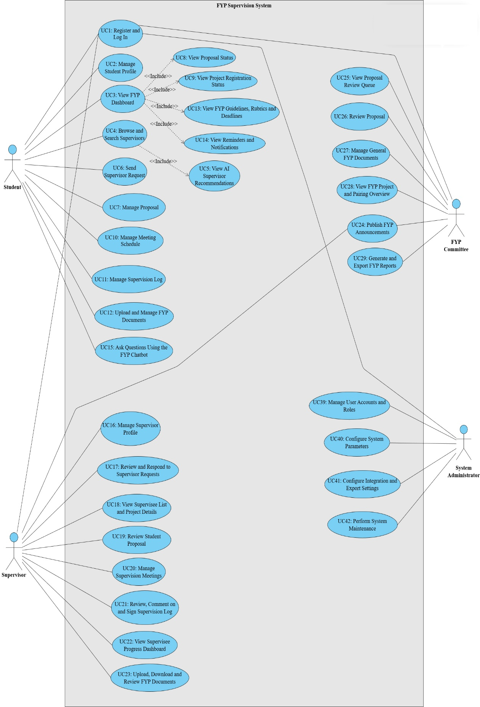

# Chapter 3: REQUIREMENTS

## 3.4 Requirements

Based on the background study, questionnaire results and observations, the following actors and requirements for the FYP Supervision System were identified.

**System actors**

- Student

- Supervisor

- FYP Committee

- System Administrator

### 3.4.1 Functional Requirements

The Functional requirements define what the system must do to support the FYP supervision workflow. Based on the problem findings and the use cases in Section 3.5, the functional requirements are organised by key modules and main actors (Student, Supervisor, FYP Committee, System Administrator), including AI-supported functions.

To keep the report concise, only a summary of the functional requirement groups is presented in this section. The complete functional requirements list (FR1–FR47) is provided in Appendix D (Table D.1) for reference and traceability.

Table 3.1 summarises the major functional modules and the most important requirement IDs that drive the system design.

Table 3.1: Summary of Functional Requirements (Main Modules)

| **Module** | **Key Functional Requirements (FR IDs)** | **Summary** |
|:---|----|----|
| User access & profile | FR1–FR2, FR41 | Users log in using MMU credentials, maintain profiles, and system admin manages accounts/roles. |
| Supervisor discovery & matching | FR3–FR8, FR29–FR32 | Students search/filter supervisors and request supervision; supervisors manage availability and respond to requests; AI recommends suitable supervisors. |
| Proposal submission & AI checking | FR9–FR17, FR12–FR15 | Students submit proposals via form/upload with versioning; AI proposal analyzer checks completeness; supervisors review/comment/approve; project status is visible to students. |
| Meetings & supervision log | FR18–FR23, FR44–FR46 | Students propose meetings; supervisors confirm/reschedule; meeting logs store summaries & action items; both parties sign and logs are locked after signing; admin verifies minimum logs. |
| Document & guideline management | FR24–FR27, FR34, FR40 | Students upload documents by phase/type; supervisors upload feedback/supporting files; admin uploads official templates/handbook; system sends deadline/meeting reminders. |
| Dashboards, reporting & announcements | FR33, FR38–FR39, FR47 | Supervisor dashboard shows supervisee progress; admin dashboard/reporting supports monitoring; announcements can be published for students/supervisees. |
| Chatbot support | FR28 | Chatbot answers common FYP questions (rules, deadlines, formatting, system usage). |
| System configuration & integration | FR42–FR43, FR45 | System admin configures FYP cycles/parameters and integration/export; meeting logs are securely locked as official records. |

### 

### 3.4.2 Non-Functional Requirements

The non-functional requirements describe quality attributes that the system must satisfy:

Table 3.2: Non-Functional Requirements (NFR)

| **ID** | **Category** | **Description** |
|----|----|----|
| NFR1 | Usability | The system shall provide a web-based, responsive user interface that works on modern desktop and laptop browsers. |
| NFR2 | Usability | The system shall use clear and consistent navigation with menu entries such as Dashboard, Projects, Meetings, Documents and Help. |
| NFR3 | Usability | All forms shall include validation and user-friendly error messages to reduce data entry mistakes. |
| NFR4 | Performance | Under normal network conditions, common actions (loading dashboard, opening project details) shall complete within 3 seconds. |
| NFR5 | Performance | AI services (proposal checker, supervisor recommendation, chatbot) shall return results within 10 seconds for typical proposal sizes. |
| NFR6 | Scalability | The system architecture shall support multiple FYP batches and future extension to other faculties without major redesign. |
| NFR7 | Availability | The system shall be available at least 99% of the time during the semester, excluding scheduled maintenance. |
| NFR8 | Reliability | The system shall perform regular backups of the database to prevent data loss. |
| NFR9 | Security | All client–server communication shall use HTTPS encryption. |
| NFR10 | Security | Access to data shall be role-based: students only see their own projects; supervisors only see their supervisees; FYP Committee and System Admin have broader access as required. |
| NFR11 | Security | FYP documents and personal data shall be stored securely with appropriate access control in the database or storage server. |
| NFR12 | Maintainability | The system shall be implemented using modular, well-documented code to ease maintenance and enhancement. |
| NFR13 | Maintainability | Interfaces between the main web application and AI microservices shall be clearly defined and documented. |
| NFR14 | Compatibility | The system shall be deployable on MMU’s existing infrastructure (e.g. Spring Boot backend, MySQL database, Python AI services). |
| NFR15 | Portability | The system shall be deployable either on-premise or on a cloud platform with minimal configuration changes. |

### 3.4.3 User Requirements

User requirements capture what each type of user expects to achieve when using the proposed FYP Supervision System. They are written from the user’s perspective and are mapped to the detailed Functional Requirements in Section 3.4.1 to ensure traceability.

To keep the main report concise, this section presents a high-level summary by actor. The complete user requirements list (UR1–UR27) with FR mapping is provided in Appendix E (Table E.1).

Table 3.3: Summary of User Requirements (by Actor)

| **Actor** | **User requirement summary (what they expect)** | **Related UR IDs** |
|----|----|----|
| Student | Single place to access FYP info; discover available supervisors; request supervision without mass emailing; guided proposal submission with AI checking; track status and deadlines; manage meetings, logs, and documents; ask common questions anytime. | UR1–UR11 |
| Supervisor | Maintain supervision profile/quota; efficiently respond to requests; review proposals online with feedback; schedule meetings and maintain supervision logs; monitor supervisee progress; share documents/feedback; publish announcements to supervisees. | UR12–UR18 |
| FYP Committee | Oversee proposals and approval workflow; monitor project/supervisor allocation; generate administrative reports (e.g., meeting logs compliance); publish faculty-wide announcements; manage official templates/guidelines in one place. | UR19–UR24 |
| System Admin | Securely manage accounts/roles; configure FYP cycles and key parameters (e.g., quota limits); manage integration/export settings when needed. | UR25–UR27 |

## 3.5 Use Case Diagram

Table 3.4 Use Cases by Actor

<table style="width:98%;">
<colgroup>
<col style="width: 22%" />
<col style="width: 76%" />
</colgroup>
<thead>
<tr>
<th><strong>Actor</strong></th>
<th><strong>Use Cases</strong></th>
</tr>
</thead>
<tbody>
<tr>
<td rowspan="15"><strong>Student</strong></td>
<td>UC1 – Register and Log In</td>
</tr>
<tr>
<td>UC2 – Manage Student Profile</td>
</tr>
<tr>
<td>UC3 – View FYP Dashboard</td>
</tr>
<tr>
<td>UC4 – Browse and Search Supervisors</td>
</tr>
<tr>
<td>UC5 – View AI Supervisor Recommendations</td>
</tr>
<tr>
<td>UC6 – Send Supervisor Request</td>
</tr>
<tr>
<td>UC7 – Manage Proposal</td>
</tr>
<tr>
<td>UC8 – View Proposal Status</td>
</tr>
<tr>
<td>UC9 – View Project Registration Status</td>
</tr>
<tr>
<td>UC10 – Manage Meeting Schedule</td>
</tr>
<tr>
<td>UC11 – Manage Supervision Log</td>
</tr>
<tr>
<td>UC12 – Upload and Manage FYP Documents</td>
</tr>
<tr>
<td>UC13 – View FYP Guidelines, Rubrics and Deadlines</td>
</tr>
<tr>
<td>UC14 – View Reminders and Notifications</td>
</tr>
<tr>
<td>UC15 – Ask Questions Using the FYP Chatbot</td>
</tr>
<tr>
<td rowspan="10"><strong>Supervisor</strong></td>
<td>UC1 – Register and Log In</td>
</tr>
<tr>
<td>UC16 – Manage Supervisor Profile</td>
</tr>
<tr>
<td>UC17 – Review and Respond to Supervisor Requests</td>
</tr>
<tr>
<td>UC18 – View Supervisee List and Project Details</td>
</tr>
<tr>
<td>UC19 – Review Student Proposal</td>
</tr>
<tr>
<td>UC20 – Manage Supervision Meetings</td>
</tr>
<tr>
<td>UC21 – Review, Comment on and Sign Supervision Log</td>
</tr>
<tr>
<td>UC22 – View Supervisee Progress Dashboard</td>
</tr>
<tr>
<td>UC23 – Upload, Download and Review FYP Documents</td>
</tr>
<tr>
<td>UC24 – Publish FYP Announcements</td>
</tr>
<tr>
<td rowspan="7"><strong>FYP Committee</strong></td>
<td>UC1 – Register and Log In</td>
</tr>
<tr>
<td>UC24 – Publish FYP Announcements</td>
</tr>
<tr>
<td>UC25 – View Proposal Review Queue</td>
</tr>
<tr>
<td>UC26 – Review Proposal</td>
</tr>
<tr>
<td>UC27 – Manage General FYP Documents</td>
</tr>
<tr>
<td>UC28 – View FYP Project and Pairing Overview</td>
</tr>
<tr>
<td>UC29 – Generate and Export FYP Reports</td>
</tr>
<tr>
<td rowspan="5"><strong>System Administrator</strong></td>
<td>UC1 – Register and Log In</td>
</tr>
<tr>
<td>UC30 – Manage User Accounts and Roles</td>
</tr>
<tr>
<td>UC31 – Configure System Parameters</td>
</tr>
<tr>
<td>UC32 – Configure Integration and Export Settings</td>
</tr>
<tr>
<td>UC33 – Perform System Maintenance</td>
</tr>
</tbody>
</table>

Figure 3.2 Use Case Diagram

### 3.5.1 Common Use Case Specification

Register use case specification

Table 3.5 UC1: Register and Log In

<table>
<colgroup>
<col style="width: 21%" />
<col style="width: 78%" />
</colgroup>
<thead>
<tr>
<th>Field</th>
<th>Details</th>
</tr>
</thead>
<tbody>
<tr>
<td>Use Case ID</td>
<td>UC1</td>
</tr>
<tr>
<td>Use Case Name</td>
<td>Register and Log In</td>
</tr>
<tr>
<td>Actors</td>
<td>Student, Supervisor, FYP Committee, System Administrator</td>
</tr>
<tr>
<td>Description</td>
<td>Allows users to access the system through registration (for eligible users) and login. The system determines the user role and displays the authorised modules and dashboard accordingly.</td>
</tr>
<tr>
<td>Pre-condition</td>
<td>System is available. For registration: user has a valid MMU ID and is eligible to self-register (Student or Supervisor). For login: user account exists in the system.</td>
</tr>
<tr>
<td>Postcondition</td>
<td>For registration: user account is created with an assigned role. For login: user is authenticated, a session is created, and the role-based dashboard and menus are displayed.</td>
</tr>
<tr>
<td>Basic Path</td>
<td><ol type="1">
<li>
User opens the system access page (Register or Log In).
</li>
<li>
If the user is a Student or Supervisor and does not have an account, the user selects Register.
</li>
<li>
User enters required details (MMU ID, full name, email, phone) and accepts the terms.
</li>
<li>
System validates details and creates the user account with role Student or Supervisor.
</li>
<li>
System redirects the user to the login page.
</li>
<li>
User enters MMU ID and password.
</li>
<li>
System validates credentials.
</li>
<li>
System retrieves the user role (Student, Supervisor, FYP Committee, or System Administrator) and permissions.
</li>
<li>
System creates a session and redirects to the corresponding dashboard.
</li>
</ol></td>
</tr>
<tr>
<td>Alternative Path</td>
<td>
A1: User account already exists → system directs user to Log In page.

A2: FYP Committee or System Administrator registration attempt → system blocks self-registration and informs that the account must be created by System Administrator.

A3: Invalid registration inputs → system highlights errors and requests correction.

A4: Invalid login credentials → system displays error and allows retry.
</td>
</tr>
<tr>
<td>Exceptional Path</td>
<td>
E1: Duplicate MMU ID or email during registration → system prevents account creation and displays message.

E2: Authentication service unavailable → system displays service unavailable message and logs the incident.

E3: Database/server error → system terminates the process and does not create account or session.
</td>
</tr>
</tbody>
</table>

### 

### 3.5.2 Student Use Case Specifications

Table 3.6 UC2: Manage Student Profile

<table style="width:97%;">
<colgroup>
<col style="width: 22%" />
<col style="width: 74%" />
</colgroup>
<thead>
<tr>
<th><strong>Field</strong></th>
<th><strong>Details</strong></th>
</tr>
</thead>
<tbody>
<tr>
<td>Use Case ID</td>
<td>UC2</td>
</tr>
<tr>
<td>Use Case Name</td>
<td>Manage Student Profile</td>
</tr>
<tr>
<td>Actors</td>
<td>Student</td>
</tr>
<tr>
<td>Description</td>
<td>Student views and updates personal and academic profile.</td>
</tr>
<tr>
<td>Pre-condition</td>
<td>Student is logged in.</td>
</tr>
<tr>
<td>Postcondition</td>
<td>Profile is updated and saved.</td>
</tr>
<tr>
<td>Basic Path</td>
<td><ol type="1">
<li>
Student opens profile page.
</li>
<li>
Student edits profile fields.
</li>
<li>
System validates inputs.
</li>
<li>
System saves profile changes.
</li>
</ol></td>
</tr>
<tr>
<td>Alternative Path</td>
<td>A1: Student cancels changes → system discards edits.</td>
</tr>
<tr>
<td>Exceptional Path</td>
<td>E1: Invalid input → system shows validation error messages.</td>
</tr>
</tbody>
</table>

Table 3.7 UC3: View FYP Dashboard

<table>
<colgroup>
<col style="width: 21%" />
<col style="width: 78%" />
</colgroup>
<thead>
<tr>
<th><strong>Field</strong></th>
<th><strong>Details</strong></th>
</tr>
</thead>
<tbody>
<tr>
<td>Use Case ID</td>
<td>UC3</td>
</tr>
<tr>
<td>Use Case Name</td>
<td>View FYP Dashboard</td>
</tr>
<tr>
<td>Actors</td>
<td>Student</td>
</tr>
<tr>
<td>Description</td>
<td>Student views project status, deadlines, and notifications.</td>
</tr>
<tr>
<td>Pre-condition</td>
<td>Student is logged in.</td>
</tr>
<tr>
<td>Postcondition</td>
<td>Dashboard is displayed.</td>
</tr>
<tr>
<td>Basic Path</td>
<td><ol type="1">
<li>
Student opens dashboard.
</li>
<li>
System loads proposal, meetings, logs, and documents summary.
</li>
<li>
System displays dashboard cards and alerts.
</li>
</ol></td>
</tr>
<tr>
<td>Alternative Path</td>
<td>A1: Student has no project → system displays next steps and guidance.</td>
</tr>
<tr>
<td>Exceptional Path</td>
<td>E1: Data retrieval error → system shows message and logs the error.</td>
</tr>
</tbody>
</table>

Table 3.8 UC4: Browse and Search Supervisors

<table style="width:98%;">
<colgroup>
<col style="width: 22%" />
<col style="width: 75%" />
</colgroup>
<thead>
<tr>
<th><strong>Field</strong></th>
<th><strong>Details</strong></th>
</tr>
</thead>
<tbody>
<tr>
<td>Use Case ID</td>
<td>UC4</td>
</tr>
<tr>
<td>Use Case Name</td>
<td>Browse and Search Supervisors</td>
</tr>
<tr>
<td>Actors</td>
<td>Student</td>
</tr>
<tr>
<td>Description</td>
<td>Student searches supervisors by research area and availability.</td>
</tr>
<tr>
<td>Pre-condition</td>
<td>Student is logged in.</td>
</tr>
<tr>
<td>Postcondition</td>
<td>Supervisor list and details are displayed.</td>
</tr>
<tr>
<td>Basic Path</td>
<td><ol type="1">
<li>
Student opens supervisor directory.
</li>
<li>
Student applies filters and keywords.
</li>
<li>
System displays matching supervisors.
</li>
<li>
Student views supervisor profile.
</li>
</ol></td>
</tr>
<tr>
<td>Alternative Path</td>
<td>A1: No results → system suggests adjusting filters.</td>
</tr>
<tr>
<td>Exceptional Path</td>
<td>E1: Directory service failure → system displays error banner.</td>
</tr>
</tbody>
</table>

Table 3.9 UC5: View AI Supervisor Recommendations

<table>
<colgroup>
<col style="width: 21%" />
<col style="width: 78%" />
</colgroup>
<thead>
<tr>
<th><strong>Field</strong></th>
<th><strong>Details</strong></th>
</tr>
</thead>
<tbody>
<tr>
<td>Use Case ID</td>
<td>UC5</td>
</tr>
<tr>
<td>Use Case Name</td>
<td>View AI Supervisor Recommendations</td>
</tr>
<tr>
<td>Actors</td>
<td>Student</td>
</tr>
<tr>
<td>Description</td>
<td>Student views recommended supervisors based on topic and profile.</td>
</tr>
<tr>
<td>Pre-condition</td>
<td>Student is logged in; topic keywords or draft proposal exists.</td>
</tr>
<tr>
<td>Postcondition</td>
<td>Recommendation list is displayed.</td>
</tr>
<tr>
<td>Basic Path</td>
<td><ol type="1">
<li>
Student opens recommendations page.
</li>
<li>
Student inputs topic or selects draft proposal.
</li>
<li>
System calls AI service.
</li>
<li>
System displays ranked recommendations.
</li>
</ol></td>
</tr>
<tr>
<td>Alternative Path</td>
<td>A1: Missing topic information → system prompts student to enter keywords. 
<mark>A2: System filters out supervisors who are unavailable or over the supervision quota before displaying the ranked list, so only eligible supervisors are recommended.</mark></td>
</tr>
<tr>
<td>Exceptional Path</td>
<td>E1: AI service timeout → system shows failure and allows retry.</td>
</tr>
</tbody>
</table>

Table 3.10 UC6: Send Supervisor Request

<table>
<colgroup>
<col style="width: 21%" />
<col style="width: 78%" />
</colgroup>
<thead>
<tr>
<th><strong>Field</strong></th>
<th><strong>Details</strong></th>
</tr>
</thead>
<tbody>
<tr>
<td>Use Case ID</td>
<td>UC6</td>
</tr>
<tr>
<td>Use Case Name</td>
<td>Send Supervisor Request</td>
</tr>
<tr>
<td>Actors</td>
<td>Student</td>
</tr>
<tr>
<td>Description</td>
<td>Student requests supervision from a supervisor.</td>
</tr>
<tr>
<td>Pre-condition</td>
<td>Student is logged in; supervisor is selectable; request rules are satisfied.</td>
</tr>
<tr>
<td>Postcondition</td>
<td>Request is created and supervisor is notified.</td>
</tr>
<tr>
<td>Basic Path</td>
<td><ol type="1">
<li>
Student selects supervisor.
</li>
<li>
Student enters message and topic.
</li>
<li>
Student submits request.
</li>
<li>
System records request as Pending and notifies supervisor.
</li>
</ol></td>
</tr>
<tr>
<td>Alternative Path</td>
<td>A1: Student withdraws pending request → status becomes Withdrawn.</td>
</tr>
<tr>
<td>Exceptional Path</td>
<td>E1: Supervisor not accepting students → system blocks request and shows reason.</td>
</tr>
</tbody>
</table>

Table 3.11 UC7: Manage Proposal

<table>
<colgroup>
<col style="width: 19%" />
<col style="width: 80%" />
</colgroup>
<thead>
<tr>
<th><strong>Field</strong></th>
<th><strong>Details</strong></th>
</tr>
</thead>
<tbody>
<tr>
<td>Use Case ID</td>
<td>UC7</td>
</tr>
<tr>
<td>Use Case Name</td>
<td>Manage Proposal</td>
</tr>
<tr>
<td>Actors</td>
<td>Student</td>
</tr>
<tr>
<td>Description</td>
<td>Student manages the proposal in a single workflow: create or edit proposal content (via form or file upload), optionally run the AI proposal checker to evaluate completeness/quality, and submit the proposal to the assigned supervisor for review. Version history is maintained for each saved or submitted proposal version.</td>
</tr>
<tr>
<td>Pre-condition</td>
<td>Student is logged in.</td>
</tr>
<tr>
<td>Postcondition</td>
<td>Draft proposal is saved with version history.</td>
</tr>
<tr>
<td>Basic Path</td>
<td><ol type="1">
<li>
Student opens the proposal module.
</li>
<li>
System displays the latest proposal draft (or an empty draft if none exists).
</li>
<li>
Student creates/edits proposal content or uploads a proposal file.
</li>
<li>
Student clicks Save Draft.
</li>
<li>
System creates a new proposal version and stores content/file.
</li>
<li>
Student clicks Run AI Checker.
</li>
<li>
System analyses the latest version and displays a score, detected issues, missing sections, and suggested improvements.
</li>
<li>
Student improves the proposal based on feedback and saves a new version if needed.
</li>
<li>
Student clicks Submit to Supervisor.
</li>
<li>
System updates proposal status to Submitted/Under Review, notifies the supervisor, and records the submission action.
</li>
</ol></td>
</tr>
<tr>
<td>Alternative Path</td>
<td style="text-align: left;">A1: Student skips AI checker → Student saves draft and proceeds to submit directly (Steps 3–5, then Step 9–10). 
A2: Student uploads file instead of form input → System extracts/stores file and creates a new version (Steps 3–5). 
A3: Student edits after running AI checker → Student saves a new version, then runs AI checker again (repeat Steps 3–8) before submission. 
A4: No supervisor assigned yet → System allows submission but routes to committee queue or prevents submission and prompts student to request/confirm supervisor (depends on your rules). 
<mark>A5: Student runs AI checker on the overall proposal (not a specific version) → System aggregates the latest proposal content across versions and stores the AI result at proposal level for traceability, instead of attaching it to a single version.</mark></td>
</tr>
<tr>
<td>Exceptional Path</td>
<td style="text-align: left;">E1: Unsupported file type / upload error → System rejects upload and shows accepted formats/size limits. 
E2: AI service unavailable / timeout → System shows error, keeps draft saved, and allows retry later. 
E3: Missing mandatory proposal fields (e.g., title/objectives) → System blocks submission and highlights required sections. 
E4: Duplicate submission attempt (already under review) → System prevents re-submit and instructs student to wait for review or create a new revision version.</td>
</tr>
</tbody>
</table>

Table 3.12 UC8: View Proposal Status

<table>
<colgroup>
<col style="width: 21%" />
<col style="width: 78%" />
</colgroup>
<thead>
<tr>
<th><strong>Field</strong></th>
<th><strong>Details</strong></th>
</tr>
</thead>
<tbody>
<tr>
<td>Use Case ID</td>
<td>UC8</td>
</tr>
<tr>
<td>Use Case Name</td>
<td>View Proposal Status</td>
</tr>
<tr>
<td>Actors</td>
<td>Student</td>
</tr>
<tr>
<td>Description</td>
<td>Student tracks proposal status and supervisor feedback.</td>
</tr>
<tr>
<td>Pre-condition</td>
<td>Student is logged in.</td>
</tr>
<tr>
<td>Postcondition</td>
<td><mark>Proposal status timeline is displayed, including the current status, AI proposal-checker results (score, missing sections, suggested improvements), and the full supervisor / committee review history with remarks and decisions.</mark></td>
</tr>
<tr>
<td>Basic Path</td>
<td><ol type="1">
<li>
Student opens proposal status page.
</li>
<li>
System displays status timeline and feedback.
</li>
<li>
Student views required actions.
</li>
</ol></td>
</tr>
<tr>
<td>Alternative Path</td>
<td>A1: Revision requested → system displays required changes and edit link.</td>
</tr>
<tr>
<td>Exceptional Path</td>
<td>E1: Proposal record not found → system displays support message and logs issue.</td>
</tr>
</tbody>
</table>

Table 3.13 UC9: View Project Registration Status

<table>
<colgroup>
<col style="width: 22%" />
<col style="width: 77%" />
</colgroup>
<thead>
<tr>
<th><strong>Field</strong></th>
<th><strong>Details</strong></th>
</tr>
</thead>
<tbody>
<tr>
<td>Use Case ID</td>
<td>UC9</td>
</tr>
<tr>
<td>Use Case Name</td>
<td>View Project Registration Status</td>
</tr>
<tr>
<td>Actors</td>
<td>Student</td>
</tr>
<tr>
<td>Description</td>
<td>Student views registration and pairing status for FYP cycle.</td>
</tr>
<tr>
<td>Pre-condition</td>
<td>Student is logged in.</td>
</tr>
<tr>
<td>Postcondition</td>
<td>Registration status is displayed.</td>
</tr>
<tr>
<td>Basic Path</td>
<td><ol type="1">
<li>
Student opens registration status.
</li>
<li>
System displays FYP stage and pairing info.
</li>
<li>
System displays next steps if applicable.
</li>
</ol></td>
</tr>
<tr>
<td>Alternative Path</td>
<td>A1: Not registered → system displays registration guidance.</td>
</tr>
<tr>
<td>Exceptional Path</td>
<td>E1: Status inconsistency → system warns user and logs warning.</td>
</tr>
</tbody>
</table>

Table 3.14 UC10: Manage Meeting Schedule

<table>
<colgroup>
<col style="width: 19%" />
<col style="width: 80%" />
</colgroup>
<thead>
<tr>
<th><strong>Field</strong></th>
<th><strong>Details</strong></th>
</tr>
</thead>
<tbody>
<tr>
<td>Use Case ID</td>
<td>UC10</td>
</tr>
<tr>
<td>Use Case Name</td>
<td>Manage Meeting Schedule</td>
</tr>
<tr>
<td>Actors</td>
<td>Student</td>
</tr>
<tr>
<td>Description</td>
<td>Student manages supervision meeting scheduling in one module: view upcoming and past meetings, propose new meeting slots with agenda, and update/cancel pending meeting requests before supervisor confirmation.</td>
</tr>
<tr>
<td>Pre-condition</td>
<td>Student is logged in; student is paired with a supervisor.</td>
</tr>
<tr>
<td>Postcondition</td>
<td>Meeting schedule is displayed, and/or a meeting request is created/updated with status Pending Confirmation and the supervisor is notified.</td>
</tr>
<tr>
<td>Basic Path</td>
<td><ol type="1">
<li>
Student opens the Meeting Schedule module.
</li>
<li>
System displays a calendar/list view of upcoming and past meetings for the student’s project.
</li>
<li>
Student clicks Request Meeting.
</li>
<li>
Student proposes date/time (start–end), selects platform (e.g., Teams/Zoom/Face-to-face), and enters an agenda.
</li>
<li>
Student submits the request.
</li>
<li>
System creates the meeting record with status Proposed/Pending Confirmation and notifies the supervisor.
</li>
<li>
Student returns to the schedule view and sees the pending meeting request.
</li>
</ol></td>
</tr>
<tr>
<td>Alternative Path</td>
<td style="text-align: left;">A1: Edit pending request → Student opens a pending request, edits time/agenda/platform, and submits; system updates the meeting and re-notifies the supervisor. 
A2: Cancel pending request → Student cancels a pending request; system updates status to Cancelled and notifies the supervisor. 
A3: View meeting details → Student opens a meeting item to view full details (agenda, status, confirmed time if available). 
A4: Export schedule → Student chooses export; system generates a calendar export file (e.g., .ics) or downloadable schedule output.</td>
</tr>
<tr>
<td>Exceptional Path</td>
<td style="text-align: left;">E1: Proposed time violates policy (outside allowed hours / too short notice / clashes with deadline blackout period) → system blocks submission and displays allowed rules. 
E2: Student not paired with supervisor → system disables request action and prompts student to complete supervisor pairing first. 
E3: Schedule/notification service error → system shows error message, logs the issue, and keeps the request as unsent or retries based on system design.</td>
</tr>
</tbody>
</table>

Table 3.15 UC11: Manage Supervision Log

<table>
<colgroup>
<col style="width: 19%" />
<col style="width: 80%" />
</colgroup>
<thead>
<tr>
<th><strong>Field</strong></th>
<th><strong>Details</strong></th>
</tr>
</thead>
<tbody>
<tr>
<td>Use Case ID</td>
<td>UC11</td>
</tr>
<tr>
<td>Use Case Name</td>
<td>Manage Supervision Log</td>
</tr>
<tr>
<td>Actors</td>
<td>Student</td>
</tr>
<tr>
<td>Description</td>
<td>Student manages supervision logs in one module: view meeting log history, create or upload a meeting log for a meeting session, submit the log for supervisor review, and sign the log once it reaches the signing stage. The log becomes an official supervision record when both student and supervisor have signed and the log is locked.</td>
</tr>
<tr>
<td>Pre-condition</td>
<td>Student is logged in; Student has an active project and related meeting record exists.</td>
</tr>
<tr>
<td>Postcondition</td>
<td><mark>Log is saved in the corresponding state (Draft, Submitted, Signed, or Locked) depending on the action performed. Once both the student and supervisor signatures have been recorded, the system locks the log and marks it as an immutable official supervision record.</mark></td>
</tr>
<tr>
<td>Basic Path</td>
<td><ol type="1">
<li>
Student opens the Supervision Log module.
</li>
<li>
System lists supervision logs by meeting (including status and signature progress).
</li>
<li>
Student selects a meeting and clicks Create/Upload Log.
</li>
<li>
Student fills in the log form (discussion summary, action items, next meeting date) and/or uploads the log file.
</li>
<li>
Student saves the log as Draft or submits it as Submitted.
</li>
<li>
System stores the log and notifies the supervisor for review/comments (if submitted).
</li>
<li>
After the supervisor reviews and signs, the student is notified.
</li>
<li>
Student opens the log and clicks Sign Log.
</li>
<li>
System records the student signature. If both signatures exist, system locks the log and marks it as an official record.
</li>
</ol></td>
</tr>
<tr>
<td>Alternative Path</td>
<td style="text-align: left;">A1: View only (history) → Student only views logs and action items; no upload/sign actions taken. 
A2: Filter logs → Student filters logs by date range, meeting, or status (Draft/Submitted/Signed/Locked). 
A3: Supervisor requests correction → Student receives feedback, edits the log, re-submits, and proceeds to signing after supervisor signs again. 
A4: Save as draft → Student saves as Draft and continues editing later before submission.</td>
</tr>
<tr>
<td>Exceptional Path</td>
<td style="text-align: left;">E1: Access to unauthorised log → System denies access and logs the attempt. 
E2: Student attempts to edit locked log → System blocks the action and displays “Locked record cannot be edited”. 
E3: Upload error / unsupported file type → System rejects upload and shows accepted formats/size limits. 
E4: Signing stage not reached (supervisor has not reviewed/signed yet) → System prevents student signing and shows current status and required next step.</td>
</tr>
</tbody>
</table>

Table 3.16 UC12: Upload and Manage FYP Documents

<table>
<colgroup>
<col style="width: 22%" />
<col style="width: 77%" />
</colgroup>
<thead>
<tr>
<th><strong>Field</strong></th>
<th><strong>Details</strong></th>
</tr>
</thead>
<tbody>
<tr>
<td>Use Case ID</td>
<td>UC12</td>
</tr>
<tr>
<td>Use Case Name</td>
<td>Upload and Manage FYP Documents</td>
</tr>
<tr>
<td>Actors</td>
<td>Student</td>
</tr>
<tr>
<td>Description</td>
<td>Student uploads reports, slides, and code archives by phase and type.</td>
</tr>
<tr>
<td>Pre-condition</td>
<td>Student is logged in.</td>
</tr>
<tr>
<td>Postcondition</td>
<td>Document is stored and visible to authorised users.</td>
</tr>
<tr>
<td>Basic Path</td>
<td><ol type="1">
<li>
Student opens document module.
</li>
<li>
Student selects document type and phase.
</li>
<li>
Student uploads file.
</li>
<li>
System stores file and updates list.
</li>
</ol></td>
</tr>
<tr>
<td>Alternative Path</td>
<td>A1: Replace document → system keeps version history.</td>
</tr>
<tr>
<td>Exceptional Path</td>
<td>E1: File exceeds limit or fails scan → system rejects and shows reason.</td>
</tr>
</tbody>
</table>

Table 3.17 UC13: View FYP Guidelines, Rubrics and Deadlines

<table>
<colgroup>
<col style="width: 22%" />
<col style="width: 77%" />
</colgroup>
<thead>
<tr>
<th><strong>Field</strong></th>
<th><strong>Detail</strong></th>
</tr>
</thead>
<tbody>
<tr>
<td>Use Case ID</td>
<td>UC13</td>
</tr>
<tr>
<td>Use Case Name</td>
<td>View FYP Guidelines, Rubrics and Deadlines</td>
</tr>
<tr>
<td>Actors</td>
<td>Student</td>
</tr>
<tr>
<td>Description</td>
<td>Student accesses official resources and deadlines.</td>
</tr>
<tr>
<td>Pre-condition</td>
<td>Student is logged in.</td>
</tr>
<tr>
<td>Postcondition</td>
<td>Resources are displayed and downloadable.</td>
</tr>
<tr>
<td>Basic Path</td>
<td><ol type="1">
<li>
Student opens guidelines page.
</li>
<li>
System displays resources by category.
</li>
<li>
Student opens or downloads resource.
</li>
</ol></td>
</tr>
<tr>
<td>Alternative Path</td>
<td>A1: Keyword search across resources.</td>
</tr>
<tr>
<td>Exceptional Path</td>
<td>E1: Missing resource file → system shows error and logs incident.</td>
</tr>
</tbody>
</table>

Table 3.18 UC14: View Reminders and Notifications

<table>
<colgroup>
<col style="width: 21%" />
<col style="width: 78%" />
</colgroup>
<thead>
<tr>
<th><strong>Field</strong></th>
<th><strong>Details</strong></th>
</tr>
</thead>
<tbody>
<tr>
<td>Use Case ID</td>
<td><mark>UC14</mark></td>
</tr>
<tr>
<td>Use Case Name</td>
<td>View Reminders and Notifications</td>
</tr>
<tr>
<td>Actors</td>
<td>Student</td>
</tr>
<tr>
<td>Description</td>
<td>System notifies student about meetings, deadlines, and announcements <mark>through configured channels (in-app inbox and email), based on the student's notification preferences</mark>.</td>
</tr>
<tr>
<td>Pre-condition</td>
<td>Student account exists; notification rules configured.</td>
</tr>
<tr>
<td>Postcondition</td>
<td>Notification is delivered and recorded.</td>
</tr>
<tr>
<td>Basic Path</td>
<td><ol type="1">
<li>
Trigger occurs (deadline, meeting update, announcement).
</li>
<li><mark>
System reads the student's notification preferences (channels and categories enabled).
</li></mark>
<li>
System sends notification <mark>through each enabled channel (in-app, email)</mark>.
</li>
<li>
Student views notification in system.
</li>
</ol></td>
</tr>
<tr>
<td>Alternative Path</td>
<td>A1: Student <mark>opens notification preferences and customises which categories (meetings, proposals, announcements, deadlines) and channels (in-app / email) to receive; the system stores the preferences and applies them to subsequent notifications</mark>.</td>
</tr>
<tr>
<td>Exceptional Path</td>
<td>E1: Delivery failure → system retries and logs failure.</td>
</tr>
</tbody>
</table>

Table 3.19 UC15: Ask Questions Using the FYP Chatbot

<table>
<colgroup>
<col style="width: 21%" />
<col style="width: 78%" />
</colgroup>
<thead>
<tr>
<th><strong>Field</strong></th>
<th><strong>Details</strong></th>
</tr>
</thead>
<tbody>
<tr>
<td>Use Case ID</td>
<td><mark>UC15</mark></td>
</tr>
<tr>
<td>Use Case Name</td>
<td>Ask Questions Using the FYP Chatbot</td>
</tr>
<tr>
<td>Actors</td>
<td>Student</td>
</tr>
<tr>
<td>Description</td>
<td>Student asks questions and receives chatbot guidance.</td>
</tr>
<tr>
<td>Pre-condition</td>
<td>Student is logged in; chatbot service is available.</td>
</tr>
<tr>
<td>Postcondition</td>
<td>Answer is displayed; conversation is stored.</td>
</tr>
<tr>
<td>Basic Path</td>
<td><ol type="1">
<li>
Student opens chatbot.
</li>
<li>
Student asks question.
</li>
<li>
System returns answer and reference source if available.
</li>
</ol></td>
</tr>
<tr>
<td>Alternative Path</td>
<td>A1: Low confidence → system suggests contacting FYP Committee and creates help request.</td>
</tr>
<tr>
<td>Exceptional Path</td>
<td>E1: Chatbot unavailable → system displays fallback contact instructions.</td>
</tr>
</tbody>
</table>

### 

### 3.5.2 Supervisor Use Case Specifications

Table 3.20 UC16: Manage Supervisor Profile

<table>
<colgroup>
<col style="width: 21%" />
<col style="width: 78%" />
</colgroup>
<thead>
<tr>
<th><strong>Field</strong></th>
<th><strong>Details</strong></th>
</tr>
</thead>
<tbody>
<tr>
<td>Use Case ID</td>
<td>UC16</td>
</tr>
<tr>
<td>Use Case Name</td>
<td>Manage Supervisor Profile</td>
</tr>
<tr>
<td>Actors</td>
<td>Supervisor</td>
</tr>
<tr>
<td>Description</td>
<td>Supervisor updates research areas, quota, and availability.</td>
</tr>
<tr>
<td>Pre-condition</td>
<td>Supervisor is logged in.</td>
</tr>
<tr>
<td>Postcondition</td>
<td>Profile updates are saved and reflected in search and recommendations.</td>
</tr>
<tr>
<td>Basic Path</td>
<td><ol type="1">
<li>
Supervisor opens profile.
</li>
<li>
Supervisor edits fields.
</li>
<li>
System validates and saves changes.
</li>
</ol></td>
</tr>
<tr>
<td>Alternative Path</td>
<td>A1: Set temporary unavailability dates.</td>
</tr>
<tr>
<td>Exceptional Path</td>
<td>E1: Quota violates policy → system blocks save and shows constraints.</td>
</tr>
</tbody>
</table>

Table 3.21 UC17: Review and Respond to Supervisor Requests

<table>
<colgroup>
<col style="width: 21%" />
<col style="width: 78%" />
</colgroup>
<thead>
<tr>
<th><strong>Field</strong></th>
<th><strong>Details</strong></th>
</tr>
</thead>
<tbody>
<tr>
<td>Use Case ID</td>
<td>UC17</td>
</tr>
<tr>
<td>Use Case Name</td>
<td>Review and Respond to Supervisor Requests</td>
</tr>
<tr>
<td>Actors</td>
<td>Supervisor</td>
</tr>
<tr>
<td>Description</td>
<td>Supervisor accepts, rejects, or requests clarification for requests.</td>
</tr>
<tr>
<td>Pre-condition</td>
<td>Supervisor logged in; pending requests exist.</td>
</tr>
<tr>
<td>Postcondition</td>
<td>Request status updated; student notified.</td>
</tr>
<tr>
<td>Basic Path</td>
<td><ol type="1">
<li>
Supervisor opens request list.
</li>
<li>
Supervisor views request details.
</li>
<li>
Supervisor selects accept or reject or clarify.
</li>
<li>
System updates status and notifies student.
</li>
</ol></td>
</tr>
<tr>
<td>Alternative Path</td>
<td>A1: Clarification requested → student replies, request remains pending.</td>
</tr>
<tr>
<td>Exceptional Path</td>
<td>E1: Acceptance exceeds quota → system blocks acceptance.</td>
</tr>
</tbody>
</table>

Table 3.22 UC18: View Supervisee List and Project Details

<table>
<colgroup>
<col style="width: 22%" />
<col style="width: 77%" />
</colgroup>
<thead>
<tr>
<th><strong>Field</strong></th>
<th><strong>Details</strong></th>
</tr>
</thead>
<tbody>
<tr>
<td>Use Case ID</td>
<td>UC18</td>
</tr>
<tr>
<td>Use Case Name</td>
<td>View Supervisee List and Project Details</td>
</tr>
<tr>
<td>Actors</td>
<td>Supervisor</td>
</tr>
<tr>
<td>Description</td>
<td>Supervisor views supervisees and their project information.</td>
</tr>
<tr>
<td>Pre-condition</td>
<td>Supervisor is logged in.</td>
</tr>
<tr>
<td>Postcondition</td>
<td>Supervisee list and details are displayed.</td>
</tr>
<tr>
<td>Basic Path</td>
<td><ol type="1">
<li>
Supervisor opens supervisee list.
</li>
<li>
System displays supervisees with status.
</li>
<li>
Supervisor opens a supervisee’s project details.
</li>
</ol></td>
</tr>
<tr>
<td>Alternative Path</td>
<td>A1: Filter by FYP stage or risk status.</td>
</tr>
<tr>
<td>Exceptional Path</td>
<td>E1: Access attempt to non-assigned student → system denies access.</td>
</tr>
</tbody>
</table>

Table 3.23 UC19: Review Student Proposal

<table>
<colgroup>
<col style="width: 19%" />
<col style="width: 80%" />
</colgroup>
<thead>
<tr>
<th><strong>Field</strong></th>
<th><strong>Details</strong></th>
</tr>
</thead>
<tbody>
<tr>
<td>Use Case ID</td>
<td>UC19</td>
</tr>
<tr>
<td>Use Case Name</td>
<td>Review Student Proposal</td>
</tr>
<tr>
<td>Actors</td>
<td>Supervisor</td>
</tr>
<tr>
<td>Description</td>
<td>Supervisor reviews the student’s submitted proposal in a single workflow screen. The supervisor can view proposal versions and AI checking results, provide comments, request revisions, or approve the proposal for project registration. All decisions and remarks are recorded for traceability.</td>
</tr>
<tr>
<td>Pre-condition</td>
<td>Supervisor logged in; proposal is submitted for review.</td>
</tr>
<tr>
<td>Postcondition</td>
<td>Proposal review outcome is recorded. The proposal status is updated to Revision Required or Approved, and the student is notified. If approved, the project registration status is updated accordingly and the supervisor’s supervision load may be updated.</td>
</tr>
<tr>
<td>Basic Path</td>
<td><ol type="1">
<li>
Supervisor opens the Proposal Review module.
</li>
<li>
System lists submitted proposals from supervisees with current status.
</li>
<li>
Supervisor selects a proposal to review.
</li>
<li>
System displays proposal details, latest proposal version, and version history.
</li>
<li>
System displays AI checking results (score, missing sections, suggested improvements) for the selected version (if available).
</li>
<li>
Supervisor reviews the content and enters remarks/comments.
</li>
<li>
Supervisor chooses an action: Request Revision or Approve.
</li>
<li>
System records the review decision and remarks in the review history.
</li>
<li>
System updates the proposal status accordingly and sends a notification to the student.
</li>
<li>
If Approve, system updates the project registration status (e.g., Registered/Approved) and updates supervisor’s current supervision load if applicable.
</li>
</ol></td>
</tr>
<tr>
<td>Alternative Path</td>
<td style="text-align: left;">A1: Review an older version → Supervisor selects a previous proposal version to compare changes; system shows the chosen version and its AI result 
A2: Request multiple revisions → After student resubmits a new version, supervisor repeats review and requests revision again until acceptable.</td>
</tr>
<tr>
<td>Exceptional Path</td>
<td style="text-align: left;">E1: Proposal not found / already withdrawn → System shows message and refreshes the list. 
E2: Supervisor not authorised (proposal not under their supervisee list) → System denies access and logs the attempt. 
E3: Missing required fields for decision (e.g., empty remarks when requesting revision if required) → System blocks submission and prompts for required input. 
E4: System error during status update/notification → System saves the review record, shows error, and retries notification or logs for admin action.</td>
</tr>
</tbody>
</table>

Table 3.24 UC20: Manage Supervision Meetings

<table>
<colgroup>
<col style="width: 21%" />
<col style="width: 78%" />
</colgroup>
<thead>
<tr>
<th><strong>Field</strong></th>
<th><strong>Details</strong></th>
</tr>
</thead>
<tbody>
<tr>
<td>Use Case ID</td>
<td>UC20</td>
</tr>
<tr>
<td>Use Case Name</td>
<td>Manage Supervision Meetings</td>
</tr>
<tr>
<td>Actors</td>
<td>Supervisor</td>
</tr>
<tr>
<td>Description</td>
<td>Supervisor confirms, reschedules, or cancels meeting requests.</td>
</tr>
<tr>
<td>Pre-condition</td>
<td>Supervisor logged in; meeting requests exist.</td>
</tr>
<tr>
<td>Postcondition</td>
<td>Meeting status updated; student notified.</td>
</tr>
<tr>
<td>Basic Path</td>
<td><ol type="1">
<li>
Supervisor opens meeting requests.
</li>
<li>
Supervisor selects request.
</li>
<li>
Supervisor confirms or reschedules or cancels.
</li>
<li>
System updates schedule and notifies student.
</li>
</ol></td>
</tr>
<tr>
<td>Alternative Path</td>
<td>A1: Suggest alternative times → student selects a new slot.</td>
</tr>
<tr>
<td>Exceptional Path</td>
<td>E1: Time conflict detected → system blocks and suggests available slots.</td>
</tr>
</tbody>
</table>

Table 3.25 UC21: Review, Comment on and Sign Supervision Log

<table>
<colgroup>
<col style="width: 21%" />
<col style="width: 78%" />
</colgroup>
<thead>
<tr>
<th><strong>Field</strong></th>
<th><strong>Details</strong></th>
</tr>
</thead>
<tbody>
<tr>
<td>Use Case ID</td>
<td>UC21</td>
</tr>
<tr>
<td>Use Case Name</td>
<td>Review, Comment on and Sign Supervision Log</td>
</tr>
<tr>
<td>Actors</td>
<td>Supervisor</td>
</tr>
<tr>
<td>Description</td>
<td>Supervisor reviews log, adds comments, and signs.</td>
</tr>
<tr>
<td>Pre-condition</td>
<td>Supervisor logged in; student submitted meeting log.</td>
</tr>
<tr>
<td>Postcondition</td>
<td>Supervisor signature recorded; student prompted to sign; log locked after both signatures.</td>
</tr>
<tr>
<td>Basic Path</td>
<td><ol type="1">
<li>
Supervisor opens submitted log.
</li>
<li>
Supervisor adds comments.
</li>
<li>
Supervisor signs log.
</li>
<li>
System notifies student to sign.
</li>
</ol></td>
</tr>
<tr>
<td>Alternative Path</td>
<td>A1: Request correction before signing → status becomes Correction Required.</td>
</tr>
<tr>
<td>Exceptional Path</td>
<td>E1: Log already locked → system blocks modifications.</td>
</tr>
</tbody>
</table>

Table 3.26 UC22: View Supervisee Progress Dashboard

<table>
<colgroup>
<col style="width: 21%" />
<col style="width: 78%" />
</colgroup>
<thead>
<tr>
<th><strong>Field</strong></th>
<th><strong>Details</strong></th>
</tr>
</thead>
<tbody>
<tr>
<td>Use Case ID</td>
<td>UC22</td>
</tr>
<tr>
<td>Use Case Name</td>
<td>View Supervisee Progress Dashboard</td>
</tr>
<tr>
<td>Actors</td>
<td>Supervisor</td>
</tr>
<tr>
<td>Description</td>
<td>Supervisor views progress indicators for meetings, logs, documents, and deadlines.</td>
</tr>
<tr>
<td>Pre-condition</td>
<td>Supervisor logged in.</td>
</tr>
<tr>
<td>Postcondition</td>
<td><mark>Dashboard is displayed showing, for each supervisee: proposal status, total and recent meeting count, supervision-log compliance (submitted / signed / locked), document submission state per phase, and upcoming deadlines, with at-risk supervisees highlighted.</mark></td>
</tr>
<tr>
<td>Basic Path</td>
<td><ol type="1">
<li>
Supervisor opens progress dashboard.
</li>
<li>
System aggregates supervisee progress data <mark>(proposal status, meeting count, log compliance, document submission state, upcoming deadlines)</mark>.
</li>
<li>
System displays indicators and alerts <mark>and highlights supervisees who are at risk (e.g., overdue logs, missing documents, no recent meetings)</mark>.
</li>
</ol></td>
</tr>
<tr>
<td>Alternative Path</td>
<td>A1: Export progress summary report.</td>
</tr>
<tr>
<td>Exceptional Path</td>
<td>E1: Metrics service failure → system shows partial results and logs issue.</td>
</tr>
</tbody>
</table>

Table 3.27 UC23: Upload, Download and Review FYP Documents

<table style="width:97%;">
<colgroup>
<col style="width: 22%" />
<col style="width: 74%" />
</colgroup>
<thead>
<tr>
<th><strong>Field</strong></th>
<th><strong>Details</strong></th>
</tr>
</thead>
<tbody>
<tr>
<td>Use Case ID</td>
<td>UC23</td>
</tr>
<tr>
<td>Use Case Name</td>
<td>Upload, Download and Review FYP Documents</td>
</tr>
<tr>
<td>Actors</td>
<td>Supervisor</td>
</tr>
<tr>
<td>Description</td>
<td>Supervisor reviews student documents and uploads feedback.</td>
</tr>
<tr>
<td>Pre-condition</td>
<td>Supervisor logged in; documents exist.</td>
</tr>
<tr>
<td>Postcondition</td>
<td>Feedback files stored; student notified.</td>
</tr>
<tr>
<td>Basic Path</td>
<td><ol type="1">
<li>
Supervisor opens student documents list.
</li>
<li>
Supervisor downloads and reviews.
</li>
<li>
Supervisor uploads feedback file.
</li>
<li>
System notifies student.
</li>
</ol></td>
</tr>
<tr>
<td>Alternative Path</td>
<td>A1: Request resubmission with remarks.</td>
</tr>
<tr>
<td>Exceptional Path</td>
<td>E1: Upload fails security scan → system rejects upload.</td>
</tr>
</tbody>
</table>

Table 3.28 UC24: Publish FYP Announcements

<table style="width:88%;">
<colgroup>
<col style="width: 22%" />
<col style="width: 65%" />
</colgroup>
<thead>
<tr>
<th><strong>Field</strong></th>
<th><strong>Details</strong></th>
</tr>
</thead>
<tbody>
<tr>
<td>Use Case ID</td>
<td>UC24</td>
</tr>
<tr>
<td>Use Case Name</td>
<td>Publish FYP Announcements</td>
</tr>
<tr>
<td>Actors</td>
<td>Supervisor</td>
</tr>
<tr>
<td>Description</td>
<td>Supervisor publishes announcements to supervisees.</td>
</tr>
<tr>
<td>Pre-condition</td>
<td>Supervisor logged in; supervisees exist.</td>
</tr>
<tr>
<td>Postcondition</td>
<td>Announcement published; recipients notified.</td>
</tr>
<tr>
<td>Basic Path</td>
<td><ol type="1">
<li>
Supervisor creates announcement.
</li>
<li>
Supervisor selects audience (supervisees).
</li>
<li>
Supervisor publishes.
</li>
<li>
System sends notifications.
</li>
</ol></td>
</tr>
<tr>
<td>Alternative Path</td>
<td>A1: Schedule announcement for a future date.</td>
</tr>
<tr>
<td>Exceptional Path</td>
<td>E1: Invalid content (empty) → system blocks publish.</td>
</tr>
</tbody>
</table>

### 3.5.3 FYP Committee Use Case Specifications

Table 3.29 UC24: Publish FYP Announcements

<table>
<colgroup>
<col style="width: 21%" />
<col style="width: 78%" />
</colgroup>
<thead>
<tr>
<th><strong>Field</strong></th>
<th><strong>Details</strong></th>
</tr>
</thead>
<tbody>
<tr>
<td>Use Case ID</td>
<td>UC24</td>
</tr>
<tr>
<td>Use Case Name</td>
<td>Publish FYP Announcements</td>
</tr>
<tr>
<td>Actors</td>
<td>FYP Committee</td>
</tr>
<tr>
<td>Description</td>
<td>Admin publishes faculty-level announcements for selected users and cycles.</td>
</tr>
<tr>
<td>Pre-condition</td>
<td>FYP Committee logged in.</td>
</tr>
<tr>
<td>Postcondition</td>
<td>Announcement published and logged; recipients notified.</td>
</tr>
<tr>
<td>Basic Path</td>
<td><ol type="1">
<li>
Admin creates announcement.
</li>
<li>
Admin selects audience and cycle.
</li>
<li>
Admin publishes.
</li>
<li>
System sends notifications.
</li>
</ol></td>
</tr>
<tr>
<td>Alternative Path</td>
<td>A1: Schedule announcement release time.</td>
</tr>
<tr>
<td>Exceptional Path</td>
<td>E1: Missing audience selection → system blocks publish.</td>
</tr>
</tbody>
</table>

Table 3.30 UC25: View Proposal Review Queue

<table style="width:99%;">
<colgroup>
<col style="width: 22%" />
<col style="width: 76%" />
</colgroup>
<thead>
<tr>
<th><strong>Field</strong></th>
<th><strong>Details</strong></th>
</tr>
</thead>
<tbody>
<tr>
<td>Use Case ID</td>
<td>UC25</td>
</tr>
<tr>
<td>Use Case Name</td>
<td>View Proposal Review Queue</td>
</tr>
<tr>
<td>Actors</td>
<td>FYP Committee</td>
</tr>
<tr>
<td>Description</td>
<td>Admin views proposals awaiting committee review.</td>
</tr>
<tr>
<td>Pre-condition</td>
<td>FYP Committee is logged in.</td>
</tr>
<tr>
<td>Postcondition</td>
<td>Queue list displayed.</td>
</tr>
<tr>
<td>Basic Path</td>
<td><ol type="1">
<li>
Admin opens queue page.
</li>
<li>
System lists proposals with status and filters.
</li>
<li>
Admin opens a proposal record.
</li>
</ol></td>
</tr>
<tr>
<td>Alternative Path</td>
<td>A1: Filter by programme or supervisor or status.</td>
</tr>
<tr>
<td>Exceptional Path</td>
<td>E1: Permission error → system denies access and logs attempt.</td>
</tr>
</tbody>
</table>

Table 3.31 UC26: Review Proposal

<table>
<colgroup>
<col style="width: 19%" />
<col style="width: 80%" />
</colgroup>
<thead>
<tr>
<th><strong>Field</strong></th>
<th><strong>Details</strong></th>
</tr>
</thead>
<tbody>
<tr>
<td>Use Case ID</td>
<td>UC26</td>
</tr>
<tr>
<td>Use Case Name</td>
<td>Review Proposal</td>
</tr>
<tr>
<td>Actors</td>
<td>FYP Committee</td>
</tr>
<tr>
<td>Description</td>
<td>FYP Committee reviews submitted proposals in a single workflow screen. The committee can view proposal versions and AI checking results, record remarks, and make a decision to approve, reject, or request revision. All decisions are stored for traceability and official record keeping.</td>
</tr>
<tr>
<td>Pre-condition</td>
<td>FYP Committee logged in; proposal exists in queue.</td>
</tr>
<tr>
<td>Postcondition</td>
<td>Committee decision is recorded. Proposal status is updated to Approved, Rejected, or Revision Required, and relevant parties (student and supervisor) are notified. If approved, project registration status is updated accordingly.</td>
</tr>
<tr>
<td>Basic Path</td>
<td><ol type="1">
<li>
Committee member opens the Proposal Review Queue.
</li>
<li>
System displays proposals pending committee action with filtering/sorting options.
</li>
<li>
Committee member selects a proposal.
</li>
<li>
System displays proposal details, latest version, and version history.
</li>
<li>
System displays AI checking results (score, missing sections, suggested improvements) for the selected version (if available).
</li>
<li>
Committee member reviews content and enters remarks/comments.
</li>
<li>
Committee member selects a decision: Approve, Reject, or Request Revision.
</li>
<li>
System records the decision and remarks in the review history.
</li>
<li>
System updates proposal status and, if applicable, updates project registration status.
</li>
<li>
System notifies the student and supervisor of the outcome.
</li>
</ol></td>
</tr>
<tr>
<td>Alternative Path</td>
<td style="text-align: left;">A1: Review previous versions → Committee member opens earlier versions to compare changes; system displays selected version and related AI results if available. 
A2: Request additional information → Committee member requests clarification and specifies required updates in remarks. 
A3: Multiple revision cycles → Student resubmits a new version; proposal returns to the queue until decision is finalised. 
A4: Assign to another committee member → Proposal remains in queue but reviewer changes.</td>
</tr>
<tr>
<td>Exceptional Path</td>
<td style="text-align: left;">E1: Proposal not found / already finalised → System shows message and refreshes the queue. 
E2: Committee member not authorised → System denies access and logs the attempt. 
E3: Missing required remarks for revision/rejection → System blocks submission and prompts for mandatory remarks. 
E4: System error during status update/notification → System saves the review record, shows error, and retries notification or logs for admin follow-up.</td>
</tr>
</tbody>
</table>

Table 3.32 UC27: Manage General FYP Documents

<table>
<colgroup>
<col style="width: 22%" />
<col style="width: 77%" />
</colgroup>
<thead>
<tr>
<th><strong>Field</strong></th>
<th><strong>Details</strong></th>
</tr>
</thead>
<tbody>
<tr>
<td>Use Case ID</td>
<td>UC27</td>
</tr>
<tr>
<td>Use Case Name</td>
<td>Manage General FYP Documents</td>
</tr>
<tr>
<td>Actors</td>
<td>FYP Committee</td>
</tr>
<tr>
<td>Description</td>
<td>Admin uploads and maintains handbook, templates, rubrics, and forms.</td>
</tr>
<tr>
<td>Pre-condition</td>
<td>FYP Committee logged in.</td>
</tr>
<tr>
<td>Postcondition</td>
<td>Resources updated and published.</td>
</tr>
<tr>
<td>Basic Path</td>
<td><ol type="1">
<li>
Admin opens resources module.
</li>
<li>
Admin uploads or replaces files.
</li>
<li>
Admin assigns category and publish settings.
</li>
<li>
System makes resources available to users.
</li>
</ol></td>
</tr>
<tr>
<td>Alternative Path</td>
<td>A1: Archive old version for reference.</td>
</tr>
<tr>
<td>Exceptional Path</td>
<td>E1: Invalid file type → system rejects upload.</td>
</tr>
</tbody>
</table>

Table 3.33 UC28: View FYP Project and Pairing Overview

<table>
<colgroup>
<col style="width: 19%" />
<col style="width: 80%" />
</colgroup>
<thead>
<tr>
<th><strong>Field</strong></th>
<th><strong>Details</strong></th>
</tr>
</thead>
<tbody>
<tr>
<td>Use Case ID</td>
<td>UC28</td>
</tr>
<tr>
<td>Use Case Name</td>
<td>View FYP Project and Pairing Overview</td>
</tr>
<tr>
<td>Actors</td>
<td>FYP Committee</td>
</tr>
<tr>
<td>Description</td>
<td>FYP Committee monitors FYP projects and supervisor–student pairings across programmes and cycles in a single dashboard. The dashboard summarises project statuses and pairing progress, and highlights unpaired students and overloaded supervisors to support timely administrative actions.</td>
</tr>
<tr>
<td>Pre-condition</td>
<td>FYP Committee logged in.</td>
</tr>
<tr>
<td>Postcondition</td>
<td>Overview dashboard is displayed with pairing status, project status summaries, and highlighted exceptions (unpaired students / overloaded supervisors).</td>
</tr>
<tr>
<td>Basic Path</td>
<td><ol type="1">
<li>
Committee member opens the Project &amp; Pairing Overview dashboard.
</li>
<li>
System retrieves and aggregates project and pairing data for the selected FYP cycle (default to current cycle).
</li>
<li>
System displays overall statistics (e.g., total projects, paired vs unpaired students, supervisor load distribution).
</li>
<li>
System lists key items, including: (a) unpaired students, (b) projects pending supervisor assignment, and (c) supervisors approaching/exceeding quota.
</li>
<li>
Committee member uses filters (programme, specialisation, supervisor, status) to refine the view.
</li>
</ol></td>
</tr>
<tr>
<td>Alternative Path</td>
<td style="text-align: left;">A1: Drill down by supervisor → Committee member selects a supervisor to view assigned students/projects and current load. 
A2: Drill down by programme/specialisation → Committee member filters by programme/specialisation to view localised pairing progress and exceptions. 
A3: Export overview → Committee member exports the list/summary (e.g., CSV/PDF report) for reporting purposes</td>
</tr>
<tr>
<td>Exceptional Path</td>
<td style="text-align: left;">E1: Query timeout / dataset too large → System prompts the user to apply filters (e.g., cycle/programme) and retries with the refined query. 
E2: No data available for selected cycle → System displays an empty-state message and suggests selecting another cycle or confirming cycle setup. 
E3: Access not authorised → System denies access and logs the attempt.</td>
</tr>
</tbody>
</table>

Table 3.34 UC29: Generate and Export FYP Reports

<table>
<colgroup>
<col style="width: 21%" />
<col style="width: 78%" />
</colgroup>
<thead>
<tr>
<th><strong>Field</strong></th>
<th><strong>Details</strong></th>
</tr>
</thead>
<tbody>
<tr>
<td>Use Case ID</td>
<td>UC29</td>
</tr>
<tr>
<td>Use Case Name</td>
<td>Generate and Export FYP Reports</td>
</tr>
<tr>
<td>Actors</td>
<td>FYP Committee</td>
</tr>
<tr>
<td>Description</td>
<td>Admin generates and exports reports such as pairing status and approved projects.</td>
</tr>
<tr>
<td>Pre-condition</td>
<td>FYP Committee logged in.</td>
</tr>
<tr>
<td>Postcondition</td>
<td><mark>Report file is produced in the requested format (CSV / PDF) and the report metadata (type, title, filters, format, file path, generated-by user, timestamp, expiry) is persisted in the system so it can be re-downloaded later from the report history.</mark></td>
</tr>
<tr>
<td>Basic Path</td>
<td><ol type="1">
<li>
Admin selects report type.
</li>
<li>
Admin sets filters <mark>and chooses output format (CSV / PDF)</mark>.
</li>
<li>
System generates report <mark>and stores the report metadata (filters, format, file path, generated-by user, timestamp) for later retrieval</mark>.
</li>
<li>
Admin downloads output file <mark>or accesses it later from the report history list</mark>.
</li>
</ol></td>
</tr>
<tr>
<td>Alternative Path</td>
<td>A1: Save report configuration for reuse <mark>(stored as a reusable export preset with selected fields, filters, and schedule)</mark>.</td>
</tr>
<tr>
<td>Exceptional Path</td>
<td>E1: Export generation failed → system displays error and logs incident.</td>
</tr>
</tbody>
</table>

### 3.5.4 System Administrator Use Case Specifications

Table 3.35 UC30: Manage User Accounts and Roles

<table>
<colgroup>
<col style="width: 21%" />
<col style="width: 78%" />
</colgroup>
<thead>
<tr>
<th><strong>Field</strong></th>
<th><strong>Details</strong></th>
</tr>
</thead>
<tbody>
<tr>
<td>Use Case ID</td>
<td>UC30</td>
</tr>
<tr>
<td>Use Case Name</td>
<td>Manage User Accounts and Roles</td>
</tr>
<tr>
<td>Actors</td>
<td>System Administrator</td>
</tr>
<tr>
<td>Description</td>
<td>System administrator manages accounts, roles, and access rights.</td>
</tr>
<tr>
<td>Pre-condition</td>
<td>System Administrator is logged in.</td>
</tr>
<tr>
<td>Postcondition</td>
<td>User account and role updates are applied.</td>
</tr>
<tr>
<td>Basic Path</td>
<td><ol type="1">
<li>
Admin searches user.
</li>
<li>
Admin edits role and status.
</li>
<li>
System validates and saves changes.
</li>
</ol></td>
</tr>
<tr>
<td>Alternative Path</td>
<td>A1: Disable account for security reasons. 
<mark>A2: Bulk-create user accounts from a CSV file → Admin uploads a CSV containing MMU ID, email, full name, and role; the system validates each row, creates the accounts in one batch, and reports successes and row-level errors.</mark></td>
</tr>
<tr>
<td>Exceptional Path</td>
<td>E1: Attempt to remove last System Administrator role → system blocks action.</td>
</tr>
</tbody>
</table>

Table 3.36 UC31: Configure System Parameters

<table>
<colgroup>
<col style="width: 22%" />
<col style="width: 77%" />
</colgroup>
<thead>
<tr>
<th><strong>Field</strong></th>
<th><strong>Details</strong></th>
</tr>
</thead>
<tbody>
<tr>
<td>Use Case ID</td>
<td>UC31</td>
</tr>
<tr>
<td>Use Case Name</td>
<td>Configure System Parameters</td>
</tr>
<tr>
<td>Actors</td>
<td>System Administrator</td>
</tr>
<tr>
<td>Description</td>
<td>Admin configures FYP cycles, sessions, and policy parameters.</td>
</tr>
<tr>
<td>Pre-condition</td>
<td>System Administrator logged in.</td>
</tr>
<tr>
<td>Postcondition</td>
<td>Settings saved and applied.</td>
</tr>
<tr>
<td>Basic Path</td>
<td><ol type="1">
<li>
Admin opens settings.
</li>
<li>
Admin updates parameters.
</li>
<li>
System validates constraints.
</li>
<li>
System saves configuration.
</li>
</ol></td>
</tr>
<tr>
<td>Alternative Path</td>
<td>A1: Preview setting impact before applying.</td>
</tr>
<tr>
<td>Exceptional Path</td>
<td>E1: Invalid values → system blocks save and displays constraints.</td>
</tr>
</tbody>
</table>

Table 3.37 UC32: Configure Integration and Export Settings

<table>
<colgroup>
<col style="width: 21%" />
<col style="width: 78%" />
</colgroup>
<thead>
<tr>
<th><strong>Field</strong></th>
<th><strong>Details</strong></th>
</tr>
</thead>
<tbody>
<tr>
<td>Use Case ID</td>
<td>UC32</td>
</tr>
<tr>
<td>Use Case Name</td>
<td>Configure Integration and Export Settings</td>
</tr>
<tr>
<td>Actors</td>
<td>System Administrator</td>
</tr>
<tr>
<td>Description</td>
<td>Admin configures integrations and export formats for faculty systems. <mark>The use case covers two related sub-flows: (a) Integration Settings — managing third-party endpoints (e.g., MMU SSO, email service, AI services) with credentials and test connections; and (b) Export Configurations — defining reusable export presets (data type, fields, filters, format, schedule) used by reporting and data-exchange features.</mark></td>
</tr>
<tr>
<td>Pre-condition</td>
<td>System Administrator logged in; integration info available.</td>
</tr>
<tr>
<td>Postcondition</td>
<td><mark>(a) Integration sub-flow: Integration record is stored with type, provider, endpoint, settings, and last-test result; connection is tested and status is recorded. (b) Export sub-flow: Export configuration record is stored with name, data type, format, included fields, filters, date format, and optional schedule, and is available as a reusable preset for report generation and data export.</mark></td>
</tr>
<tr>
<td>Basic Path</td>
<td><ol type="1">
<li><mark>
Admin chooses to manage Integration Settings or Export Configurations.
</li></mark>
<li>
Admin enters endpoints and credentials <mark>(integration sub-flow) or defines export name, data type, format, fields, filters, and schedule (export sub-flow)</mark>.
</li>
<li>
Admin runs test connection <mark>(integration sub-flow) or previews a sample export (export sub-flow)</mark>.
</li>
<li>
System saves settings <mark>and records the last-test result or last-export timestamp accordingly</mark>.
</li>
</ol></td>
</tr>
<tr>
<td>Alternative Path</td>
<td>A1: Disable integration temporarily. 
<mark>A2: Edit an existing export configuration → Admin updates fields, filters, or schedule; system updates the preset and the next scheduled run uses the new definition. 
A3: Run an export immediately from a saved configuration → System generates the file using the preset and updates the last-export path and timestamp.</mark></td>
</tr>
<tr>
<td>Exceptional Path</td>
<td>E1: Test connection fails → system blocks or saves as disabled with error note. 
<mark>E2: Export configuration validation fails (e.g., unknown field, invalid date format) → System blocks save and displays the offending field.</mark></td>
</tr>
</tbody>
</table>

Table 3.38 UC33: Perform System Maintenance

<table>
<colgroup>
<col style="width: 25%" />
<col style="width: 74%" />
</colgroup>
<thead>
<tr>
<th><strong>Field</strong></th>
<th><strong>Details</strong></th>
</tr>
</thead>
<tbody>
<tr>
<td>Use Case ID</td>
<td>UC33</td>
</tr>
<tr>
<td>Use Case Name</td>
<td>Perform System Maintenance</td>
</tr>
<tr>
<td>Actors</td>
<td>System Administrator</td>
</tr>
<tr>
<td>Description</td>
<td>Admin performs backup, restore, and monitoring tasks.</td>
</tr>
<tr>
<td>Pre-condition</td>
<td>System Administrator logged in; maintenance permissions granted.</td>
</tr>
<tr>
<td>Postcondition</td>
<td><mark>A maintenance job record is created with job type, status (Pending / Running / Completed / Failed), start and completion timestamps, result message and structured result data, and the triggering administrator's identity. The job result is retained for auditing and visible in the maintenance job history.</mark></td>
</tr>
<tr>
<td>Basic Path</td>
<td><ol type="1">
<li>
Admin selects maintenance task <mark>(e.g., backup, cleanup, integrity check, cache reset)</mark>.
</li>
<li>
Admin confirms execution.
</li>
<li>
System <mark>creates a maintenance job record (status = Running, triggered-by user recorded), runs the task, and updates the record on completion with outcome status, result data, and timestamps</mark>.
</li>
</ol></td>
</tr>
<tr>
<td>Alternative Path</td>
<td>A1: Schedule automatic backup. 
<mark>A2: View maintenance job history → Admin opens the job list, filters by job type or status, and inspects past runs and their result details.</mark></td>
</tr>
<tr>
<td>Exceptional Path</td>
<td>E1: Backup fails due to storage issue → system alerts and logs critical error <mark>and marks the maintenance job as Failed with the error message captured in the job record</mark>.</td>
</tr>
</tbody>
</table>

##  3.6 Entity Relationship Diagram

Note: refer to @Project-info/reports/ERD.md

Figure 3.3 Entity Relationship Diagram

### 3.6.1 ERD Overview

Figure 3.3 presents the Entity Relationship Diagram (ERD) of the FYP Supervision System. The ERD models the core data structure required to support user management, project supervision workflows, proposal handling, meeting management, document storage, system communications, and administrative auditing. The USER_ACCOUNT entity serves as the central identity table for all system roles (student, supervisor, and administrators), while STUDENT_PROFILE and SUPERVISOR_PROFILE store role-specific information using optional one-to-one relationships <mark>(both profile tables share their primary key with USER_ACCOUNT.user_id, and all role-based foreign keys throughout the schema reference USER_ACCOUNT.user_id directly)</mark>.

Each FYP_CYCLE contains multiple PROJECT records. A project is owned by a student and may be assigned to a supervisor through foreign keys referencing USER_ACCOUNT. Students may submit SUPERVISOR_REQUEST records to request supervision, supporting the supervisor selection and assignment process.

For proposal handling, each project is associated with PROPOSAL records and maintains revision history through PROPOSAL_VERSION. Automated proposal analysis results are stored in PROPOSAL_CHECK_RESULT, while review decisions and feedback are captured in PROPOSAL_REVIEW to support approval tracking and revision management. <mark>To support overall (proposal-level) AI checks, PROPOSAL_CHECK_RESULT may also reference a PROPOSAL directly, in addition to the version-level link, so AI evaluation can be recorded against either a specific PROPOSAL_VERSION or the proposal as a whole.</mark>

Supervision meetings are managed in MEETING, and each meeting may optionally generate a corresponding MEETING_LOG (0..1). Meeting logs can be verified by both parties via MEETING_LOG_SIGNATURE before being locked as an official supervision record. Project deliverables and uploaded files are stored in PROJECT_DOCUMENT, while shared templates, rubrics, and administrative materials are stored in RESOURCE_DOCUMENT.

Important dates and submissions are tracked using DEADLINE. System communication is supported through ANNOUNCEMENT, targeted audiences in ANNOUNCEMENT_AUDIENCE, and user NOTIFICATION for reminders and alerts. <mark>Per-user channel and category preferences for notifications are stored in USER_NOTIFICATION_PREFERENCES, which has an optional one-to-one relationship with USER_ACCOUNT.</mark> Chatbot interactions are recorded in CHAT_SESSION and CHAT_MESSAGE. Administrative configuration and traceability are supported through SYSTEM_PARAMETER, INTEGRATION_SETTING, and AUDIT_LOG.

<mark>For administrative reporting and operational tasks, three additional entities are introduced. GENERATED_REPORT records the metadata of every report produced by the FYP Committee (report type, title, format, filters, file path, expiry, and the generating user) so that previously generated reports can be retrieved later. EXPORT_CONFIG stores reusable export presets (data type, included fields, filters, output format, optional schedule, and last-export information) used by the reporting and data-exchange features. MAINTENANCE_JOB tracks system maintenance and cleanup tasks performed by the System Administrator, capturing the job type, status, start/completion timestamps, result, and the triggering administrator for full auditability.</mark>

The full database table descriptions for all entities shown in Figure 3.3, including attributes, keys, constraints, and field definitions, are provided in Appendix F (ERD Table Dictionary).

### 3.6.2 Use Case to Database Traceability (CRUD Mapping)

Tables 3.47–3.50 show traceability between use cases and database tables.

Table 3.47: Student Use Cases (UC1<mark>–UC15</mark>) and Main Database Tables Involved (CRUD)

| **Use Case** | **Main Tables Involved (CRUD)** |
|----|----|
| UC1 – Register and Log In | USER_ACCOUNT (C/R/U last_login_at), AUDIT_LOG (C) |
| UC2 – Manage Student Profile | STUDENT_PROFILE (C/U), USER_ACCOUNT (U), AUDIT_LOG (C) |
| UC3 – View FYP Dashboard | PROJECT (R), PROPOSAL (R), MEETING (R), DEADLINE (R), NOTIFICATION (R) |
| UC4 – Browse and Search Supervisors | SUPERVISOR_PROFILE (R), USER_ACCOUNT (R) |
| UC5 – View AI Supervisor Recommendations | SUPERVISOR_PROFILE (R), USER_ACCOUNT (R), AUDIT_LOG (C) |
| UC6 – Send Supervisor Request | SUPERVISOR_REQUEST (C), NOTIFICATION (C), AUDIT_LOG (C) |
| UC7 – Manage Proposal | PROPOSAL (C/U), PROPOSAL_VERSION (C), PROPOSAL_CHECK_RESULT (C<mark>, version-level or proposal-level</mark>), PROPOSAL_REVIEW (R), NOTIFICATION (C), AUDIT_LOG (C) |
| UC8 – View Proposal Status | PROPOSAL (R), PROPOSAL_VERSION (R), <mark>PROPOSAL_CHECK_RESULT (R), </mark>PROPOSAL_REVIEW (R) |
| UC9 – View Project Registration Status | PROJECT (R), FYP_CYCLE (R) |
| UC10 – Manage Meeting Schedule | MEETING (C/R/U), NOTIFICATION (C), AUDIT_LOG (C) |
| UC11 – Manage Supervision Log | MEETING_LOG (C/R/U), MEETING_LOG_SIGNATURE (C/R), MEETING (R), NOTIFICATION (C), AUDIT_LOG (C) |
| UC12 – Upload and Manage FYP Documents | PROJECT_DOCUMENT (C/R/U/D), AUDIT_LOG (C) |
| UC13 – View FYP Guidelines, Rubrics and Deadlines | RESOURCE_DOCUMENT (R), DEADLINE (R), ANNOUNCEMENT (R) |
| UC14 – View Reminders and Notifications | NOTIFICATION (R/U read_at)<mark>, USER_NOTIFICATION_PREFERENCES (R/U)</mark> |
| UC15 – Ask Questions Using the FYP Chatbot | CHAT_SESSION (C/R), CHAT_MESSAGE (C/R<mark>)</mark> |

Table 3.48: Supervisor Use Cases (UC1, <mark>UC16–UC24</mark>) and Main Database Tables Involved (CRUD)

| **Use Case** | **Main Tables Involved (CRUD)** |
|:---|:---|
| UC1 – Register and Log In | USER_ACCOUNT (C/R/U last_login_at), AUDIT_LOG (C) |
| UC16 – Manage Supervisor Profile | SUPERVISOR_PROFILE (C/U), USER_ACCOUNT (U), AUDIT_LOG (C) |
| UC17 – Review and Respond to Supervisor Requests | SUPERVISOR_REQUEST (R/U), PROJECT (U), NOTIFICATION (C), AUDIT_LOG (C) |
| UC18 – View Supervisee List and Project Details | PROJECT (R), USER_ACCOUNT (R), STUDENT_PROFILE (R) |
| UC19 – Review Student Proposal | PROPOSAL (R/U), PROPOSAL_VERSION (R), PROPOSAL_CHECK_RESULT (R), PROPOSAL_REVIEW (C), PROJECT (U), SUPERVISOR_PROFILE (U), NOTIFICATION (C), AUDIT_LOG (C) |
| UC20 – Manage Supervision Meetings | MEETING (C/R/U), NOTIFICATION (C), AUDIT_LOG (C) |
| UC21 – Review, Comment on and Sign Supervision Log | MEETING_LOG (R/U), MEETING_LOG_SIGNATURE (C), MEETING (R), NOTIFICATION (C), AUDIT_LOG (C) |
| UC22 – View Supervisee Progress Dashboard | PROJECT (R), PROPOSAL (R), MEETING (R), MEETING_LOG (R), PROJECT_DOCUMENT (R), DEADLINE (R) |
| UC23 – Upload, Download and Review FYP Documents | PROJECT_DOCUMENT (C/R), AUDIT_LOG (C) |
| UC24 – Publish FYP Announcements | ANNOUNCEMENT (C/R), ANNOUNCEMENT_AUDIENCE (C/R), NOTIFICATION (C), AUDIT_LOG (C) |

Table 3.49: FYP Committee Use Cases (UC1, <mark>UC24–UC29</mark>) and Main Database Tables Involved (CRUD)

| **Use Case** | **Main Tables Involved (CRUD)** |
|:---|:---|
| UC1 – Register and Log In | USER_ACCOUNT (C/R/U last_login_at), AUDIT_LOG (C) |
| UC24 – Publish FYP Announcements | ANNOUNCEMENT (C/R), ANNOUNCEMENT_AUDIENCE (C/R), NOTIFICATION (C), AUDIT_LOG (C) |
| UC25 – View Proposal Review Queue | PROPOSAL (R), PROJECT (R), USER_ACCOUNT (R) |
| UC26 – Review Proposal | PROPOSAL (R/U), PROPOSAL_VERSION (R), PROPOSAL_CHECK_RESULT (R), PROPOSAL_REVIEW (C), PROJECT (U), NOTIFICATION (C), AUDIT_LOG (C) |
| UC27 – Manage General FYP Documents | RESOURCE_DOCUMENT (C/R/U/D), AUDIT_LOG (C) |
| UC28 – View FYP Project and Pairing Overview | PROJECT (R), FYP_CYCLE (R), SUPERVISOR_PROFILE (R), STUDENT_PROFILE (R), SUPERVISOR_REQUEST (R), USER_ACCOUNT (R), AUDIT_LOG (C) |
| UC29 – Generate and Export FYP Reports | PROJECT (R), PROPOSAL (R), MEETING_LOG (R), PROJECT_DOCUMENT (R), USER_ACCOUNT (R), <mark>GENERATED_REPORT (C/R), EXPORT_CONFIG (R), </mark>AUDIT_LOG (C) |

Table 3.50: System Administrator Use Cases (UC1, <mark>UC30–UC33</mark>) and Main Database Tables Involved (CRUD)

| **Use Case** | **Main Tables Involved (CRUD)** |
|:---|:---|
| UC1 – Register and Log In | USER_ACCOUNT (C/R/U last_login_at), AUDIT_LOG (C) |
| UC30 – Manage User Accounts and Roles | USER_ACCOUNT (C/R/U/D), STUDENT_PROFILE (C/R/U/D), SUPERVISOR_PROFILE (C/R/U/D), AUDIT_LOG (C) |
| UC31 – Configure System Parameters | SYSTEM_PARAMETER (C/R/U/D), FYP_CYCLE (C/R/U/D), DEADLINE (C/R/U/D), AUDIT_LOG (C) |
| UC32 – Configure Integration and Export Settings | INTEGRATION_SETTING (C/R/U/D), <mark>EXPORT_CONFIG (C/R/U/D), </mark>AUDIT_LOG (C) |
| UC33 – Perform System Maintenance | <mark>MAINTENANCE_JOB (C/R/U), </mark>AUDIT_LOG (C/R) |

