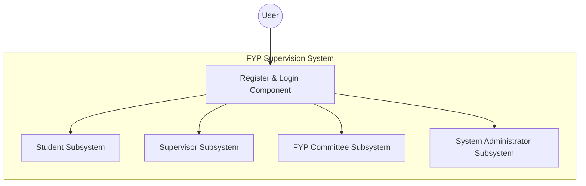
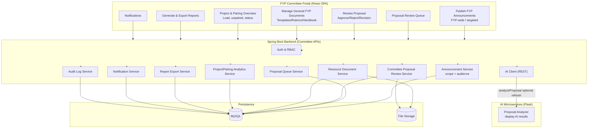

# Chapter 4: DESIGN

## 4.1 Software Architecture

This section presents the software architecture of the proposed FYP
Supervision System. The architecture is documented using two
complementary views. The first view describes the system at a UML
component or subsystem level to show how the platform is organised by
user roles and how access is controlled through a shared authentication
component. The second view describes the implementation-level layered
architecture to show how the web application, backend services, data
storage, and AI microservices communicate in the deployed system.



Figure 4.1 Overall Software Architecture (Subsystem and Component View)

Figure 4.1 illustrates the overall structure of the FYP Supervision
System as four main subsystems based on system actors: Student,
Supervisor, FYP Committee, and System Administrator. Each subsystem
contains the features and operations required by the corresponding user
role. All subsystems interact with a shared Register and Login
component, which acts as the entry point for authentication and
role-based access. After a user successfully registers and logs in, the
system enables access to the appropriate subsystem according to the
user's role. This design improves modularity by separating
responsibilities by user type while maintaining consistent access
control through a single authentication component.

<!--
UPDATED 2026-05-10: AI Microservices Layer labels in this diagram have
been refreshed to reflect the actual implementation in FYP2.
- "TF-IDF + Cosine Similarity" → "Sentence-BERT (BGE-base) + Weighted Scoring"
- "NLP Rules/spaCy" → "Rule-based NLP + DistilBERT + Optional LLM"
- Chatbot service tech stack added: "FAISS RAG + Remote LLM (Groq/OpenAI)"
-->

```mermaid
flowchart LR
  subgraph Clients["Client Layer (Web Browser)"]
    S[Student Browser]
    SV[Supervisor Browser]
    FC[FYP Committee Browser]
    SA[System Admin Browser]
  end

  I[(Internet / HTTPS)]

  subgraph App["Application Layer (FYP Web Server)"]
    FE["React SPA Frontend"]
    BE["Spring Boot Backend (REST API)"]

    AUTH["Auth & RBAC (Spring Security/JWT)"]
    NOTI["Notification Service"]
    DOCS["Document Service"]
    AUD["Audit Logging Service"]
    AIClient["AI Integration Client (REST calls)"]
  end

  subgraph Data["Data Layer"]
    DB[(MySQL Database)]
    FS[(File Storage<br/>Local/Cloud Object Storage)]
  end

  subgraph AI["AI Microservices Layer (Python/Flask)"]
    REC["Supervisor Recommendation Service<br/>Sentence-BERT (BGE-base) + Weighted Scoring"]
    PA["Proposal Analyzer Service<br/>Rule-based NLP + DistilBERT + Optional LLM"]
    CB["FYP Chatbot Service<br/>FAISS RAG + Remote LLM (Groq/OpenAI)"]
  end

  S --> I --> FE
  SV --> I --> FE
  FC --> I --> FE
  SA --> I --> FE

  FE -->|REST/JSON| BE

  BE --> AUTH
  BE --> NOTI
  BE --> DOCS
  BE --> AUD
  BE --> AIClient

  BE --> DB
  DOCS --> FS
  BE --> FS

  AIClient -->|/recommendSupervisor| REC
  AIClient -->|/analyzeProposal| PA
  AIClient -->|/chatbotQuery| CB
```Figure 4.2 Implementation Software
Architecture (Layered System View)

Figure 4.2 shows the deployed architecture in a layered structure. The
Client Layer consists of web browsers used by students, supervisors, the
FYP committee, and system administrators. These clients access the
system through the Internet/HTTPS, ensuring secure communication. The
React SPA Frontend provides the user interface and interacts with the
backend using REST/JSON API calls.

The Application Layer is implemented using a Spring Boot Backend (REST
API), which contains the core business logic and system workflows such
as proposal management, meeting scheduling, supervision logging, and
document handling. Supporting services inside the backend include Auth
and RBAC for access control, a Notification Service for reminders and
alerts, a Document Service for file operations, and an Audit Logging
Service for tracking critical actions and ensuring accountability. For
AI functions, the backend communicates through an AI Integration Client,
which sends requests to the AI layer and returns AI-generated results to
users.

The Data Layer stores structured system data in a MySQL Database,
including user profiles, proposals, meeting schedules, supervision logs,
and request statuses. Uploaded files such as proposal documents and
supporting attachments are stored in a File Storage component, which is
accessed through the backend document module.

Finally, the AI Microservices Layer consists of independent Python/Flask
services to support intelligent features. These include a Supervisor
Recommendation Service for matching students to supervisors, a Proposal
Analyzer Service for checking proposal completeness and weaknesses, and
an FYP Chatbot Service for answering user questions. Separating the AI
services from the main backend improves maintainability and allows AI
modules to be updated independently without disrupting the core system.

### 4.1.1 Subsystem 1 (Student)

```mermaid
graph TD
  Login["Register & Login Component"]
  subgraph "Student Subsystem"
    Dashboard["Profile & Dashboard"]
    Search["Search & View Recommendations"]
    Requests["Send Supervisor Requests"]
    Proposals["Manage Proposals & Check Status"]
    Registration["Track Registration Status"]
    Meetings["Schedule Meetings"]
    Logs["Maintain Supervision Logs"]
    Uploads["Upload FYP Documents"]
    Resources["View Guidelines/Rubrics/Deadlines"]
    Notifications["Receive Reminders/Notifications"]
    Chatbot["Ask Questions via Chatbot"]
  end
  Login --> "Student Subsystem"
```

Figure 4.3 Student Subsystem Architecture (Component View)

Figure 4.3 shows the Student subsystem as a set of components accessed
through the Register and Login component. After authentication, students
can perform the main functions required in the FYP process, including
managing profile and dashboard, searching supervisors and viewing AI
recommendations, sending supervisor requests, managing proposals and
checking status, tracking registration status, scheduling meetings,
maintaining supervision logs, uploading FYP documents, viewing
guidelines/rubrics/deadlines, receiving reminders/notifications, and
asking questions via the chatbot.

```mermaid
flowchart TB
  %% =========================
  %% Student Software Architecture
  %% =========================

  subgraph StudentUI["Student Portal (React SPA)"]
    SD["Dashboard"]
    SSD["Supervisor Directory & Search"]
    SAR["AI Supervisor Recommendations"]
    SSR["Supervisor Request"]
    SP["Proposal Module\n(Versioning + AI Check)"]
    SM["Meeting Schedule"]
    SL["Supervision Log\n(Create/Submit/Sign)"]
    SDoc["FYP Documents Upload/Manage"]
    SRes["Guidelines / Rubrics / Deadlines"]
    SNoti["Notifications"]
    SChat["Chatbot"]
  end

  subgraph Backend["Spring Boot Backend (Student APIs)"]
    Auth["Auth & RBAC"]
    StudentSvc["Student/Profile Service"]
    SupervisorSvc["Supervisor Directory Service"]
    RequestSvc["Supervisor Request Service"]
    ProposalSvc["Proposal Service\n(Proposal + Versions + Reviews)"]
    MeetingSvc["Meeting Service"]
    LogSvc["Meeting Log & Signature Service"]
    DocSvc["Project Document Service"]
    ResourceSvc["Resource & Deadline Service"]
    NotiSvc["Notification Service"]
    ChatSvc["Chat Session/Message Service"]
    AIClient["AI Client (REST)"]
    AuditSvc["Audit Log Service"]
  end

  subgraph Data["Persistence"]
    DB[(MySQL)]
    FS[(File Storage)]
  end

  subgraph AI["AI Microservices (Flask)"]
    REC["Supervisor Recommendation"]
    PA["Proposal Analyzer"]
    CB["Chatbot"]
  end

  %% UI -> Backend
  SD --> Backend
  SSD --> Backend
  SAR --> Backend
  SSR --> Backend
  SP --> Backend
  SM --> Backend
  SL --> Backend
  SDoc --> Backend
  SRes --> Backend
  SNoti --> Backend
  SChat --> Backend

  %% Backend internal deps
  Backend --> Auth
  Backend --> StudentSvc
  Backend --> SupervisorSvc
  Backend --> RequestSvc
  Backend --> ProposalSvc
  Backend --> MeetingSvc
  Backend --> LogSvc
  Backend --> DocSvc
  Backend --> ResourceSvc
  Backend --> NotiSvc
  Backend --> ChatSvc
  Backend --> AIClient
  Backend --> AuditSvc

  %% Data
  StudentSvc --> DB
  SupervisorSvc --> DB
  RequestSvc --> DB
  ProposalSvc --> DB
  MeetingSvc --> DB
  LogSvc --> DB
  DocSvc --> DB
  ResourceSvc --> DB
  NotiSvc --> DB
  ChatSvc --> DB
  AuditSvc --> DB

  DocSvc --> FS
  ProposalSvc --> FS

  %% AI calls
  AIClient -->|recommend| REC
  AIClient -->|analyze| PA
  AIClient -->|chat| CB
```Figure 4.4 Student Subsystem Architecture
(Implementation Layer View)

Figure 4.y illustrates the implementation of the Student subsystem where
the Student Portal (React SPA) communicates with the Spring Boot Backend
(Student APIs) via REST/JSON. The backend enforces access control using
Auth and RBAC, stores structured records in MySQL, stores uploaded files
in File Storage, and integrates with Flask-based AI microservices
(recommendation, proposal analysis, and chatbot) to support intelligent
features.

### 4.1.2 Subsystem 2 (Supervisor)

```mermaid
graph TD
  Login["Register & Login Component"]
  subgraph "Supervisor Subsystem"
    Profile["Manage Profile"]
    Requests["Review & Respond to Requests"]
    Supervisees["View Supervisee Lists & Project Details"]
    Proposals["Review Student Proposals"]
    Meetings["Manage Supervision Meetings"]
    Logs["Review/Comment/Sign Supervision Logs"]
    Progress["View Supervisee Progress"]
    Documents["Upload/Download/Review Documents"]
    Announcements["Publish Announcements"]
  end
  Login --> "Supervisor Subsystem"
```

Figure 4.5 Supervisor Subsystem Architecture (Component View)

Figure 4.5 shows the Supervisor subsystem where access is provided
through the Register and Login component. After logging in, supervisors
can manage their profile, review and respond to supervisor requests,
view supervisee lists and project details, review student proposals,
manage supervision meetings, review/comment/sign supervision logs, view
supervisee progress, upload/download/review FYP documents, and publish
announcements.

```mermaid
flowchart TB
  %% =========================
  %% Supervisor Software Architecture
  %% =========================

  subgraph SupUI["Supervisor Portal (React SPA)"]
    SVD["Supervisor Dashboard / Progress"]
    SVP["Manage Supervisor Profile<br/>Research Areas, Quota, Availability"]
    SVR["Review & Respond Supervisor Requests"]
    SVL["Supervisee List & Project Details"]
    SVPR["Review Student Proposal<br/>View versions + AI results"]
    SVM["Manage Supervision Meetings<br/>Confirm/Reschedule"]
    SVLog["Review/Comment/Sign Meeting Log"]
    SVDOC["Review Documents / Upload Feedback"]
    SVA["Publish Announcements to supervisees"]
    SVNoti["Notifications"]
  end

  subgraph Backend["Spring Boot Backend (Supervisor APIs)"]
    Auth["Auth & RBAC"]
    SupervisorProfileSvc["Supervisor Profile Service"]
    RequestSvc["Supervisor Request Service"]
    ProjectSvc["Project & Supervisee Service"]
    ProposalSvc["Proposal Review Service"]
    MeetingSvc["Meeting Service"]
    LogSvc["Meeting Log & Signature Service"]
    DocSvc["Document Review/Feedback Service"]
    AnnSvc["Announcement Service"]
    NotiSvc["Notification Service"]
    AIClient["AI Client (REST)"]
    AuditSvc["Audit Log Service"]
  end

  subgraph Data["Persistence"]
    DB[(MySQL)]
    FS[(File Storage)]
  end

  subgraph AI["AI Microservices (Flask)"]
    PA["Proposal Analyzer"]
    REC["Supervisor Recommendation - optional view"]
  end

  %% UI -> Backend
  SVD --> Backend
  SVP --> Backend
  SVR --> Backend
  SVL --> Backend
  SVPR --> Backend
  SVM --> Backend
  SVLog --> Backend
  SVDOC --> Backend
  SVA --> Backend
  SVNoti --> Backend

  %% Backend internal deps
  Backend --> Auth
  Backend --> SupervisorProfileSvc
  Backend --> RequestSvc
  Backend --> ProjectSvc
  Backend --> ProposalSvc
  Backend --> MeetingSvc
  Backend --> LogSvc
  Backend --> DocSvc
  Backend --> AnnSvc
  Backend --> NotiSvc
  Backend --> AIClient
  Backend --> AuditSvc

  %% Data
  SupervisorProfileSvc --> DB
  RequestSvc --> DB
  ProjectSvc --> DB
  ProposalSvc --> DB
  MeetingSvc --> DB
  LogSvc --> DB
  DocSvc --> DB
  AnnSvc --> DB
  NotiSvc --> DB
  AuditSvc --> DB

  ProposalSvc --> FS
  DocSvc --> FS

  %% AI calls
  AIClient -->|analyzeProposal| PA
  AIClient -->|recommendSupervisor optional| REC
```



Figure 4.6 Supervisor Subsystem Architecture (Implementation Layer View)

Figure 4.6 illustrates that the Supervisor Portal (React SPA)
communicates with the Spring Boot Backend (Supervisor APIs) via
REST/JSON. The backend applies Auth and RBAC, stores records in MySQL,
stores files in File Storage, and integrates with the Proposal Analyzer
AI microservice through the AI client to support proposal review and
analysis.

### 4.1.3 Subsystem 3 (FYP Committee)

```mermaid
graph TD
  Login["Register & Login Component"]
  subgraph "FYP Committee Subsystem"
    Announcements["Publish FYP Announcements"]
    Queue["View Proposal Review Queue"]
    Review["Review Proposals (Approve/Reject/Revision)"]
    Resources["Manage General Documents (Templates/Rubrics/Handbook)"]
    Overview["View Project & Pairing Overview"]
    Reports["Generate & Export FYP Reports"]
  end
  Login --> "FYP Committee Subsystem"
```

Figure 4.7 FYP Committee Subsystem Architecture (Component View)


Figure 4.7 shows the FYP Committee
subsystem where access is provided through the Register and Login
component. After logging in, the committee can publish FYP
announcements, view the proposal review queue, review proposals
(approve/reject/revision), manage general FYP documents
(templates/rubrics/handbook), view FYP project and pairing overview, and
generate and export FYP reports.

Figure 4.8 FYP Committee Subsystem Architecture (Implementation Layer
View)

Figure 4.8 illustrates that the FYP Committee Portal (React SPA)
communicates with the Spring Boot Backend (Committee APIs) via
REST/JSON. The backend enforces Auth and RBAC, uses services such as
announcement, proposal queue/review, resource document, analytics,
report export, notification and audit logging, stores data in MySQL,
stores files in File Storage, and can retrieve AI proposal analysis
results via the AI client for committee review.

### 4.1.4 Subsystem 4 (System Admistrator)

```mermaid
graph TD
  Login["Register & Login Component"]
  subgraph "System Administrator Subsystem"
    Users["Manage User Accounts & Roles"]
    Params["Configure System Parameters"]
    Integration["Configure Integration & Export Settings"]
    Maintenance["Perform System Maintenance Activities"]
  end
  Login --> "System Administrator Subsystem"
```Figure 4.9 System Administrator Subsystem
Architecture (Component View)

Figure 4.9 shows the System Administrator subsystem where access is
provided through the Register and Login component. After logging in, the
administrator can manage user accounts and roles, configure system
parameters, configure integration and export settings, and perform
system maintenance activities.

*/*
```mermaid
flowchart TB
  %% =========================
  %% System Administrator Software Architecture
  %% =========================

  subgraph AdminUI["System Admin Console (React SPA)"]
    UAM["Manage User Accounts & Roles\n(Create/Update/Disable)"]
    PARAM["Configure System Parameters\n(Policy, Quotas, Limits)"]
    CYCLE["Manage FYP Cycles & Deadlines"]
    INTG["Integration & Export Settings"]
    MAINT["System Maintenance\n(Backup/Restore/Monitoring)"]
    AUDV["Audit Log Viewer"]
  end

  subgraph Backend["Spring Boot Backend (Admin APIs)"]
    Auth["Auth & RBAC (Admin-only)"]
    UserSvc["User & Role Management Service"]
    ParamSvc["System Parameter Service"]
    CycleSvc["FYP Cycle & Deadline Service"]
    IntegrationSvc["Integration Setting Service"]
    MaintenanceSvc["Maintenance Orchestrator\n(backup jobs, health checks)"]
    AuditSvc["Audit Log Service"]
    NotiSvc["Notification Service (Admin alerts)"]
  end

  subgraph Data["Persistence"]
    DB[(MySQL)]
    FS[(File Storage / Backups)]
  end

  %% UI -> Backend
  UAM --> Backend
  PARAM --> Backend
  CYCLE --> Backend
  INTG --> Backend
  MAINT --> Backend
  AUDV --> Backend

  %% Backend internal deps
  Backend --> Auth
  Backend --> UserSvc
  Backend --> ParamSvc
  Backend --> CycleSvc
  Backend --> IntegrationSvc
  Backend --> MaintenanceSvc
  Backend --> AuditSvc
  Backend --> NotiSvc

  %% Data
  UserSvc --> DB
  ParamSvc --> DB
  CycleSvc --> DB
  IntegrationSvc --> DB
  AuditSvc --> DB
  NotiSvc --> DB

  MaintenanceSvc --> DB
  MaintenanceSvc --> FS
```
Figure 4.10 System Administrator Subsystem
Architecture (Implementation Layer View)

Figure 4.10 illustrates that the System Admin Console (React SPA)
communicates with the Spring Boot Backend (Admin APIs) via REST/JSON.
The backend enforces Admin-only Auth and RBAC, manages configuration and
maintenance through dedicated services, stores system records in MySQL,
and stores backup or maintenance files in File Storage/Backups, with
audit logs available for monitoring and traceability.

# 4.2 Sequence Diagrams
Refer to Project-info/reports/Sequence Diagram.md

# 4.4 Data Dictionary 
Refer to Project-info/reports/Data-Dictionary-Report.md
