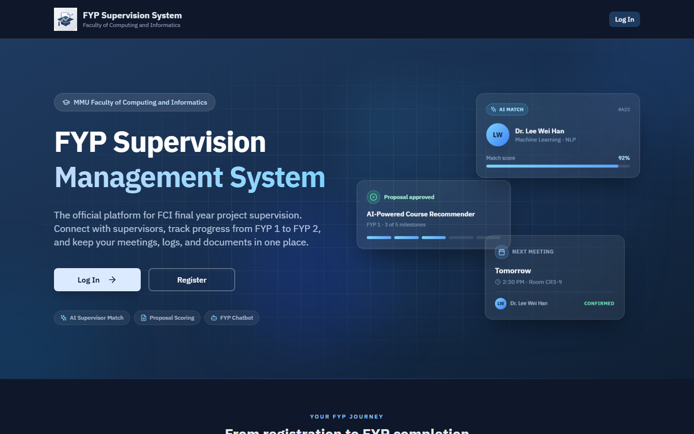
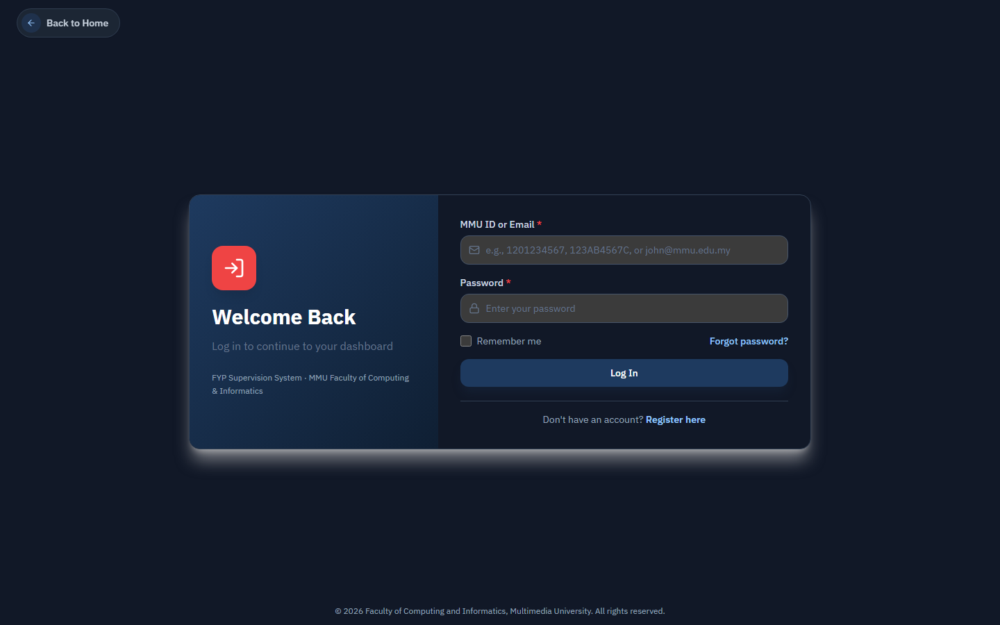
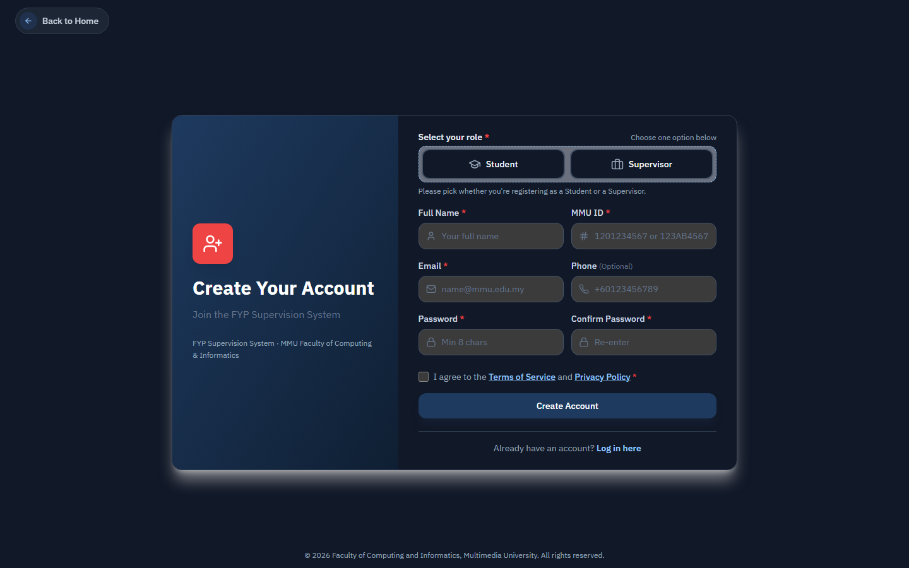

# FYP Supervision System

A comprehensive web-based platform designed to streamline and digitize the Final Year Project (FYP) supervision process at MMU FCI. This system helps students find supervisors, manage proposals, track meetings, and maintain supervision logs—all in one place.

> **Live demo:** [app.supervisi.me](https://app.supervisi.me) — the portfolio build, deployed on a DigitalOcean droplet over HTTPS (API at `api.supervisi.me/api`).

## What It Does

Managing an FYP project can be overwhelming. Students need to find the right supervisor, submit proposals, schedule meetings, keep track of supervision logs, and manage documents—often using multiple tools and manual processes. This system brings everything together in a single, easy-to-use platform.

The system includes AI-powered features like supervisor recommendations based on project topics, automated proposal analysis, and an intelligent chatbot to answer FYP-related questions. Everything is designed to make the supervision process smoother for students, supervisors, and administrators.

## Screenshots

Captured from the live deployment at [app.supervisi.me](https://app.supervisi.me).



| Sign in | Register |
|---|---|
|  |  |

## Key Features

### For Students
- **AI-Powered Supervisor Matching** - Get personalized supervisor recommendations based on your project topic and preferences
- **Proposal Management** - Submit, track, and manage your FYP proposals with version control
- **Meeting Scheduling** - Schedule meetings with supervisors and track your meeting history
- **Digital Supervision Logs** - Create and maintain meeting logs in MMU format with e-signature support
- **Document Management** - Upload and organize all your FYP-related documents
- **Progress Tracking** - Dashboard showing your project status, upcoming deadlines, and pending tasks
- **FYP Chatbot** - Get instant answers to common FYP questions

### For Supervisors
- **Request Management** - Review and respond to supervision requests from students
- **Proposal Review** - Review student proposals and provide feedback
- **Meeting Management** - Schedule meetings and review supervision logs
- **Supervisee Dashboard** - Track progress of all your supervisees in one place
- **Document Review** - Review and approve student-submitted documents

### For FYP Committee
- **Proposal Review Queue** - Review and approve proposals at the faculty level
- **Announcements** - Publish faculty-wide announcements and updates
- **Project Overview** - View all FYP projects and supervisor-student pairings
- **Report Generation** - Generate and export comprehensive FYP reports

### For System Administrators
- **User Management** - Manage user accounts, roles, and permissions
- **System Configuration** - Configure system parameters and settings
- **Integration Settings** - Manage external integrations and export configurations
- **Audit Logs** - Track all system activities for security and compliance

## Tech Stack

### Backend
- **Java 17** with **Spring Boot 3.2.5**
- **MySQL 8** for database
- **JWT** for authentication
- **Flyway** for database migrations
- **Spring Security** for security
- **Lombok** for cleaner code

### Frontend
- **React 18** with **TypeScript**
- **Vite** for fast development and building
- **Tailwind CSS** for styling
- **TanStack Query** for data fetching
- **React Hook Form** + **Zod** for form validation
- **React Router** for navigation

### AI / ML
- **Flask** microservices (served by **Gunicorn**) for three independent engines:
  - Supervisor recommendation — **Sentence-BERT** (BGE) embeddings + a deterministic weighted scorer
  - Proposal analysis — **DistilBERT** + rule-based NLP, with an optional remote LLM
  - FYP chatbot — **FAISS** vector search + a remote LLM (Groq / OpenAI)
- **PyTorch**, **Hugging Face Transformers**, **sentence-transformers**
- **scikit-learn**, **NumPy**, **pandas** for the scoring and analysis pipelines

### DevOps & Infrastructure
- **Docker** and **Docker Compose** (base + prod + observability overlays) orchestrating the full 9-service stack
- **Caddy** reverse proxy with automatic **Let's Encrypt** HTTPS in production
- **Nginx** serving the production frontend build
- **Prometheus** and **Grafana** for metrics and dashboards
- **MySQL 8** with persistent volumes; schema managed by **Flyway**
- Deployed on a **DigitalOcean** droplet

## Project Structure

```
fyp-supervision-system/
├── backend/                 # Spring Boot backend API
│   ├── src/main/java/      # Java source code
│   ├── src/main/resources/ # Configuration files
│   └── Dockerfile          # Backend container config
├── frontend/               # React frontend application
│   ├── src/
│   │   ├── pages/         # Page components
│   │   ├── components/    # Reusable components
│   │   ├── lib/           # Utilities and API clients
│   │   └── types/         # TypeScript type definitions
│   └── Dockerfile         # Frontend container config
├── ai-recommendation/      # Flask service for supervisor recommendations
├── ai-proposal-analyzer/   # Flask service for proposal analysis
├── ai-chatbot/            # Flask service for chatbot
├── docker-compose.yml               # Base stack (db, backend, 3× AI, frontend)
├── docker-compose.override.yml      # Auto-merged: frontend Vite dev mode (HMR)
├── docker-compose.prod.yml          # Production overlay (Caddy, secrets)
├── docker-compose.observability.yml # Prometheus + Grafana overlay
└── .env.example                     # Environment variables template
```

## Prerequisites

Before you begin, make sure you have the following installed:

- **Java 17** or higher
- **Node.js 18+** and **npm**
- **Docker** and **Docker Compose**
- **MySQL 8** (if running database locally)
- **Groq or OpenAI API key** — only for the chatbot and the proposal analyzer's optional LLM pass; the supervisor-recommendation engine runs locally and needs no key

## Getting Started

### 1. Clone the Repository

```bash
git clone <repository-url>
cd fyp-supervision-system
```

### 2. Set Up Environment Variables

Copy the example environment file and fill in your values:

```bash
cp .env.example .env
```

Edit `.env` and set:
- `JWT_SECRET` - A secure secret key (at least 32 characters). **Do not use the default in production.**
- `GROQ_API_KEY` or `OPENAI_API_KEY` - LLM key for the chatbot and the proposal analyzer's optional LLM pass (Groq is the default provider). The recommendation engine runs locally and needs no key.
- `VITE_API_BASE_URL` - Backend API base URL for the frontend (e.g. `http://localhost:8080/api` when frontend runs on host; when both run in Docker, use `http://backend:8080/api` or the public URL of the backend)
- `DB_URL`, `DB_USER`, `DB_PASS` - Database connection (required for backend; use strong credentials in production)
- **Email (optional)** - set `APP_EMAIL_ENABLED=true` plus `MAIL_HOST`/`MAIL_PORT`/`MAIL_USERNAME`/`MAIL_PASSWORD` and `APP_EMAIL_FROM` to send real email (registration verification codes, notifications, password reset). Left `false` (default), those codes/links are written to the backend log instead. See `.env.example`.

### 3. Run with Docker Compose (Recommended)

The easiest way to get everything running:

```bash
docker-compose up --build
```

This will start the full stack. `docker-compose.override.yml` is **auto-merged**, so the default run uses the frontend Vite dev server with hot-reload:
- **MySQL** on host port **3307** (→ container 3306; the offset avoids clashing with a local MySQL on 3306)
- **Backend API** on port 8080 (context path `/api`)
- **Frontend (dev)** on port **5173** — Vite dev server with HMR, source mounted for live edits. Remove or rename `docker-compose.override.yml` to run the nginx production build on port **3000** instead.
- **AI recommendation** on port 5001
- **AI proposal analyzer** on port 5002
- **AI chatbot** on port 5003

Because the override mounts the frontend source, you don't need to run Vite separately. To run the frontend on the host instead, `cd frontend && npm run dev` and set `VITE_API_BASE_URL=http://localhost:8080/api`.

### 4. Run Locally (Development)

If you prefer running services individually:

#### Backend

```bash
cd backend
mvn clean install
mvn spring-boot:run
```

The backend will run on `http://localhost:8080/api`

#### Frontend

```bash
cd frontend
npm install
npm run dev
```

The frontend will run on `http://localhost:3000` (or the port shown in terminal)

#### AI Services

Each AI service can be run individually:

```bash
cd ai-recommendation  # or ai-proposal-analyzer, ai-chatbot
pip install -r requirements.txt
python app.py
```

## Configuration

### Database

The system uses MySQL 8. When running with Docker Compose, the database is automatically set up. For local development, create a database:

```sql
CREATE DATABASE fyp_supervision;
```

Update `backend/src/main/resources/application.yml` or set environment variables:
- `DB_URL` - Database connection URL
- `DB_USER` - Database username
- `DB_PASS` - Database password

### File Uploads

By default, uploaded files are stored in `./uploads` (backend) or `/app/uploads` (Docker). You can configure this via:
- `FILE_UPLOAD_DIR` environment variable
- `app.file.upload-dir` in `application.yml`

### JWT Configuration

JWT tokens are used for authentication. Configure via:
- `JWT_SECRET` - Secret key for signing tokens
- `JWT_EXPIRY_MS` - Token expiration time in milliseconds (default: 24 hours)

### Email & Notifications

Transactional email (registration verification codes, system notifications, password reset) is sent over SMTP and is **off by default**:
- `APP_EMAIL_ENABLED` - `true` to send email; `false` (default) writes codes/links to the backend log instead
- `MAIL_HOST` / `MAIL_PORT` - SMTP server (e.g. `smtp.gmail.com:587`, or a transactional relay such as Brevo on port `2525`)
- `MAIL_USERNAME` / `MAIL_PASSWORD` - SMTP credentials
- `APP_EMAIL_FROM` - sender address
- `APP_BASE_URL` - base URL used in email links (e.g. the password-reset link)

### CORS and cross-origin

When the frontend and backend run on different origins (e.g. frontend on port 3000, backend on 8080), the backend is configured to allow the frontend origin. For production, ensure CORS allowed origins and cookie/same-site settings match your deployment (e.g. same site or trusted domain).

## User Roles

The system supports four user roles:

1. **STUDENT** - Undergraduate FYP students
2. **SUPERVISOR** - Academic staff supervising projects
3. **FYP_COMMITTEE** - Faculty coordinators
4. **SYSTEM_ADMIN** - IT staff managing the system

## API Documentation

The backend API is available at `http://localhost:8080/api`. Key endpoints include:

- `/auth/*` - Authentication (login, register + email verification, password reset)
- `/student/*` - Student endpoints
- `/supervisor/*` - Supervisor endpoints
- `/supervisors/*` - Student-facing supervisor directory (browsable by students)
- `/committee/*` - FYP Committee endpoints
- `/admin/*` - System admin endpoints
- `/announcements/*` - Announcements (audience-filtered per student)
- `/notifications/*` - Notification management
- `/resources/*` - Resource documents

Authority is derived from the URL prefix in `SecurityConfig` (e.g. `/student/**` requires the `STUDENT` role).

## Development

### Backend Development

```bash
cd backend
mvn spring-boot:run
```

The backend uses Flyway for database migrations. Migrations are located in `backend/src/main/resources/db/migration/`.

### Frontend Development

```bash
cd frontend
npm run dev
```

The frontend uses Vite for hot module replacement, so changes will be reflected immediately.

### Running Tests

Backend tests:
```bash
cd backend
mvn test
```

Frontend tests (if configured):
```bash
cd frontend
npm test
```

## Building for Production

### Backend

```bash
cd backend
mvn clean package
java -jar target/supervision-1.0.0.jar
```

### Frontend

```bash
cd frontend
npm run build
```

The production build will be in `frontend/dist/`.

## Troubleshooting

### Database Connection Issues

- Make sure MySQL is running and accessible
- Check database credentials in `.env` or `application.yml`
- Verify the database exists: `CREATE DATABASE fyp_supervision;`

### Port Already in Use

If a port is already in use, either:
- Stop the service using that port
- Change the port in `docker-compose.yml` or configuration files

### AI Services Not Working

- Verify `GROQ_API_KEY` (or `OPENAI_API_KEY`) is set in `.env` — only the chatbot and the proposal analyzer's LLM pass need it; the recommendation engine runs locally
- Check that AI services are running and accessible
- Review logs: `docker-compose logs ai-recommendation`

### File Upload Issues

- Ensure the upload directory exists and has write permissions
- Check `FILE_UPLOAD_DIR` configuration
- Verify file size limits in `application.yml` (default: 50MB)
