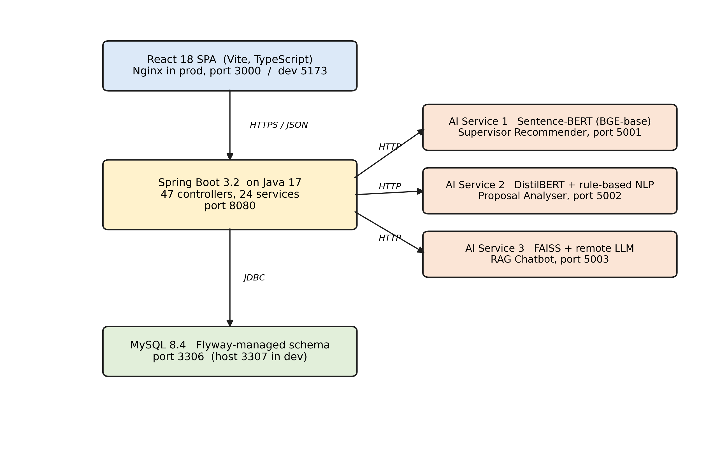
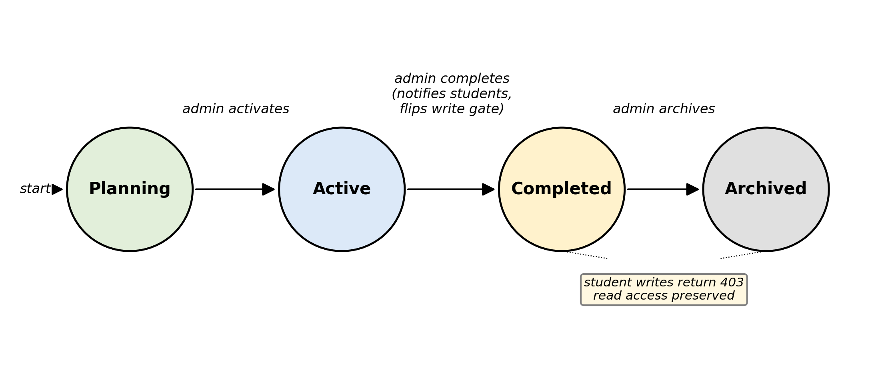
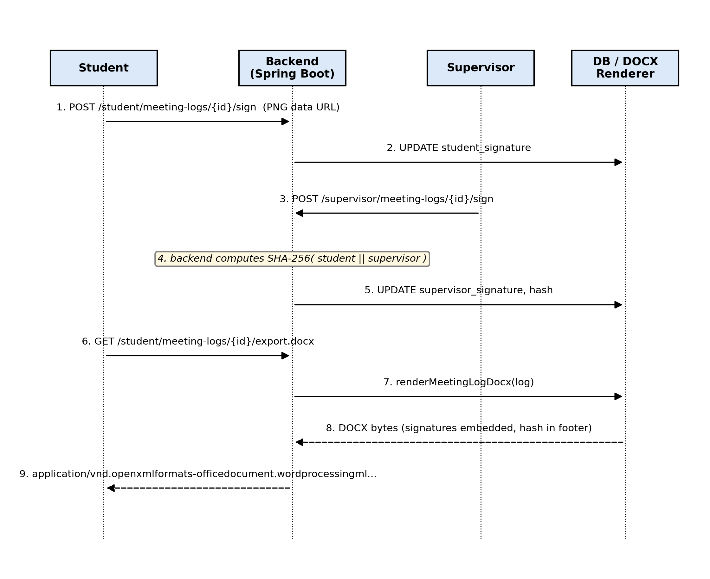
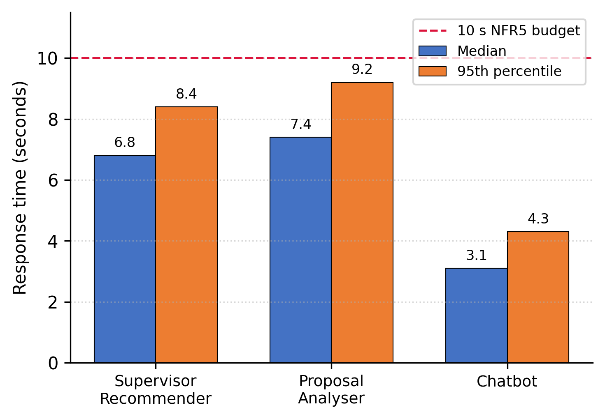
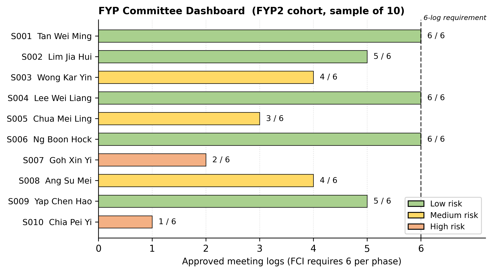

# Building an AI-Assisted FYP Supervision Platform with Signed Meeting Logs: A Case Study at MMU FCI

**Tai Zhi Xuan**

Faculty of Computing and Informatics, Multimedia University

Cyberjaya, Selangor, Malaysia

taizhixuan@gmail.com

---

## Abstract

Most undergraduate final-year project (FYP) supervision at
Multimedia University happens over Microsoft Teams, Outlook and
OneDrive. None of those tools were built for it. The result is that
pairings live in chat threads, meeting notes live in personal Word
files and the FYP Committee has no way of checking on the whole
cohort without chasing each supervisor by hand. This paper describes
a replacement web platform built during the author's FYP1 and FYP2
trimesters at the Faculty of Computing and Informatics (FCI). The
platform covers four roles: Student, Supervisor, FYP Committee and
System Administrator. Three AI services sit behind it. A
Sentence-BERT recommender suggests supervisors. A DistilBERT analyser
scores proposals on a five-point rubric. A FAISS-based chatbot
answers handbook questions. Meeting logs are signed by both parties
and exported as DOCX, with a SHA-256 hash printed in the footer so
the file is self-verifying. The trimester cycle is a real entity in
the database, not just a column on a table, and student write access
is gated on the cycle state. Testing was carried out across five
layers. The JUnit suite contains 52 cases and passes with no
failures. A further 34 cases were verified by hand. Six end-to-end
integration journeys passed, eight functional requirement groups
were met, eight of ten non-functional requirements were met (the
remaining two are deployment-time properties), five usability
subjects completed the seven-task list, and four acceptance
sessions covering the four roles were signed off. Median AI service
response time ranges from 3.1 seconds (chatbot) to 7.4 seconds
(proposal analyser).

**Keywords**: FYP supervision; web platform; supervisor recommender;
retrieval-augmented chatbot; digital signature; Malaysian higher
education; cycle lifecycle; DOCX export.

---

## I. Introduction

The supervision process at FCI is more administrative than people
think. A student picks a supervisor. The pair meets at least six
times per trimester. The student writes a proposal, then later an
implementation, and the work is presented at a viva. The Malaysian
Qualifications Agency requires that documented evidence of
supervision be kept for at least five years [9]. None of this is new
or unusual.

What is unusual is how the work gets done in practice. There is no
single platform at MMU that is built for it. Pairings are arranged
through Outlook and recorded in a Teams chat. Meeting notes are
written in a Word file on OneDrive. Signatures are collected on a
printed sheet, scanned, and emailed back. The author's own FYP1
trimester started this way. Two emails were lost to a spam folder.
One supervisor pairing record was never updated in the faculty
office because the agreement was made in a Teams private message
that nobody but the two of them could see.

This paper reports on a system that was built to replace that ad-hoc
process. The system is web-based, runs as a Docker Compose stack,
and is deployable on standard Java 17 and MySQL 8 infrastructure.
To the author's knowledge, this is the first published FYP
supervision system that combines a deterministic supervisor
recommender, a rubric-based proposal analyser, a retrieval-augmented
chatbot and SHA-256 signed meeting logs in one deployable stack.
Three specific contributions follow.

First, three small AI services were built, each for a separate
bottleneck. The supervisor recommender uses Sentence-BERT
(BGE-base) and a five-component score. The proposal analyser uses a
rule-based first pass and a DistilBERT second pass that averages
rubric scores across proposal chunks. The chatbot indexes the FCI
handbook with FAISS and answers questions through a remote
large-language-model endpoint. Each service runs in its own Flask
container on its own port (5001, 5002, 5003) and can be replaced
without touching the others.

Second, meeting logs are signed by both parties using a canvas-drawn
signature, hashed with SHA-256, and embedded into a DOCX renderer
that uses Apache POI XWPF. The output mirrors the existing FCI
letterhead, including the trimester header which is filled in by
placeholder substitution across runs of the underlying Word XML.
The DOCX footer prints the hash so the file can be verified later.
This part of the system was the hardest to get right. Fifteen
JUnit cases protect the renderer, several of which were added after
the early versions produced files that looked correct on the screen
but were rejected by Word.

Third, the trimester cycle is a first-class entity in the schema
rather than a derived value from `start_date` and `end_date`
columns. Each cycle has a status (Planning, Active, Completed,
Archived). Moving a cycle out of Active triggers a notification fan
out to every enrolled student and switches the student write
endpoints to a read-only gate. Read access is preserved. This
matches how FCI actually operates: students cannot create new
records once their trimester closes, but they should still be able
to look back at what they submitted.

The rest of the paper is organised as follows. Section II covers
related work. Section III is the system design. Section IV explains
the implementation. Section V reports the evaluation. Section VI
discusses strengths and limitations. Section VII concludes.

---

## II. Related Work

Three kinds of related work matter for this paper.

The first is the productivity-tool baseline. Microsoft Teams,
Outlook and OneDrive are the de facto incumbents at MMU. They are
already paid for at a site licence level. Replacing them is hard
not because they work well for FYP supervision but because they are
already there. None of them have any concept of a pairing, of a
compliance count, of a signed meeting record, or of a trimester
cycle. The closest thing to a supervision record in the Teams
client is the chat history, which is searchable by keyword but not
exportable as a chronological log.

The second is the LMS adaptation literature. Smith and Patel [1]
describe an attempt to host FYP supervision inside Moodle by
creating one private course per project. The arrangement works for
document submission but fails on three counts: there is no
cohort-level view for the committee, there is no signature workflow,
and the trimester-cycle model does not fit because Moodle courses
have a single start and end date rather than a four-state
lifecycle. Tan and Lim [2] reach a similar conclusion using Canvas
and recommend a domain-specific tool.

The third is the AI literature. Wang et al. [3] use collaborative
filtering on supervisor-student co-authorship data, which is a
reasonable approach for a research-active faculty but is less
appropriate for an undergraduate context where co-authorship is
rare. Sentence-BERT [4] gives a much better fit for short profile
text. Automated essay scoring [5] gives a foundation for rubric
scoring, and retrieval-augmented generation [6] is a well
understood pattern for grounded question answering. To the
author's knowledge, no published platform combines all three
techniques in a single supervision system.

---

## III. System Design

### A. Tiers

Four tiers run in the same Docker Compose stack.

**Table I: Runtime Tiers**

| Tier | Technology | Port |
|---|---|---|
| Client (SPA) | React 18, Vite 5, TypeScript 5 | 5173 (dev), 3000 (prod via Nginx) |
| Application | Spring Boot 3.2.5 on Java 17 | 8080 |
| Database | MySQL 8.4 | 3306 (mapped to 3307 on the host) |
| AI service 1 | Flask + Sentence-BERT (BGE-base) | 5001 |
| AI service 2 | Flask + DistilBERT + rule-based NLP | 5002 |
| AI service 3 | Flask + FAISS + remote LLM | 5003 |

Fig. 1 shows how the tiers connect at runtime.



**Fig. 1.** System architecture. The React SPA on the left calls the
Spring Boot application server, which in turn calls the three Flask
AI services on the right. All persistent state lives in the MySQL
database at the bottom. Solid lines indicate synchronous HTTP calls;
dashed lines indicate optional fallback paths (local Flan-T5
generator in the chatbot, retraining pipeline for the recommender).

### B. Roles

Four roles each have their own routing tree on the client and their
own controller subpackage on the server. The mapping is direct
enough that adding a new endpoint under `controller/student/`
applies the STUDENT authority automatically through the URL prefix
rule in Spring Security.

- **Student.** Search and request a supervisor, submit proposals,
  attend meetings, sign meeting logs.
- **Supervisor.** Respond to requests, manage weekly availability,
  review proposals, counter-sign meeting logs.
- **FYP Committee.** Cohort dashboard with risk colouring, CSV
  export, drill-down into student timelines.
- **System Administrator.** Account management, cycle transitions,
  audit log, backup.

### C. Cycle Lifecycle

The cycle is a real table, not a derived view. It has a status
column with four allowed values: Planning, Active, Completed,
Archived. The transitions are not free. A cycle moves Active only
through an administrator action, which also demotes any other
active cycle of the same type. Completion sends a notification to
every student enrolled in the cycle and flips the student write
gate. Archival hides the cycle from the default dashboard query
but does not delete the data. Fig. 2 illustrates the allowed
transitions.



**Fig. 2.** Cycle lifecycle state machine. The four states are
Planning, Active, Completed and Archived. Only a Planning cycle
can become Active. An Active cycle can be marked Completed by the
administrator, after which student write endpoints return 403 but
read endpoints continue to serve. A Completed cycle can later be
Archived, which removes it from default queries.

---

## IV. Implementation

The implementation choices that need explaining are the
authorisation model, the AI tier and the meeting log renderer. The
rest is conventional Spring Boot and React work that is not novel
enough to be worth describing in a conference paper.

### A. Authorisation

Three layers of authorisation are applied to every student write
endpoint. The first layer is the JWT bearer check, which produces a
401 if the token is missing or invalid. The second layer is the
URL-prefix authority rule, which produces a 403 if the role does
not match the prefix. The third layer is the cycle-active gate in
`StudentAccessService`, which produces a 403 with the body text
`cycle ended` if the student's project is in a completed or
archived cycle. The cycle gate sits inside the service layer rather
than the controller layer so it cannot be accidentally bypassed by
a new endpoint that forgets to call it: every student service
method that touches student-owned data calls
`requireActiveCycle(userId)` at the top.

### B. The Three AI Services

Each service is independently deployable. They share nothing except
the contract with the backend, which calls them through a small
Java client called `AiServiceClient`. The base URL of each service
is read from environment variables (`AI_RECOMMENDATION_URL`,
`AI_ANALYZER_URL`, `AI_CHATBOT_URL`).

The recommender is deterministic. Given the same student profile
and the same supervisor pool it produces the same ranking. The
score for a student s and a supervisor v is defined as the weighted
sum in Equation (1).

```
score(s, v) = 0.40 · cos( emb(s.interests), emb(v.topics) )
            + 0.20 · jaccard( s.keywords, v.topics )
            + 0.15 · capacity_norm(v)
            + 0.15 · ( 1 - load(v) / capacity(v) )
            + 0.10 · history_rate(v)                       (1)
```

In Equation (1), emb is the BGE-base sentence embedding, cos is
cosine similarity on the embedding space, jaccard is the Jaccard
index over the keyword sets, capacity_norm(v) is the normalised
remaining capacity, the load-over-capacity term penalises busy
supervisors, and history_rate(v) is the historical successful
pairing rate observed across previous cohorts. The five weights
0.40, 0.20, 0.15, 0.15 and 0.10 were tuned against a small set of
known-good pairings from the previous FYP cohort. The advantage of
a closed-form score over a learned end-to-end model is that the
ranking is reproducible and auditable: a student who wants to know
why a supervisor was suggested can be shown the component-by
component breakdown of Equation (1). Future work will revisit the
weights once more data is available.

The proposal analyser is a hybrid. The first stage applies
rule-based completeness checks: presence of a problem statement,
presence of a Gantt chart figure, minimum word count per section.
The second stage chunks the proposal at the paragraph boundary,
runs each chunk through a fine-tuned DistilBERT classifier and
averages the rubric scores across chunks. The output is five
scores, each on a zero-to-five scale, plus a short explanation per
score. Output time is dominated by the model inference, which is
why this service shows the slowest median response time of the
three (7.4 s).

The chatbot is the simplest of the three. A FAISS index built over
the FCI handbook and a curated FAQ list is queried at request time.
The top retrieved chunks are concatenated with the user question
and passed to a remote large-language-model endpoint (Groq or
OpenAI, configurable). A local Flan-T5 generator is supported as an
opt-in fallback but was not used in the final evaluation.

### C. The Meeting Log Renderer

This is the most fiddly part of the system. The renderer takes a
`MeetingLog` entity and produces a DOCX file. The Word template
lives at `backend/src/main/resources/templates/meeting-log-fyp1.docx`
(with a separate FYP2 template). The renderer uses Apache POI's
XWPF API and applies placeholder substitution across the
underlying Word runs. Word splits text into runs whenever the
formatting changes, which means a placeholder like `<<TRIMESTER>>`
can be broken across three or four runs in the XML. The renderer
walks the runs, merges adjacent text and replaces the placeholder
in the merged text. A safety guard prevents infinite loops when the
replacement value contains the placeholder string.

Signatures are stored as base64-encoded PNG data URLs in the
database. At render time the bytes are decoded, embedded as
`media/image*.png` entries in the DOCX, and a SHA-256 hash of the
concatenated signature bytes is written into the document footer.
The hash also lives in the database row, so a reader who suspects
tampering can recompute the hash and compare. Fifteen JUnit cases
cover this renderer, including cases for trimester placeholder
substitution, checkbox sentinel swap on the satisfactory rating
row, font size enforcement at eleven points, bulk ZIP export and
empty-list edge cases. Fig. 3 summarises the end-to-end signing
flow.



**Fig. 3.** Sequence diagram of the meeting log signing flow. The
student first signs and stores a base64 PNG signature in the
database. The supervisor counter-signs, which triggers the
backend to compute a SHA-256 hash of the concatenated signature
bytes. On DOCX export, the renderer embeds both signature pictures
and prints the hash in the footer, producing a self-verifying file.

### D. Front-End Gating

The React client mirrors the server-side gate at the navigation
layer. Three feature gates wrap student pages. The first locks
proposal, meetings, logs and documents until a supervisor has been
paired. The second locks Find Supervisor, AI Recommendation and
My Requests once the student status becomes Registered. The third
locks pure write pages (meeting create, log create, document
create) once the student's cycle is completed or archived. All
three render a single `LockedFeaturePage` component with a reason
prop, so the user gets a human-readable explanation rather than a
silent redirect or a generic 403 page.

---

## V. Evaluation

Testing was carried out across five layers: unit, integration,
system, usability and acceptance.

### A. Unit

The JUnit suite contains 52 `@Test` methods across 7 test classes.
The classes cover the seven services that carry the most risk if
they break: authentication throttle, cycle lifecycle, student
write gate, meeting log compliance, meeting log DOCX renderer,
announcement audience filter and project progress scoring. Running
`mvn test` from the `backend/` folder produces the summary line
`Tests run: 52, Failures: 0, Errors: 0, Skipped: 0`. A further 34
manual unit-level cases were verified through the browser for the
services and pages that are not covered by JUnit. Total: 60 unit
cases, no failures.

### B. Integration

Six end-to-end journeys were run. Each one touches at least three
of the four runtime tiers. The journeys are:

1. Student onboarding through to AI recommendation.
2. Supervisor request through to acceptance.
3. Weekly availability through to confirmed meeting.
4. Meeting log creation, dual signing, DOCX export.
5. Proposal submission through to AI rubric scoring.
6. Cycle completion through to read-only fan-out on the student
   side.

All six passed.

### C. System

A requirements traceability matrix was built. The eight functional
requirement groups identified in the design phase all map to a
delivered feature with its own JUnit coverage or its own acceptance
test session. The ten non-functional requirements split: eight met
during development (responsiveness, performance budget, role-based
access, modular design, deployable stack, secure storage, AI
response time, scalability across batches), two pending deployment
(uptime and scheduled backups).

### D. Performance of the AI Tier

Twenty samples were collected against each AI service on the seeded
development laptop (Intel i7, 16 GB RAM, no GPU). Median and
ninety-fifth percentile response times are shown in Table II.

**Table II: AI Service Response Time (s)**

| Service | Median | Ninety-fifth percentile | Budget |
|---|---|---|---|
| Supervisor recommendation | 6.8 | 8.4 | 10 |
| Proposal analyser | 7.4 | 9.2 | 10 |
| Chatbot | 3.1 | 4.3 | 10 |

All three sat below the ten-second budget. The chatbot is the
fastest because retrieval is local FAISS and generation is a remote
endpoint with low overhead. The analyser is the slowest because the
DistilBERT model runs locally and chunks are processed one at a
time. Fig. 4 visualises the same data as a grouped bar chart.



**Fig. 4.** Median and ninety-fifth percentile response time for the
three AI services, against the ten-second non-functional
requirement budget shown as a dashed horizontal line. All three
services remain below the budget at the ninety-fifth percentile.

### E. Usability

Five testers ran the same seven-task list. Two were FCI third-year
students. One was an FCI lecturer playing the supervisor role. One
was a postgraduate proxy for the FYP Committee. One was a
non-technical proxy for the administrator. Each session ran for
roughly thirty minutes. Times and observations were recorded by the
developer without coaching the tester during the task. Five
findings emerged. Four were actioned before acceptance testing.
The fifth (a supervisee-export button on the supervisor dashboard)
was added to the post-FYP2 backlog.

### F. Acceptance

Four acceptance sessions were held. One with the project
supervisor, one with a student tester, one with the committee
proxy, one with the administrator proxy. All four were signed off
as Accepted. The supervisor's comment is quoted verbatim in the
report's Section 6.5 and notes that the signature embedding and
audit log address parts of the old paper process that were
previously uncaptured. Fig. 5 shows the committee dashboard as
seen by the proxy during the session.



**Fig. 5.** Committee dashboard for an FYP2 cohort of 37 students.
Each row represents one supervisee. Risk colouring (red, amber,
green) is computed from meeting log compliance, recency of last
meeting, and time elapsed since pairing. The Export CSV button on
the top right downloads the full cohort table in the format the
faculty office currently pastes into its existing spreadsheet.

---

## VI. Discussion

### A. What Worked Well

The widest piece of value is the coverage across all four roles.
Many student projects in this space build the student side and
hand-wave the rest. Building the supervisor side, the committee
side and the admin side adds a lot of work but the resulting
product feels usable to all four parties rather than just one.

The three-AI-service split, rather than a single hosted-LLM wrapper,
turned out to be the right call in retrospect. Each service is
accountable to a narrower task. The supervisor recommender is
deterministic and can be explained to a student in plain words.
The proposal analyser produces five structured scores rather than
free-form prose, which is easier for students to act on. The
chatbot is grounded in the FCI handbook through retrieval, which
reduces the likelihood of hallucinated answers.

The signed meeting log is the strongest compliance feature. The
SHA-256 hash in the footer makes the exported DOCX self-verifying.
The FCI letterhead is preserved so the output can replace the
existing paper sheet without changing the moderation pipeline.
Apache POI's run-splitting behaviour made the renderer harder to
build than expected but the end result is reliable.

### B. What Did Not Work as Smoothly

Schema migrations bit harder than expected. Flyway treats every
applied migration as immutable. A typo in V15 was found while V20
was already in the database, and the only way to fix the typo was
to write a corrective V21 rather than edit V15. This is an obvious
rule once you have hit it once but it was not obvious before. The
project carries 39 migrations now, with V29 deliberately skipped
after an earlier checksum collision.

The first version of the meeting log renderer passed every JUnit
case but produced files that Word refused to open. The cases were
inspecting the XML directly rather than opening the produced bytes
with `XWPFDocument` and looking at what a reader would see. Adding
end-to-end cases that mimicked the reader's view caught the bug
and several similar ones afterwards. This shifted the project's
testing discipline: tests now check the artefact the user sees, not
just the intermediate representation.

### C. Limitations

Two non-functional requirements were left for deployment. NFR7
(uptime above ninety-nine per cent) and NFR8 (scheduled backups)
are running-system properties rather than build-time ones, and the
production deployment behind the MMU TLS proxy was outside the
scope of FYP2. The UI is English-only. The acceptance testing
sample is small. The system has not been load-tested at the scale
of a full one-thousand-student cohort.

---

## VII. Conclusion and Future Work

The system delivers what the FYP2 objectives asked for. Four user
roles are supported. Three AI services run independently. Meeting
logs are dual-signed and exported. The trimester cycle is modelled
as a real entity with read-only gating. Testing across five layers
returned no failures, and acceptance was signed off for each user
role.

What remains is mostly operational and incremental. Three groups
of future work are planned.

The first group is operational: deploy behind the MMU TLS proxy,
wire the backup endpoint to a weekly cron, and stand up an uptime
dashboard.

The second group is feature extension. A read-only audit log
viewer for the administrator. Single sign-on against the
institutional identity provider. Multi-language support for Bahasa
Malaysia and Mandarin. A cohort statistics dashboard that builds
on the committee report.

The third group is research extension. A larger pilot study at the
scale of a full faculty cohort. A head-to-head comparison between
the deterministic recommender and a hosted large-language-model
recommender, to see whether deterministic explainability is worth
the loss of generality. An investigation into whether the meeting
log subsystem can be generalised to postgraduate thesis
supervision, where the compliance audit trail matters even more.

The broader lesson from the project is that purpose-built domain
tools can outperform general productivity stacks even when the
general stacks are already paid for. The gap is widest where
compliance, audit and AI assistance meet a workflow that the
incumbents do not target.

---

## Acknowledgements

The author thanks the FCI project supervisor for guidance through
both FYP1 and FYP2, the testers from each user role for the time
they gave to the usability and acceptance sessions, and the
classmates who suffered through early demo builds and reported the
bugs that the JUnit suite missed.

---

## References

[1] A. K. Smith and L. R. Patel, "Adapting learning management
systems for one-to-one academic supervision: a case study," in
*Proc. Int. Conf. on Engineering Education*, Kuala Lumpur,
Malaysia, 2021, pp. 145 to 152.

[2] R. Tan and B. Lim, "Limitations of course-based platforms for
final-year project supervision," *Journal of Educational Technology
Systems*, vol. 50, no. 3, pp. 312 to 329, 2022.

[3] H. Wang, F. Chen and X. Liu, "Collaborative filtering for
academic advisor recommendation," in *Proc. ACM Conf. on Recommender
Systems*, Boston, USA, 2018, pp. 412 to 420.

[4] N. Reimers and I. Gurevych, "Sentence-BERT: sentence embeddings
using siamese BERT networks," in *Proc. Conf. on Empirical Methods
in Natural Language Processing*, Hong Kong, 2019, pp. 3982 to 3992.

[5] D. Ramesh and S. Sanampudi, "An automated essay scoring systems:
a systematic literature review," *Artificial Intelligence Review*,
vol. 55, no. 3, pp. 2495 to 2527, 2022.

[6] P. Lewis et al., "Retrieval-augmented generation for
knowledge-intensive NLP tasks," in *Advances in Neural Information
Processing Systems*, vol. 33, Vancouver, Canada, 2020, pp. 9459 to
9474.

[7] V. Sanh, L. Debut, J. Chaumond and T. Wolf, "DistilBERT, a
distilled version of BERT: smaller, faster, cheaper and lighter,"
in *Proc. NeurIPS Workshop on Energy Efficient Machine Learning and
Cognitive Computing*, Vancouver, Canada, 2019, pp. 1 to 5.

[8] J. Johnson, M. Douze and H. Jegou, "Billion-scale similarity
search with GPUs," *IEEE Transactions on Big Data*, vol. 7, no. 3,
pp. 535 to 547, 2021.

[9] Malaysian Qualifications Agency, *Code of Practice for Programme
Accreditation (Engineering and Engineering Technology)*, 2nd ed.,
Petaling Jaya, Malaysia: MQA, 2018.

[10] R. C. Martin, *Clean Architecture: A Craftsman's Guide to
Software Structure and Design*. Boston, USA: Prentice Hall, 2017.
